# 监测LED在玫瑰种植中的应用  

监测气候、质量和实践经验（2022-2023）  

C.W. Labrie, M. Raaphorst, A. de Gelder, M. Warmenhoven, N. Garcia  

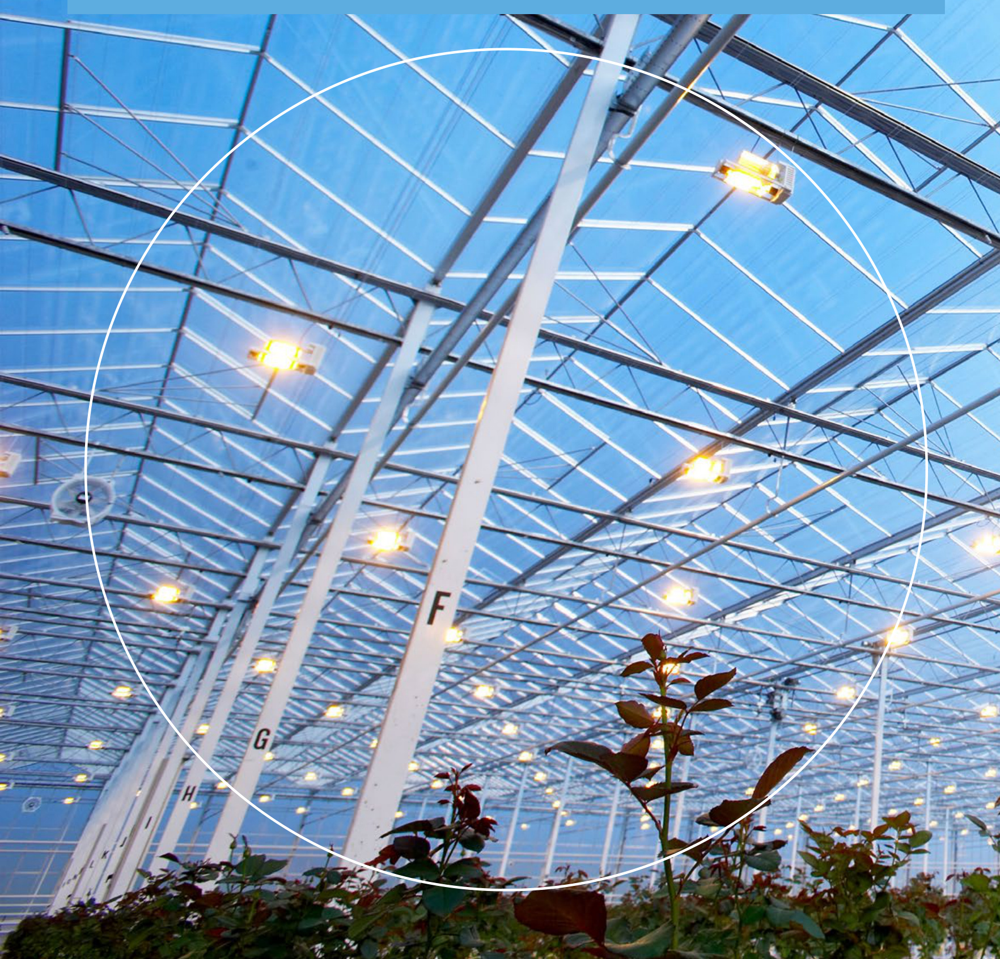  

# 摘要  

五家从SON-T转向混合（SON-T和/或LED）照明的玫瑰公司在2022-2023年冬季期间，针对温室气候、能源消耗和产品质量进行了监测。LED降低了电力需求，但其使用有时与花蕾颜色和花瓶寿命呈负相关。尽管尚未建立这些相关性的因果关系，但目前建议避免在光源中使用高比例的LED，增加通风，减少下部加热并增加上部加热。  

# 摘要  

在2022-2023年冬季，五家从HPS转向混合（HPS和/或LED）照明的玫瑰公司在温室气候、能源消耗和产品质量方面进行了监测。LED减少了电力需求，但其使用有时与花蕾颜色和花瓶寿命呈负相关。尽管尚未建立这些相关性的因果关系，但目前建议避免在光源中使用高比例的LED，增加通风，减少下部加热并增加上部加热。  

报告数据  
报告WPR-1382  
项目编号：3742294200  
DOI：https://doi.org/10.18174/686244  

本研究是由“温室作为能源来源”项目委托的，这是荷兰温室园艺和农业、自然与食品质量部（LNV）的创新项目，旨在促进能源节约和可再生能源在温室园艺中的使用。该研究由瓦赫宁根研究基金会（WR）、温室园艺和花卉业务单元与五家玫瑰种植公司合作进行。  

# 免责声明  

$\circleddash$ 2025 瓦赫宁根，瓦赫宁根研究基金会，瓦赫宁根植物研究，温室园艺业务单元，邮政信箱20，2665 MV Bleiswijk T 0317 48 56 06，wur.nl/plant-research 商会注册号：09098104 | 增值税号：NL 8113.83.696.B07  

瓦赫宁根研究基金会。保留所有权利。本出版物的任何部分不得以任何形式或方式复制、存储在自动数据文件中或公开，电子、机械、复印、录音或其他任何方式，未经瓦赫宁根研究基金会的事先书面许可。瓦赫宁根研究基金会对因使用本研究结果或应用建议而导致的任何损害不承担责任。  

瓦赫宁根大学与研究，温室园艺业务单元的地址  

邮政信箱20，2665 ZG Bleiswijk Violierenweg 1，2665 MV Bleiswijk T $^{+31}$ (0)317 48 56 06 wur.nl/glastuinbouw  

邮政信箱644，6700 AP 瓦赫宁根  
Droevendaalsesteeg 1，6708 PB 瓦赫宁根  
T $^{+31}$ (0)317 48 60 01  
wur.nl/glastuinbouw  

# 目录  

# 摘要 5  

# 1 引言  

1.1 目标 8  
1.2 注意事项 8  

# 2 方法  

# 9  

2.1 过程与知识互动 9  
2.2 公司特征 9  
2.3 数据收集 10  
2.3.1 气候和能源使用记录 10  
2.3.2 附加传感器 10  
2.3.3 花瓶寿命和花瓶上的质量 10  
2.3.4 由种植者进行的产品和作物质量评估 10  
2.3.5 额外测量以供参考 11  

# 3 结果  

# 12  

3.1 初步访谈 12  
3.2 产品质量 12  
3.2.1 花瓶寿命和灰霉病 12  
3.2.2 花蕾颜色 14  
3.2.3 花青素含量 14  
3.2.4 花蕾形状 15  
3.2.5 花蕾高度 16  
3.3 作物 16  
3.3.1 作物生长 16  
3.3.2 叶片大小和作物颜色 16  
3.3.3 白粉病和对其他疾病的易感性 17  
3.4 气候和能源 17  
3.4.1 热输入 17  
3.4.2 温度、PAR和VD 18  
3.4.3 屏幕使用、窗户状态和湿度 19  
3.4.4 水分吸收 23  
3.4.5 凝结或滴水的风险 24  
3.4.6 花蕾和作物温度 26  

# 气候对花卉质量的影响分析 29  

4.1 可能的气候影响对花瓶寿命的影响 29  

4.1.1 PAR 29  
4.1.2 温室气候的变化 30  
4.1.3 与温室气候的其他关系 31  
4.1.4 VD的变化 31  
4.2 深色花蕾颜色的可能原因 32  
4.2.1 文献中关于花蕾颜色和花青素形成的研究 32  
4.2.2 日间温度 35  
4.2.3 温度与光的比率 36  
4.2.4 每种来源的热输入 37  
4.2.5 因素组合 39  

4.3 温室气候与花蕾高度或形状之间的关系 40  

结论与建议 41  

5.1 一般 41  
5.2 花瓶寿命和灰霉病 41  
5.2.1 建议/讨论 42  
5.3 花蕾颜色、高度和形状 42  
5.3.1 建议 43  
5.4 气候控制评估 43  

文献 44  

附录1 记录 45  

附录2 与花瓶寿命的相关性 46  

附录3 与花蕾颜色的相关性 49 附录4 与花蕾形状的相关性 51  

# 摘要  

玫瑰种植者发现，随着LED照明的兴起，他们必须调整温室气候策略，以保持生产和质量在所需水平。 在2022-2023年冬季，WUR对五家玫瑰种植者的温室气候和花卉质量进行了监测和评估。 这些玫瑰种植者包括三家使用Red Naomi!的公司、一家使用White Naomi!的公司和一家使用Avalanche的公司。 所有四家Naomi!种植者都采用混合照明，因此可以使用LED和SON-T进行照明。 温室气候特征主要涉及${\mathsf{P A R}}$、湿度、温室温度、植物温度、照明、屏幕使用、窗户状态、${\mathsf{C O}}_{2}$、浇水和排水。 质量特征涉及花瓶寿命、花蕾颜色、花青素含量、花蕾形状和花蕾高度。  

五家公司的花卉花瓶寿命每两周测量一次。 报废的原因因公司和时期而异，但主要是花瓣的萎蔫和花蕾上的灰霉病。 高光强度、湿度变化和收获前三周的较长夜间长度对花瓶寿命产生了积极影响。  

花蕾颜色每周由三家Red Naomi!种植者在各自的公司进行评分。 深色花蕾的评分较低，通常是由于花青素的形成。 文献研究表明，花青素的形成与高源-汇比率有关，但在两家公司中，高PAR总量反而导致了更好的花蕾颜色。 另外，高热输入与花蕾颜色评分之间存在高度相关性，而PAR总量中的LED比例则与之呈负相关。  

花蕾形状和高度由三家Red Naomi!种植者和一位White Naomi!种植者每周评分。 花蕾高度仅与日间温度存在（负）关系，尤其是在White Naomi!中。 花蕾高度与其他气候因素之间的关系较小。 有趣的是，花蕾形状与RTR（温度与PAR总量的比率）和PAR总量中的LED比例均呈负相关，而LED照明通常提供较低的RTR。  

作为对原计划的补充，进行了包括热成像相机、净辐射计和WET传感器在内的密集测量。 结果表明，SON-T照明下花蕾温度与叶片温度之间的差异比LED照明下大$0{,}2{}^{\circ}\mathsf{C}$。 如果低花蕾温度被视为问题，则可以通过更频繁地使用上部加热来解决。  

由于使用Avalanche的公司在冬季大部分时间保持寒冷，因此在本报告中仅包含少量结果。  

种植者发现，在LED光照下的湿度问题比在SON-T下更为严重。 这直接是因为LED光照在温室中带来的热量较少，导致通风减少。 间接地，LED似乎刺激了枝条的生长，导致更多的（蒸发）叶片。  

拉开（大）遮光帘的必要性是在湿气排放需求和低花蕾温度需求之间的权衡。 为了促进湿气排放，建议更多使用打开的窗户和较小的遮光帘，而为了降低花蕾温度，则需要开放的遮光布。 LED导致较低的花蕾温度，但并未改善花蕾质量，这引发了对LED光谱是否对玫瑰作物最优的问题。  

本研究是瓦赫宁根大学与研究的监测项目的一部分，温室园艺和花卉业务单元，该项目由“温室作为能源来源”计划资助；这是荷兰温室园艺和LNV部的创新项目。  

# 1 引言  

玫瑰种植业追求可持续的高效种植，以生产高质量的玫瑰。 在玫瑰种植中，越来越多地采用LED照明而非SON-T。 LED的光效能（约2.5~μmol/m³）与SON-T（约1.9~μmol/m³）相比，在相同的照明强度下，LED的电力输入节省了24%。 在全年玫瑰种植中，照明的使用相对较多。 LED的较低能量输入也意味着温室中产生的热量过剩较小。 较低的热量输入意味着，使用混合照明的玫瑰温室，尤其是完全使用LED的温室，其气候将与仅使用SON-T的温室不同，因此需要采取不同的气候策略。 较小的热量过剩使得更多的遮光帘和更少的光排放成为可能，但仍需足够排放湿气以避免质量问题。 LED光谱的变化也会影响产品质量（{Gelder, 2022#460}）。  

早期对质量下降的担忧——花蕾形状、花蕾大小、茎长和茎重，是不大规模投资LED的主要原因。 在WUR和Delphy的多年度研究“完美玫瑰”中，积累了在LED下种植玫瑰的丰富经验。 对于Red Naomi!品种，已证明完全使用LED可以实现良好的产量和枝条质量，但花卉质量仍然不够理想。 通过选择R/W/B/VR光谱，质量问题显著减少（{Gelder, 2022#460}）。 这些知识的发展和经验降低了向LED过渡的风险。 结合能源价格的急剧上涨和社会对生产系统可持续化的需求，使得在SON-T的混合解决方案中应用LED成为玫瑰种植公司的现实选择。 2022年，许多公司加快了对LED的投资。 但在从SON-T过渡到混合照明，再到完全使用LED以进一步实现可持续化的过程中，仍然存在关于保持良好花卉质量的重要问题；花瓶寿命、灰霉病、花蕾颜色、花蕾形状和花蕾高度。 良好的质量对玫瑰价格及其盈利能力至关重要。  

有效利用LED以最小化能源使用并保持质量，要求种植者了解如何调整其种植策略，以适应减少的热辐射和LED照明的光谱变化。 预计通过LED节能和其他节能措施（如更多使用遮光帘、使用Airmix和加湿），玫瑰种植将使能源使用减少25%，从而为实现可持续和无化石燃料的种植做出贡献（{Gelder, 2022#460}）。  

为了促进在玫瑰种植中使用LED照明以取代传统的SON-T照明，本项目监测了五家玫瑰公司如何应用LED。 在WUR的指导下，收集了气候数据、种植方式、作物和花卉的质量以及获得的经验，以便相互学习并制定知识交流的要点。 实施最佳实践将导致较低的能源消耗、减少农药使用和改善质量。 这种方法符合能源创新的实践监测，因为通过结合LED的节能、使用遮光帘和限制管道加热的使用，促进了玫瑰种植以更节能的方式种植，减少光排放。 本研究是瓦赫宁根大学与研究的监测项目的一部分，温室园艺，项目由“温室作为能源来源”计划资助；这是荷兰温室园艺和LNV部的创新项目。  

# 1.1 目标  

本监测项目的目标是相互学习，以促进从SON-T到LED照明的过渡，并限制光排放，从而有助于节能的玫瑰种植。  

在作为种植者考虑从SON-T过渡到LED照明并尽量减少能源使用时，质量问题的风险往往是最大的障碍。 为了减少这一障碍并促进LED和节能种植的实施，本监测项目的重点是：  

• 限制能源使用 • 保持花瓶寿命（保鲜、灰霉病） • 保持花卉质量（花蕾颜色、花蕾形状、花蕾高度）  

# 1.2 注意事项  

由于本项目是一个监测项目，参与的公司被允许在一年内调整其种植策略。 因此，这不是一个控制试验设计来检验假设，而是为了促进现有知识的实施，创造更多的洞察力，并通过分享实践经验、支持气候和产品质量数据来制定学习要点。 根据目标和重点，制定了以下注意事项：  

主要问题：在LED种植玫瑰的过程中，保持花卉质量（包括花瓶寿命、灰霉病、花蕾颜色、花蕾形状和花蕾高度）以及节能的背景下，有哪些学习要点？  

子问题1：保持花瓶寿命（保鲜和灰霉病）的关键时期是什么，这些时期在不同公司之间有何不同，这些差异可能如何通过气候因素解释，以及可以从中提取哪些学习要点？  

子问题2：在湿度控制方面（如防止潮湿），在日间的关键时刻是什么，这些时刻在不同公司之间有何不同，这些差异可能如何通过气候控制（包括能源输入和屏幕使用）解释，以及可以从中提取哪些学习要点？  

子问题3：不同公司之间的花蕾颜色、花蕾形状和花蕾高度如何变化，这些差异可能如何通过气候因素解释，以及可以从中提取哪些学习要点？  

子问题4：不同公司之间还有哪些显著差异，包括作物特征、对疾病（白粉病）的易感性、水分吸收和施肥，以及可以从中提取哪些学习要点？  

子问题5：从冬季未照明且最低限度加热的公司的经验中可以提取哪些学习要点（“冷去”）？  

# 2 方法  

# 2.1 过程与知识互动  

该方法是跟踪LED与其他节能技术在玫瑰中的实际应用，并组织相关的知识交流。 最终在五家公司中——这些公司由玫瑰作物合作社推荐——跟踪了LED应用和其他节能技术的使用——如屏幕和低温种植。 数据监测的时间段为2022年10月3日至2023年5月19日（第40周至第20周）。 通过对六家公司的个别初步访谈，记录了企业主的考虑，了解他们为何选择特定技术以及他们的期望。 在初步访谈中，还描述了公司的温室设备和跟踪的参数。 在此访问中，还商定了如何尽可能在线提供数据。 基本原则是没有安装额外的传感器，以便基于实际情况和可用数据。 项目开始时举行了共同的启动会议，讨论了项目的设置和每个人的期望，并就收集的数据、工作方法和沟通等方面达成了具体协议。 数据在发布时进行了匿名处理。 每月制作数据概览。 该概览每八周与相关公司共同讨论，并成为交流经验的指导。 荷兰温室园艺的协调员也被邀请参加这些会议。 根据这些讨论，制定了学习要点和改进点。 在项目期间，工作方法、中期结果、经验和学习要点在各种互动会议上进行了展示，包括玫瑰作物合作社的会议和行业广泛的会议。 还定期在专业期刊上发表文章。 在该项目结束时，制定了监测的总体学习要点并与行业分享。  

# 2.2 公司特征  

在荷兰监测了五家玫瑰公司，其中四家使用“玫瑰光谱”（R/W/B/VR）的LED照明，辅以SON-T照明，一家仅使用SON-T照明。 安装的照明强度见表1。 通常可以将照明作为单独的安装分几个阶段切换。 公司2由于可调光的LED照明，可以在多个阶段进行切换。 在使用LED照明的公司中，跟踪了红色品种Red Naomi!（公司1）和白色品种White Naomi!（公司4）。 在仅使用SON-T的公司（公司5）中，跟踪了Avalanche品种。 公司3的作物比其他公司更老。 由于极高的能源价格，仅使用SON-T的公司在冬季中期“冷去”，未进行照明且加热非常有限。 因此，该公司暂时停产。 所有温室均为“Venlo”类型。 下部加热通过常规的管道进行，公司2也通过上部管道提供了一定的能力。 公司1由于温室顶部的热交换器和风扇，具有相对较高的加热能力。 公司5有水平风扇。 其他公司没有风扇。 没有公司在花蕾高度上安装生长管。 所有监测的公司都有遮光帘，以限制光排放（98%至99%）。 作为第二个遮光帘，公司使用夏季帘（20%至29%），除了公司4没有第二个遮光帘。 遮光帘也用于节能。  

表1 监测公司安装的照明强度（单位：μmol/（m².s））。  

<html><body><table><tr><td></td><td>公司1</td><td>公司2</td><td>公司3</td><td>公司4</td><td>公司5</td></tr><tr><td>SON-T</td><td>90</td><td>112</td><td>140</td><td>140</td><td>97</td></tr><tr><td>LED</td><td>163</td><td>200</td><td>193</td><td>200</td><td>0</td></tr><tr><td>总计</td><td>253</td><td>312</td><td>333</td><td>340</td><td>97</td></tr></table></body></html>  

# 2.3 数据收集  

# 2.3.1 气候和能源使用记录  

通过气候计算机的导出，在试验期间收集了实现的气候数据，包括PAR、湿度、温室温度、照明、屏幕使用、窗户状态、$C O_{2}$、浇水和排水，以及每家公司的能源供应数据（见附录1）。 仅在公司1和3提供了植物温度数据。  

根据可用数据和温室布局，计算和监测了照明和加热的能源消耗。 热需求通过计算的管道温度、温室温度、管道直径和每米管道数量进行计算。 电力需求通过灯具的燃烧时间乘以安装的功率进行计算。  

关于施肥的数据不足，无法进行良好的分析。  

# 2.3.2 附加传感器  

根据2022年11月30日荷兰温室园艺日的讨论请求，在一家公司的要求下，安装了附加传感器，从1月27日起收集数据。 与监测的公司协商后，决定在公司4安装这些传感器。 这包括一台成像热像仪和一台非蒸发参考测量（“非活跃叶片”）的传感器，用于测量植物温度（Sigrow Stomata Camera $\textcircled{8}$）、一台净辐射计和两个额外的温度和相对湿度传感器，分别放置在作物和花蕾高度（$\mathsf{A i r}+\mathfrak{B}$）。 由于怀疑出现滴水现象，4月11日还在公司4安装了一台基质传感器（W.E.T）。 为了更好地了解花蕾温度的变化，从2月28日起，热像仪的八个测量点中的四个每周手动对准色彩鲜艳的花蕾3到4次。 其他四个测量点则始终对准叶片。  

# 2.3.3 花瓶寿命和花瓶上的质量  

为了确定花瓶寿命，从2022年第44周到2023年第20周，每两周在所有参与公司（公司5在第48周至第10周未生产）收集10支70厘米长的A级玫瑰进行花瓶寿命测试。 玫瑰在前一天采摘，放入水中并冷却。 然后将其干燥运输到Bleiswijk，并在一小时内放入装有预处理剂（Florissant 810）的水中，放入5°C的冷藏室，切去1厘米的茎和底部叶片。 在冷藏室中放置5天后，玫瑰单独放入干净的花瓶中，使用自来水而不添加切花营养液，剪去茎底3厘米，使用锋利、干净的剪刀，并在必要时去除额外的底部叶片，以免浸入水中。 玫瑰被放置在符合国际标准的调节开花室中[Reid和Kofranek，1984]。 在报废之前，玫瑰每周评估三次。 从放入花瓶到报废的平均天数称为“花瓶寿命”。 报废的原因根据VBN玫瑰评估表记录，主要包括灰霉病、萎蔫（软化）、紫色边缘和黄叶。 在花瓶中放置7天后，花蕾的开放程度使用2（紧闭的色彩鲜艳的花蕾）到5（完全开放的花蕾）的评分进行评估。 还记录了何时出现异常的花蕾形状以及花蕾的形状（Red Naomi的球形或旋转花蕾和Avalanche的尖花蕾）。 还观察了叶片的质量。  

# 2.3.4 由种植者进行的产品和作物质量评估  

参与的种植者每周评估其公司中的花蕾和作物质量及健康状况。 这包括花蕾高度（毫米）和花蕾颜色、花蕾形状、作物生长（如枝条生长）和叶片大小及作物颜色的评分（从1（非常差）到10（优秀））。 如果在自己的公司中也进行了花瓶寿命测试，则还会对灰霉病和萎蔫进行评分。 作物中的白粉病的发生程度从1（几乎没有白粉病）到5（非常多白粉病）进行评估。此外，还记录了其他疾病和害虫的显著发生情况。  

选择不将生产数据纳入共同监测。  

# 2.3.5 额外测量以供参考  

由于1月23日Red Naomi!的叶片紫色和花蕾变暗的显著差异，测量了每家公司绿色和紫色叶片的花青素和叶绿素含量，使用MultiPigmentMeter 100。 此外，还对每家公司使用Red Naomi!进行了一次性分析，测量花和叶中的营养物质以及花中的糖。 从2月到3月，对花瓶寿命测试中的玫瑰的叶片进行了花青素和叶绿素含量的测量，使用MultiPigmentMeter 100。  

# 3 结果  

# 3.1 初步访谈  

在与玫瑰种植者的初步访谈中，询问了关于LED的相关问题，概括如下。 玫瑰种植者的种植策略受到高能源价格的不确定性和对LED技术的有限经验的影响。 在最小化能源消耗的过程中，保持花卉质量是一个重要挑战。 需要进行哪些调整以保持花卉颜色和花蕾形状的良好状态？ 目前，通常使用SON-T照明来在早晨“加热”花蕾，以防止凝结。 此外，还考虑了全面使用LED照明对花卉质量的影响，以及如何优化浇水和施肥，以适应LED照明与SON-T相比的较低蒸发量。  

此外，还存在关于LED所需的技术设备的问题，因为其辐射热较少；是否需要额外的遮光帘？ 是否需要额外的空气流动以保持作物活跃并在更多遮光的情况下排出湿气？ 是否需要主动除湿？ 是否需要额外的上部加热？  

在能源市场的背景下，还存在以下问题：可调光LED是否能根据电网的过剩能力实现更灵活的切换？ 对于玫瑰而言，光照水平的下限是什么？ 变化的照明对作物质量和发展有什么影响？  

由于在本监测项目中无法回答所有这些问题，因此本研究共同选择将重点放在第1章中提到的注意事项上，主要问题是：在LED种植玫瑰的过程中，保持花卉质量（包括花瓶寿命、灰霉病、花蕾颜色、花蕾形状和花蕾高度）以及节能的背景下，有哪些学习要点？  

# 3.2 产品质量  

# 3.2.1 花瓶寿命和灰霉病  

花瓶寿命（以天数计算）在图1中显示。 公司5在12月至3月中旬未生产。 在其他公司中，12月和1月的玫瑰花瓶寿命短于其他月份。 特别是在公司4的品种2中，12月最后一周和1月（第52周和第2周）的花瓶寿命与试验期间的其他时间相比非常短。 在12月，需要将玫瑰浸泡以防止灰霉病，但在第49周出现的链条问题无法得到充分解决。 经验表明，当温室中已经出现腐烂的花蕾时，浸泡效果不佳。  

在第一次保鲜测试中，品种1在11月初（第44周）在公司2的花瓶寿命长于公司1。 在12月底和1月初的测试中（第52周和第2周），公司1的花瓶寿命显著长于公司2和3。  

报废的原因因公司和时期而异，但主要是花瓣的萎蔫和花蕾上的灰霉病。 除了11月初的花瓶寿命测试（第44周），公司1的灰霉病相对较少。 对于公司2，12月底至4月的测试玫瑰几乎没有灰霉病，而在5月时又有所增加。 对于公司3，灰霉病在一年中波动较大。 公司4的品种2的短花瓶寿命主要是由于花蕾底部的腐烂区域，花瓣和萼片与花底的连接处，进一步扩散到花瓣（图2）。 对于公司5，品种3的花朵在11月因灰霉病而需要浸泡，之后问题消失。 在冬季停产后，4月初，几周后从寒冷期恢复，出现了灰霉病问题，表现为花蕾上的棕色斑点（“小疙瘩”），并扩散到花蕾上。  

公司2在12月底（第52周）的下降主要是由于花瓣的萎蔫，同时花朵和叶片上也出现了许多紫色变色和一些白粉病。 公司3在12月底也出现了这种情况，但这里的灰霉病也是报废的原因。  

公司1在1月底和2月初的下降主要是由于花朵的早期萎蔫，2月时也出现了一些棕色边缘。 经验表明，紫色或棕色边缘是冬季问题。  

值得注意的是，3月底（第12周）公司3的第二次下降是由于灰霉病的高峰，花瓶寿命显著短于两周前和之后的测试，并且显著短于公司1和2的测试。 对于公司1和2，也观察到小幅但显著的花瓶寿命下降，但仅在随后的测试中，即4月初（第14周），而此时花瓣的萎蔫，通常伴随花瓣的棕色或紫色边缘，是报废的主要原因。  

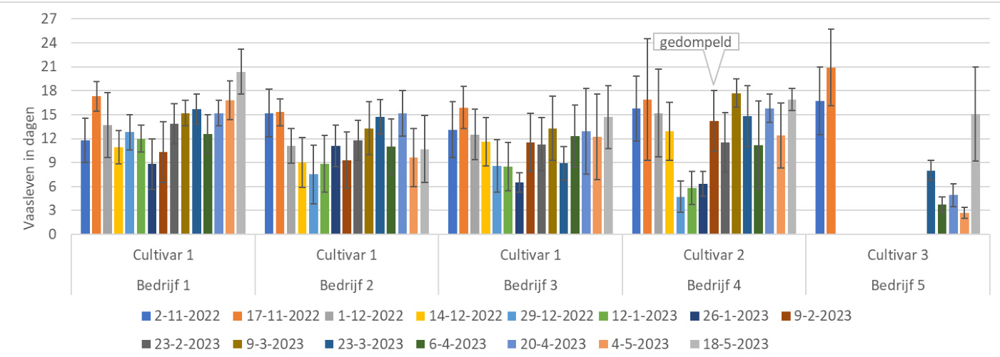  
图1  在试验期间每家公司按采摘日期计算的花瓶寿命（天数）。 2023年2月19日，测试玫瑰的花蕾在采摘后被公司4浸泡以防止灰霉病。  

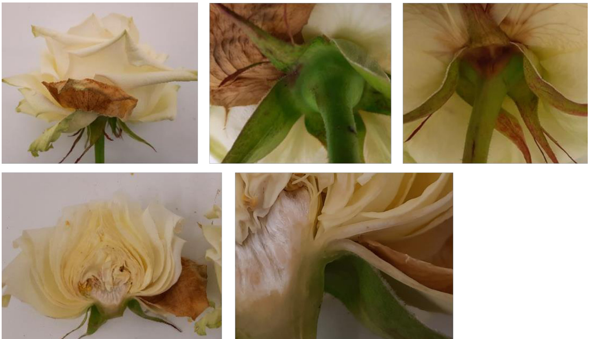  
图2  花瓣和萼片与花底的连接处的损害，进一步扩散到花瓣的腐烂。  

# 3.2.2 花蕾颜色  

对于品种1，种植者用评分 $(1~{\sf t}/{\sf m}~10,$ 来评估他们玫瑰的花蕾颜色，其中10表示红色品种的完美颜色，鲜红色。较暗的花蕾会导致较低的评分。在这三家公司中，观察到12月的花蕾颜色稍微较差且波动，从1月开始变得更好且更稳定（图3）。从第50周开始，使用SON-T照明的时间也增加，从而提供了更高的PAR总量。公司1表示，从第47周开始，由于天气变冷，花蕾的形状和颜色变得不那么美观。在第4.2章中将深入探讨公司之间与环境因素相关的差异。  

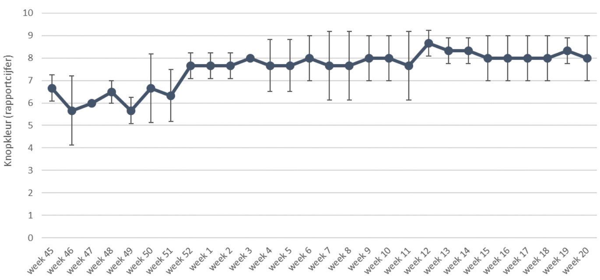  
图3  红色品种的花蕾颜色变化，按相关种植者的评估，平均值为公司1、2和3。  

# 3.2.3 花青素含量  

作为指示，1月23日测量了花青素含量（图4）。公司2当时相对于公司1和3有较多的紫色叶片和较暗的花蕾。绿色和紫色叶片是分开测量的。紫色叶片的花青素含量几乎是绿色叶片的两倍。此外，公司2的紫色叶片的花青素含量高于其他公司的（较少紫色的）叶片。从2月到3月，比较了各公司的平均含量（未单独计算绿色和紫色叶片），但未能显示出公司之间的差异。对花和叶中的营养物质及花中的糖进行的一次性分析显示，公司2（紫色较多）的花中相对含有更多的氮和更少的糖（葡萄糖和果糖），而在叶片中则含有更少的干物质和更多的硼和钙，与公司1和3相比。公司2较暗的花朵中糖的较低含量与糖积累的假设不符，尽管对于叶片和花朵作为源和汇可能是不同的。成熟度也可能影响，生长中的花蕾颜色较暗。样本数量太少，无法得出结论。种植者的经验表明，紫色叶片和暗花蕾并不总是同时出现。在第4.2章中将深入探讨导致花蕾颜色变暗的可能原因。  

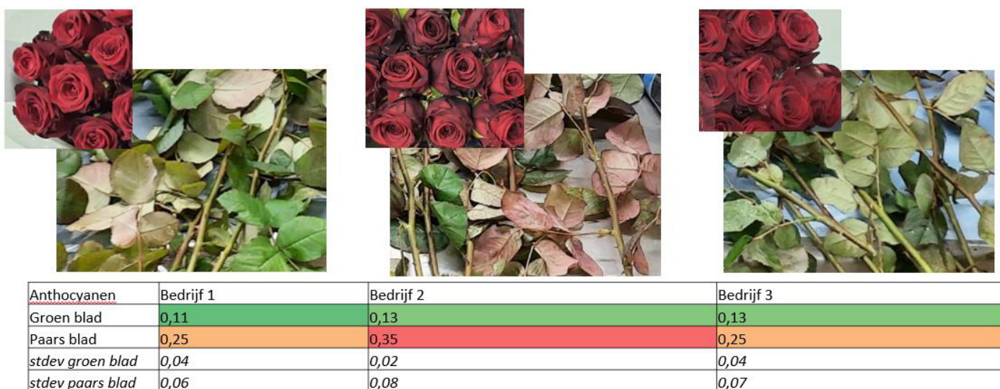  

图4  2023年1月23日用MultiPigmentMeter 100进行的叶片花青素测量。  

# 3.2.4 花蕾形状  

Red Naomi!的不良花蕾形状是指内层花瓣未能很好地向外展开，内层花瓣的发育异常导致花瓣变形。这种情况被称为“旋转心”。在“球形”中，内层花瓣特别饱满，导致内层花瓣在顶部重叠，形成心中的小球（{Gelder, 2015 #451}）。品种1的种植者在试验期间对花蕾形状进行了评分（图5）。在12月中旬，花蕾形状的评分较低，而从第2周开始，花蕾形状又得到了改善。第51周是最关键的一周，公司1和2都给自己的花蕾形状打了相对较低的分数。公司2在第1周也给自己打了相对较低的分数，而公司1则恢复到了正常水平。实践经验表明，使用SON-T照明时，花蕾形状比使用LED时更好。此外，一些种植者认为，在蒸发量较少且水分供应不足的情况下，较差的花蕾形状更常见，导致基质通常较湿。公司2提到，夏季高光照与低温的组合导致了不稳定的花蕾形状，如果使用SON-T来使作物升温，则会有所改善。  

在花瓶中（第7天），10朵测试花中旋转心的数量从0到8不等。这种变化在公司之间以及公司内部和整个季节中都存在，没有明显的趋势。球形花蕾的出现频率低于旋转心，测试花中0到3朵出现球形花蕾。在这里也没有观察到趋势。  

值得注意的是，种植者评估中的时间趋势（图5）并未在花瓶寿命测试中反映出来。可能在某些花朵中，变形在采摘阶段就已可见，因此这些花朵已被筛选掉，从而不再成为常规分拣的玫瑰的花瓶寿命测试的一部分。  

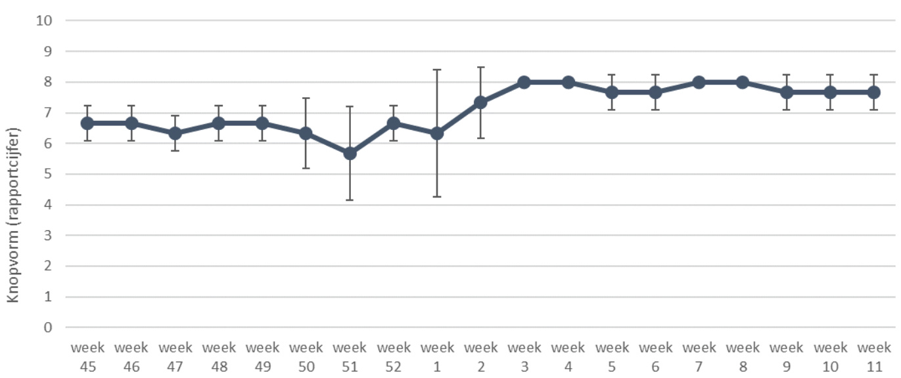  
图5  红色品种的花蕾形状变化，按相关种植者的评估，平均值为公司1、2和3。  

# 3.2.5 花蕾高度  

花蕾高度在各公司之间显示出大致相同的趋势，在第5周和第6周之间，所有公司都出现了花蕾高度的下降。经验表明，在采摘结束时，花蕾高度通常会稍微变小，因此这与第7周初的情人节采摘相符。对于品种1，花蕾高度在整个季节中变化为3到 $4\mathsf{m m}$。值得注意的是，对于公司2，花蕾高度在第51周和第1周之间相对强烈增加 $(3\mathrm{mm})$，并在第6周再次下降。公司3在第47周和第49周之间以及第6周和第7周之间也出现了类似的快速增长。对于公司4（品种2），在第51周和第4周之间，花蕾高度增加了 $6m m$。公司5（品种3）在第12周开始新季节时，花蕾高度比第47周结束时高出 $8m m$。  

# 3.3 作物  

# 3.3.1 作物生长  

总体而言，种植者认为使用LED时生长更旺盛，且比使用SON-T时更少空秧。这个效果似乎与品种有关。特别是公司4的品种2在秋季出现了大量新芽，种植者认为作物过于茂盛。学习的重点是调整作物策略，通过更多的底部修剪来保持作物更开放。对于品种2，这种效果似乎不那么明显；公司1和2在整个试验期间都认为作物生长良好，只有公司2在第49周到第52周之间的评估较低。公司3仅在第20-21周对作物生长的评估略低于试验期间的其他时间。对于公司5（品种3），冬季种植的寒冷影响显而易见：在第44周出现了强烈的生长，逐渐减少到第48周的停产，随后在第12周再次逐渐增加，直到第20和21周出现强烈的生长。第2周，公司5开始进行部分修剪和部分弯曲。  

# 3.3.2 叶片大小和作物颜色  

作物的叶片大小和颜色的评分大致显示出相同的模式，只是作物颜色的变化比叶片大小稍微不那么极端。在公司5中，季节变化非常明显：在第12周的冬季停产后，叶片大小和作物颜色的评分都被评为非常高，并在4周后逐渐下降，直到第22周。  

对于公司 $1\mathrm{t}/\mathsf{m}3$，叶片大小和作物颜色的评分在第50周时最低，公司1指出较低的日温是原因。公司3认为，当使用更多的SON-T照明时，颜色会变得更好。在第3周，公司1的叶片大小再次被评为良好，而公司3在第10和第11周出现了下降，直到第15周才再次评估为良好。在公司1中，值得注意的是，在第44周，作物颜色的评分相对较低。在第5周，公司1提到叶片出现秋季颜色，其中部分枝条仍然是良好的绿色。  

# 3.3.3 白粉病和其他疾病的易感性  

白粉病的发生程度在各公司之间有所不同，但在年末的最后几周，除了公司5外，所有公司的发生率相对较高。在公司1中，峰值出现在第51周，比公司2早一周，而公司2在第5周仍有一个小峰值。公司3在几乎整个试验期间比公司1和2更容易受到白粉病的影响。公司3认为，使用SON-T时白粉病的发生增加，可能是由于更多的通风和因此在温室中产生更多的气流。公司1表示，在第11周和第18周，白粉病再次略有增加，经过尝试使用更多绿色药剂喷洒后。关于作物中其他疾病的易感性，没有特别的情况（在收获后描述的Botrytis见第3.2.1节）。  

公司5在第50周开始出现叶片变黄，在第52周和第1周“真的很多”。此外，在寒冷期间出现了一些蚜虫，但得到了很好的控制。从第11周开始出现白粉病问题，第13周时伴随出现了Botrytis和蚜虫。在第21周，Botrytis和蚜虫减少，但出现了蓟马。  

# 3.4 气候与能源  

# 3.4.1 热量输入  

总体而言，温室中的热量通过三种不同的方式引入：  

1. 通过阳光  
2. 通过灯具（LED或SON-T）  
3. 通过加热（作物下方或上方）  
这些热流在图28中为5家公司展示，针对第48周到第5周的平均日间，最关键的花卉质量时期。  
从图中可以看出以下几点：  
• 最高的热量输入发生在白天中间，当阳光照射和灯具点亮时。最低的热量输入发生在晚上，当灯具尚未点亮时。  
• 下部加热几乎均匀分布在整个日间。  
• 上部加热的使用仅在公司1中较高，并且在日间波动。其他公司几乎没有使用上部加热。  
• 公司4大约每4天进行24小时的照明。公司1-3最多照明20小时。  
• 在整个日间，阳光仅占总热量的一小部分。  

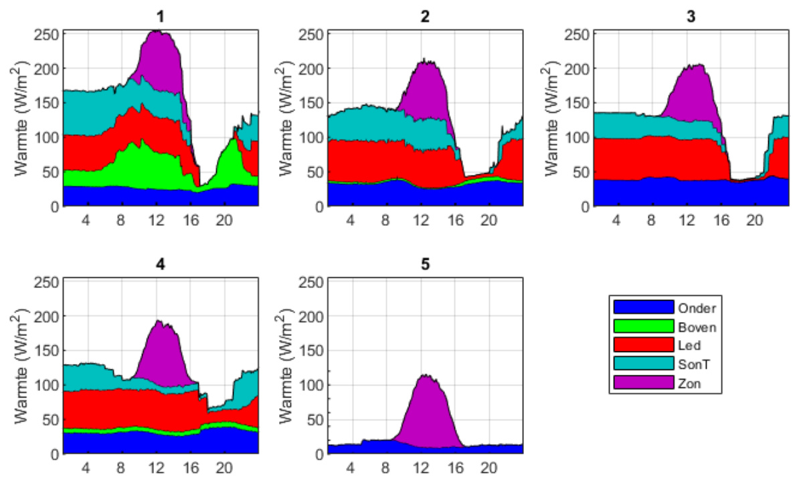  
图6  12月和1月（第48周至第5周）期间的热源的循环平均 $(W/m^{2},$ )。  

# 3.4.2 温度、PAR和VD  

PAR总量（光活性辐射，单位为 $\scriptstyle{\mathsf{m o l}}/{\mathsf{m}}^{2}.$）、日间温度 $(\mathrm{单位为}^{\circ}C)$ 和VD（湿度缺失，单位为 ${9/\mathsf{m}^{3}}$）在表2中为所有公司按周列出。公司中的颜色表示该公司每周的值与平均值的偏差（绿色为低，红色为高）。平均值的颜色表示该周的值与2022年第40周至2023年第20周的整个期间的偏差。日间温度和PAR的数量在图7中也以图形方式表示。  

除了公司5的较大偏差外，还可以观察到以下几点：  
• 在第5周，公司1-3的温度相对较高（与情人节有关）；  
• 在第1周之前，公司1的VD较高，之后公司4的VD较高；  

表2  每家公司每周的温室温度 $(^{\circ}C).$、PAR总量 (mol/m2.wk)、VD $(g/m^{3})$ 和外部温度 $(^{\circ}C)$ 及日照 $(W/m^{2})$。  

<html><body><table><tr><td rowspan="2">温度(°C)</td><td colspan="2"></td><td></td><td></td><td></td><td></td><td></td><td></td><td></td><td></td><td></td><td></td><td></td><td></td><td></td><td></td><td></td><td></td><td></td><td></td><td></td><td></td><td></td><td></td><td></td></tr><tr><td>周</td><td>w40w41w42w43w44w45w46w47w48w49w50w51w52w1</td><td></td><td></td><td></td><td></td><td></td><td></td><td></td><td></td><td></td><td>w2</td><td>w3</td><td>w4</td><td>w5</td><td>w6 w7</td><td>w8</td><td>w9</td><td>w10w11w12w13w14w15w16w17w18w19w20</td><td></td><td></td><td></td><td></td><td></td><td></td><td></td></tr><tr><td>公司1</td><td>19.4 19.6</td><td>19.4</td><td>19.7</td><td>19.6 19.7</td><td>19.3</td><td>19.8</td><td>19.4 19.6</td><td>20.0</td><td>19.2</td><td>19.4</td><td>19.6</td><td></td><td></td><td></td><td>19.7</td><td>19.5 19.5</td><td>19.0</td><td>19.3</td><td>19.2 19.5</td><td>18.9</td><td>19.5</td><td>19.3</td><td>19.9</td><td></td><td></td></tr><tr><td>公司2</td><td>17.5 18.7</td><td>19.3</td><td>20.4</td><td>19.6 19.3</td><td>18.8</td><td>19.1</td><td>18.1 18.0</td><td>18.8</td><td>20.1</td><td>19.5 20.0</td><td></td><td>19.8 19.7</td><td>20.0</td><td>20.1 19.9</td><td></td><td>19.6 19.6</td><td>19.7</td><td>19.9</td><td>19.8</td><td>20.2</td><td></td><td>20.0</td><td></td><td>20.8 20.4</td><td>20.7</td></tr><tr><td>公司3</td><td>18.3 18.9</td><td>19.3</td><td>20.1</td><td>19.1 18.6</td><td>17.3</td><td>18.5</td><td>17.4 18.6</td><td>19.8</td><td></td><td>19.7</td><td>19.3</td><td></td><td>20.3</td><td>21.1 20.3</td><td>19.5</td><td></td><td></td><td></td><td>20.2</td><td></td><td>20.2</td><td></td><td>20.5 20.7</td><td>20.5</td><td>20.8</td></tr><tr><td>公司4</td><td>18.5 19.0</td><td>18.8</td><td>20.0 18.9</td><td>19.8</td><td>19.9</td><td>20.4</td><td>19.6 19.0</td><td>19.4</td><td>18.5</td><td>18.2 17.8</td><td>17.4</td><td>19.6</td><td>20.1</td><td>21.0 20.1</td><td>18.5</td><td>19.6</td><td>19.4 19.0</td><td>19.2</td><td>18.0 18.9</td><td>18.8</td><td>18.7</td><td>18.9</td><td>19.9</td><td>20.9 20.0</td><td>20.5</td></tr><tr><td>公司5</td><td>16.2 16.7</td><td>16.7</td><td>17.6 14.5</td><td>13.8</td><td>11.3</td><td>11.6</td><td>7.9 6.7</td><td>6.8</td><td>18.6</td><td>17.7 18.6</td><td>17.8</td><td>17.8</td><td>18.5</td><td>18.7 19.3</td><td>19.2</td><td>19.2</td><td>20.1 19.2</td><td>19.3</td><td>19.0 19.3</td><td>19.1</td><td>19.0</td><td>19.4</td><td>20.1</td><td>20.0 19.8</td><td>20.0</td></tr><tr><td>平均</td><td>18.0 18.6 18.7</td><td></td><td>19.6</td><td>18.318.2</td><td>17.317.9</td><td></td><td></td><td>16.5 16.417.0 17.1 17.0 17.0 16.517.2</td><td>9.2</td><td>9.6</td><td>9.6 8.6</td><td>9.1</td><td>10.9</td><td>12.4 13.0 18.018.618.5</td><td>14.8</td><td>14.6</td><td>15.8 15.9 18.318.518.918.6</td><td>18.3 19.218.919.319.119.119.219.7</td><td>18.4 18.4</td><td>18.4</td><td>18.4</td><td>18.5</td><td>17.9 18.8</td><td>18.5 20.219.820.3</td><td>19.8</td></tr><tr><td>PAR(mol/m².week)</td><td></td><td></td><td></td><td></td><td></td><td></td><td></td><td></td><td></td><td></td><td></td><td></td><td></td><td></td><td></td><td></td><td></td><td></td><td></td><td></td><td></td><td></td><td></td><td></td><td></td></tr><tr><td>周</td><td>w40 w41w42w43w44w45w46w47w48w49w50w51w52w1</td><td></td><td></td><td></td><td></td><td></td><td></td><td></td><td></td><td></td><td>w2</td><td>w3</td><td>w4</td><td>w5</td><td>w7</td><td>w8</td><td>6M</td><td>w10w11w12</td><td></td><td></td><td></td><td></td><td></td><td>2w13w14w15w16w17w18w19w20</td><td></td></tr><tr><td>公司1</td><td>168 145</td><td>146</td><td>144</td><td>142 137</td><td>109</td><td>110</td><td>89 95</td><td>125</td><td>137</td><td>157</td><td>156 149</td><td>153</td><td>157</td><td>w6 160</td><td>166</td><td>174</td><td>166 164</td><td>163</td><td>181 165</td><td>153</td><td></td><td>169</td><td></td><td>152</td><td></td></tr><tr><td>公司2</td><td>104 101</td><td>126</td><td>131</td><td>116 126</td><td>119</td><td>113</td><td>91 96</td><td>120</td><td>144</td><td>144</td><td>166 154</td><td>155</td><td>171</td><td>154 180 180</td><td>167</td><td>178</td><td>178 171</td><td>169</td><td>170 155</td><td>148</td><td>166 152</td><td>156</td><td>172 163 166</td><td>168 176</td><td>186</td></tr><tr><td>公司3</td><td>115 105</td><td>115</td><td>116 114</td><td>129</td><td>102</td><td>103</td><td>92 101</td><td>113</td><td>110</td><td>126</td><td>135 131</td><td>165</td><td>177</td><td>183 150</td><td>137</td><td>147</td><td>154 157</td><td>131</td><td>129 139</td><td>138</td><td>142</td><td>154</td><td>182 161</td><td>162</td><td>208 183</td></tr><tr><td>公司4</td><td>109 100</td><td>90</td><td>96 88</td><td>115</td><td>157</td><td>131</td><td>118 122</td><td>123</td><td>127</td><td>152 135</td><td>135</td><td>129</td><td>145</td><td>155 156</td><td>156</td><td>171 171</td><td>177</td><td>171</td><td>197 201</td><td>201</td><td>193</td><td>184</td><td>210 180</td><td>188</td><td>197</td></tr><tr><td>平均</td><td>67 51</td><td>53</td><td>51</td><td>35 41</td><td>22</td><td>24</td><td>14</td><td>15 13</td><td>12</td><td>11</td><td>17 14</td><td>19</td><td>23</td><td>30 39</td><td>43</td><td>62</td><td>85 83</td><td>97</td><td>129 136</td><td>126</td><td>147</td><td>145</td><td>159</td><td>137 151</td><td>183</td></tr><tr><td>113</td><td>100</td><td>106</td><td>107</td><td>66</td><td>110 102</td><td>96</td><td>81</td><td>86 99</td><td>106</td><td>118</td><td>122 117</td><td>124</td><td>135</td><td>142 136</td><td>134</td><td>146</td><td>151 150</td><td>146</td><td>161 159</td><td>153</td><td>160</td><td>162</td><td>177</td><td>162 166</td><td>191</td></tr><tr><td>平均</td><td>外部温度(°C)</td><td></td><td></td><td></td><td></td><td></td><td></td><td></td><td></td><td></td><td></td><td></td><td></td><td></td><td></td><td></td><td></td><td></td><td></td><td></td><td></td><td></td><td></td><td></td><td></td></tr><tr><td>阳光(w/m²)</td><td>13.1 13.6 14.1 15.511.810.1 6.5</td><td></td><td></td><td></td><td></td><td>8.3</td><td>4.0</td><td>1.2 2.1</td><td>8.4</td><td>9.7</td><td>9.6 7.6</td><td>2.9</td><td>4.8</td><td>6.9 5.8</td><td>8.4</td><td>4.9</td><td>4.1 5.1</td><td>9.5</td></table></body></html>  

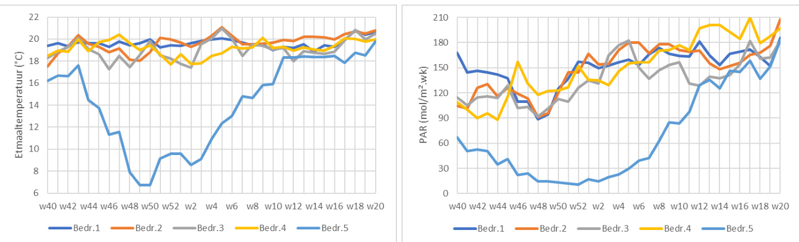  
图7  日间温度（左）和每平方米PAR总量（右）的变化，来自5家公司。  

温度与PAR的比率（RTR）在第48周到第5周的五家公司中显示在图8中。值得注意的是，公司5显示出非常陡峭的线。这是由于几乎没有加热，且日间温度直接受到辐射量的影响。其他公司加热更多，因此线条较平坦。 ${\mathsf{R}}^{2}$表示回归线的代表性。在公司2和3中相对较高（ $61\%$ 和 $30\%$ ），但在公司4和5中非常低（ $11\%$ 和 $2\%$ ）。这表明公司2和3的日间温度更依赖于PAR的数量，而公司4和5则不然。  

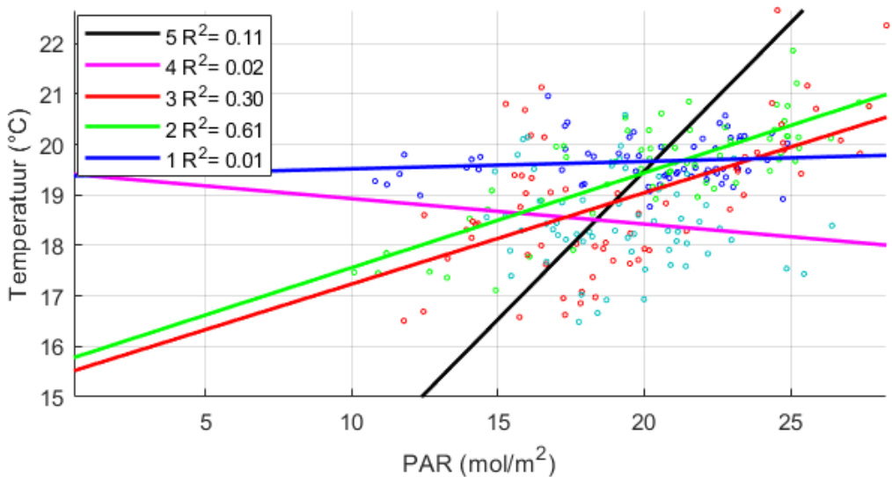  
图8  日间温度 $(^{\circ}C)$ 与PAR数量 $(m o l/m^{2}.d a g)$ 的比率，来自第48周到第5周的5家公司。  

# 3.4.3 屏幕使用、窗户开度和湿度  

高湿度或低湿度缺失（VD）增加了疾病的风险，缩短了花瓶寿命或导致生理性异常。这就是种植者采取措施尽可能排出湿气的原因，例如通过打开通风窗并结合拉开屏幕缝隙。这有时与光排放的法规相冲突，规定在夜间必须遮挡超过 $75\%$。对于光照强度超过15,000 lux的公司，适用更严格的规定，但使用RWB LED光谱时，照明强度必须超过 $385~\upmu\mathrm{mol}/(\mathsf{m}^{2}.5)$。 (https://www.waveformlighting.com/horticulture/convert-lumens-to-ppf-online-calculator)。在某些地区也会给予豁免，以便减少遮挡的要求。  

# 3.4.3.1 在照明夜间的屏幕缝隙和VD  

图9显示了四家公司在照明夜间的屏幕位置，以及当时的VD水平。首先引人注意的是屏幕策略的差异：公司1采用了一些固定的屏幕位置，而其他公司则在屏幕位置上变化较大。  

由于温室温度与外部温度之间存在较大差异（即较大的δT），因此更容易排出湿气，因此用颜色表示。风速可以通过标记的直径读取：风越大，圆圈越大。屏幕位置对VD的影响可以通过相同颜色的点在较高屏幕位置时VD的轻微下降来观察到。这在95%到 $100\%$ 的屏幕位置之间尤其明显。在 $80\%$ 到 $95\%$ 之间，这种影响则不太明显。这可能是由于屏幕调节的结果：在较低的湿度缺失下，拉开更大的屏幕缝隙。有时，较大的屏幕缝隙会导致VD增加，而有时，较低的VD会导致拉开更大的屏幕缝隙。在这种情况下，原因和结果并不总是明确。  

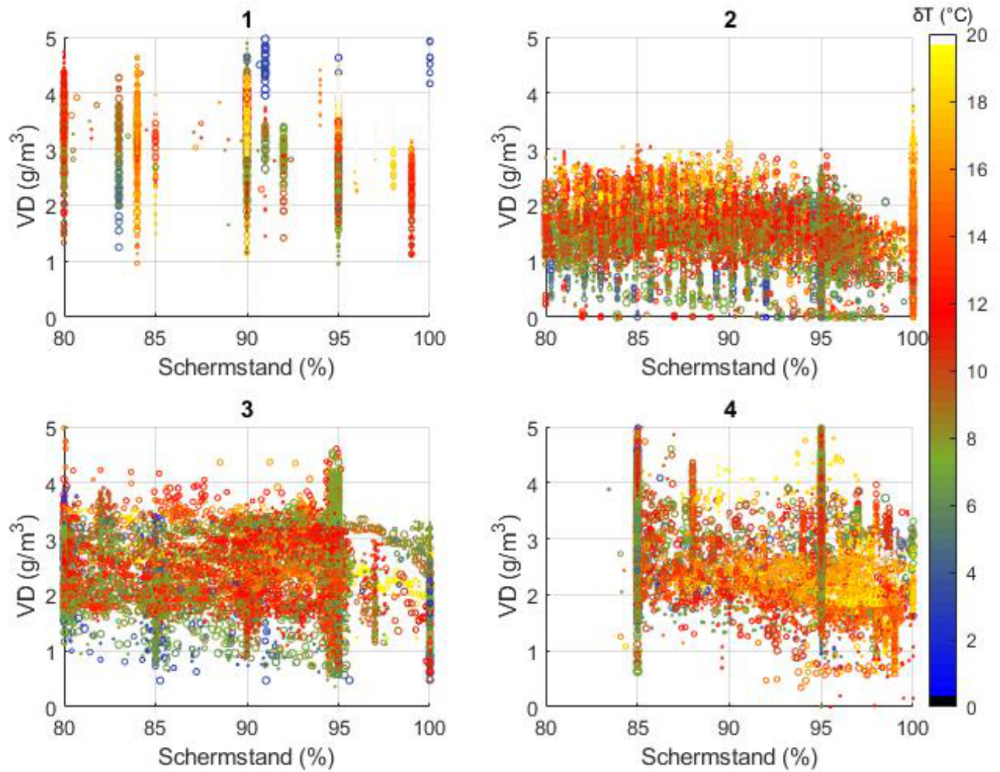  
图9  在四家公司中，VD与照明夜间的屏幕位置的关系，时间为10月1日至5月1日。颜色表示温室温度与外部温度之间的差异（δT）  

# 3.4.3.2 在照明夜间的窗户开度和VD  

窗户开度对VD的影响更为明显（图10）：窗户开度越高，VD越高。各公司之间的差异很大：公司2在相同的窗户开度下VD明显较低。这可能与测量箱的可靠性或位置有关。公司4的窗户开度高于其他公司。然而，趋势保持不变：窗户开度对VD的影响大于屏幕开度。然而，这并不意味着小的屏幕缝隙可以完全通过高窗户开度来补偿。空气交换及其湿气排出是由阻力最大的屏障决定的。  

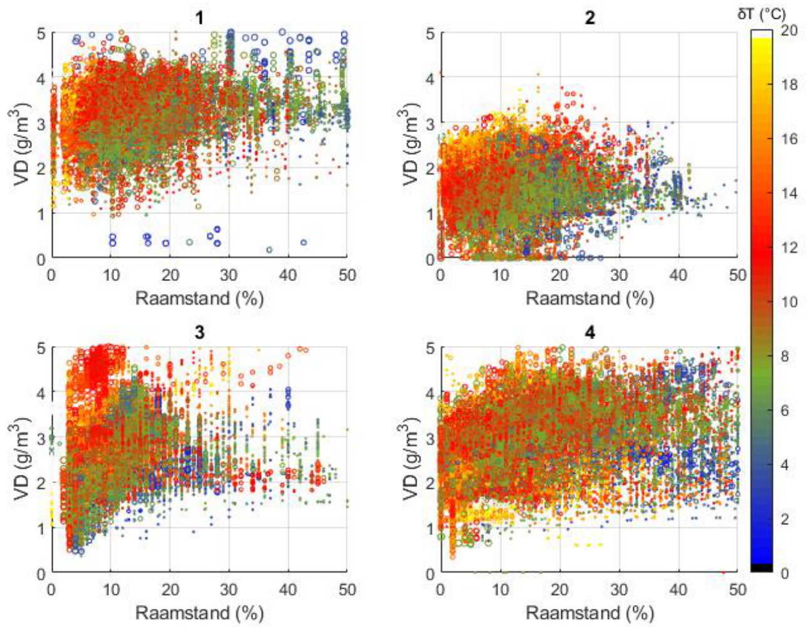  
图10  在四家公司中，VD与照明夜间的窗户开度的关系，时间为10月1日至5月1日。颜色表示温室温度与外部温度之间的差异（δT）  

# 3.4.3.3 推荐的屏幕缝隙与窗户缝隙的比例  

假设在温室和外部温度为20和 $10~^{\circ}\mathsf{C}$，VD分别为2和1 ${\sf g}/{\sf m}^{3}$的情况下，需要排出 $100~{\sf g}/{\sf m}^{2}$ .小时的水分。那么AV差为 $6.99/\mathsf{m}^{3}$，因此需要交换 $100/6.9{=}14.5\mathsf{m}^{3}/\mathsf{m}^{2}$ .小时的空气。通过5%的屏幕缝隙，空气需要以 $14.5/5\%^{*}2/3600=0.16\mathsf{m}/\mathsf{s}$ 的速度流动（注意：空气必须能够通过缝隙进出）。对于每 $^{20~\mathsf{m}^{2}}$ 的窗户，宽度为2.5米，高度为1.2米，在5%的窗户开度下，空气需要以 $14.5/(5^{0}/0^{*}1.2^{*}(2.5+1.2)/20)^{*}2/3600=0.72~\mathsf{m}/\mathsf{s}$ 的速度流动。为了在窗户和屏幕之间实现最佳的阻力分配，在无风的情况下，窗户缝隙的大小应为屏幕缝隙的 $0.72/0.16{=}4.5$ 倍。然而，在任何种植者中，这种情况很少发生。图11显示，屏幕缝隙与窗户缝隙之间的比例几乎总是大于1/4.5。这可能是由于高窗户开度在高风速下造成更多的不稳定（屏幕布的抖动，局部空气流动）。  

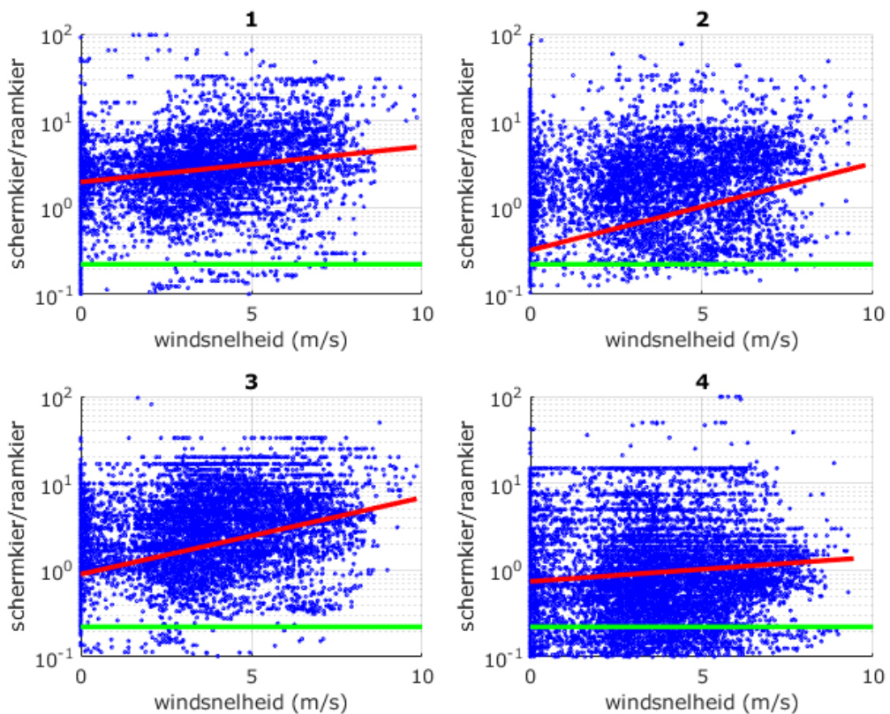  
图11  在照明夜间，屏幕缝隙与窗户缝隙的比例（对数）与风速的关系。红线是回归线，绿色线表示比例 ${\mathcal{I}}/4.5$。  

在无照明的夜间，屏幕缝隙/窗户缝隙的比例甚至更高（见图12）。红线的高度高于图11。在无照明的夜间，存在相互矛盾的利益：种植者希望降低作物温度。另一方面，必须尽量避免过低的蒸发，甚至在作物上形成凝结。为了降低作物温度，拉开窗户缝隙和打开屏幕是有帮助的。为了防止过低的蒸发或凝结，屏幕应尽量保持关闭，以便排出湿气，但尽量避免向寒冷的温室顶面辐射。  

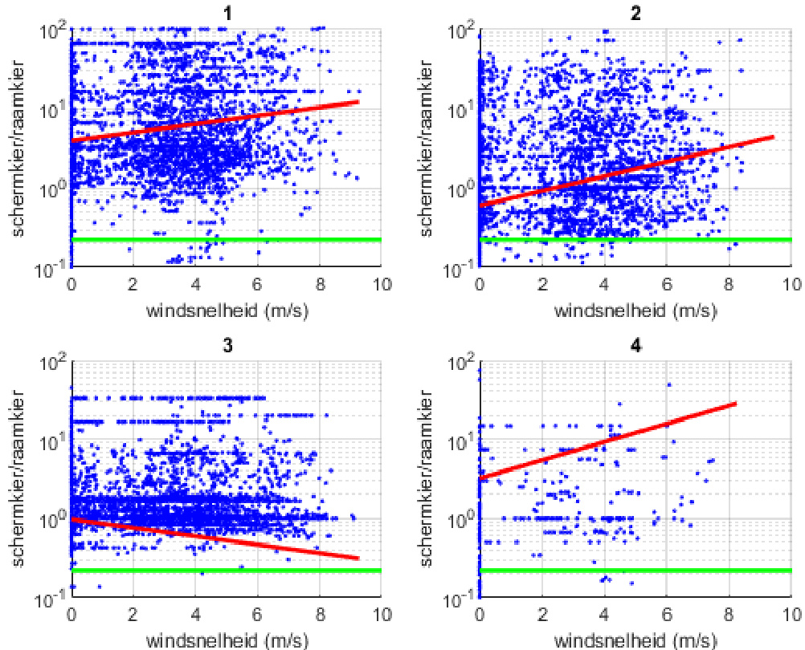  
图12  在无照明夜间，屏幕缝隙与窗户缝隙的比例（对数）与风速的关系。红线是回归线，绿色线表示比例1/4.5。  

# 3.4.4 水分吸收  

在四家公司中，水分吸收（灌溉量减去排水量；也称为作物吸收）在研究期间进行了监测（图13），并与每个日间的PAR量进行了比较（图14）。由于某些公司的测量在床中间的沟渠进行，而其他公司则在床边的沟渠进行，因此比较各公司的水分吸收变得困难。然而，可以分析每个公司每摩尔PAR的水分吸收变化。理论上，水分吸收与PAR之间的比例不应过低，以避免营养物质（包括钙）的吸收限制生长。图中显示，在质量关键期的1月1日，水分吸收并未落后于PAR的数量。到3月1日，每摩尔的水分吸收甚至低于1月1日的水平。  

因此，在该期间内刺激蒸发似乎对平均的营养物质吸收并不必要。然而，水分和营养物质的吸收在日间的分布可能导致瞬时短缺。瞬时水分吸收无法从灌溉量与排水量的差异中读取，但VD（蒸汽压差，见图18）确实提供了指示，显示植物与温室空气之间的蒸汽压差较低时，蒸发量较少。这主要发生在无照明的夜间。  

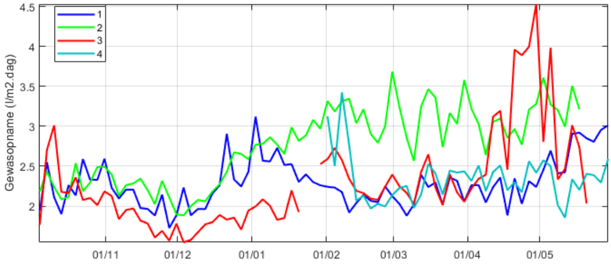  
图13  3天平均作物吸收 $(I/m^{2})$ （注意：公司4的数值在1月1日之前未在图中显示，因为当时的数值异常高）。  

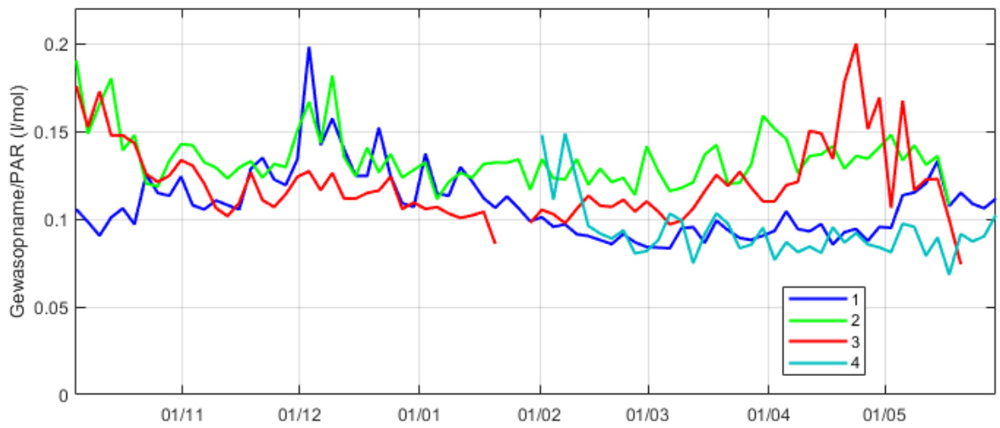  
图14  3天平均作物吸收 $(I/m^{2})$ 与作物上的PAR总量 $(m o I/m^{2})$ 的比例。  

# 3.4.5 凝结或滴水的风险  

凝结和滴水常被视为质量问题的原因。当空气湿度高且作物温度低于温室温度时，作物上会出现凝结（湿斑）。低作物温度是由于向寒冷的温室顶面辐射和温室温度上升速度快于作物温度造成的。  

# 3.4.5.1 辐射  

通过辐射监测器，可以计算外部温度、云量和屏幕使用对植物温度的影响。例如，在温室温度为 $18^{\circ}{\mathsf{C}}$、外部温度为 $5^{\circ}\mathsf{C}$、晴天、无屏幕或照明的情况下，辐射到温室顶面的热量可能为 $46~\mathsf{W}/\mathsf{m}^{2}$，因此作物顶部的温度平均会低于温室温度 $1.5~^{\circ}\mathsf{C}$。当VD低于 $1.4\:9/\mathsf{m}^{3}$ 时，凝结就会发生。由于辐射造成的凝结风险仅在不照明且屏幕打开时存在。关闭屏幕几乎可以将辐射减少一半，因此在发生凝结之前，可以接受上述VD减少一半。  

如果照明开启，通过灯具向作物提供 $50$ 到 $100~\mathsf{W}/\mathsf{m}^{2}$ 的热量。这几乎总是超过辐射到温室顶面的热量。  

在图15中，四家公司通过简单的公式计算出何时净辐射到温室顶面为正，颜色表示净辐射的强度。蓝色和黑色表示辐射较少或没有。红色和黄色表示辐射超过 $30\mathsf{W}/\mathsf{m}2$。这表明净辐射确实仅在屏幕打开且灯具关闭时构成风险。在许多情况下，可以看到净辐射在黑暗期开始时较高，但随着温室温度的下降，净辐射也降低。这不适用于公司4，在11月和12月期间，净辐射长时间保持较高水平。  

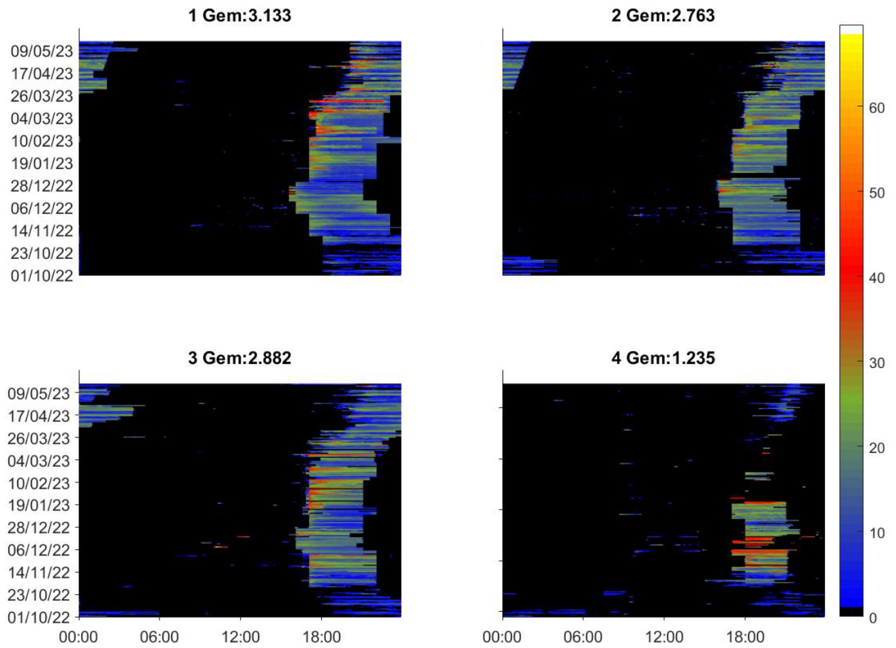  
图15  净辐射 $(W/m^{2},$ ) 在四家公司中，当其大于0时的情况。  

# 3.4.5.2 花蕾温度缓慢升高  

对于较重的花蕾，完全升温可能需要很长时间。作为经验法则，对于大花蕾，可以认为在一小时内，温室温度与花蕾温度之间的温差会减半。因此，如果温室温度突然从 $19^{\circ}\mathrm{C}$ 升高到 $21^{\circ}\mathsf{C}$，则花蕾温度在一小时后仍然只会升高到 $20^{\circ}\mathsf{C}$。当VD低于 $2.1~9/\mathsf{m}^{3}$ 时，温度为 $19^{\circ}\mathsf{C}$ 的花蕾会出现凝结。在一小时后，当VD低于 $1.1~9/\mathsf{m}^{3}$ 时，温度升高到 $20^{\circ}\mathsf{C}$ 的花蕾仍会出现凝结。  
在图16中，四家公司显示了温度每小时升高超过 $1^{\circ}\mathsf{C}$ 的时刻。颜色表示VD，其中蓝色表示低VD（低于 $0.59/\mathsf{m}^{3}$），黄色表示高VD（高于 $2~9/\mathsf{m}^{3}$）。值得注意的是，温度上升通常发生在灯具开启时（通常在午夜附近），但特别是在公司2中，早晨也可以看到温度相对快速上升。在大多数情况下，温度上升超过 $1^{\circ}\mathsf{C}$ 时，VD安全较高（红色或黄色），但也有一些时刻（绿色或蓝色）存在大花蕾上凝结的风险。  

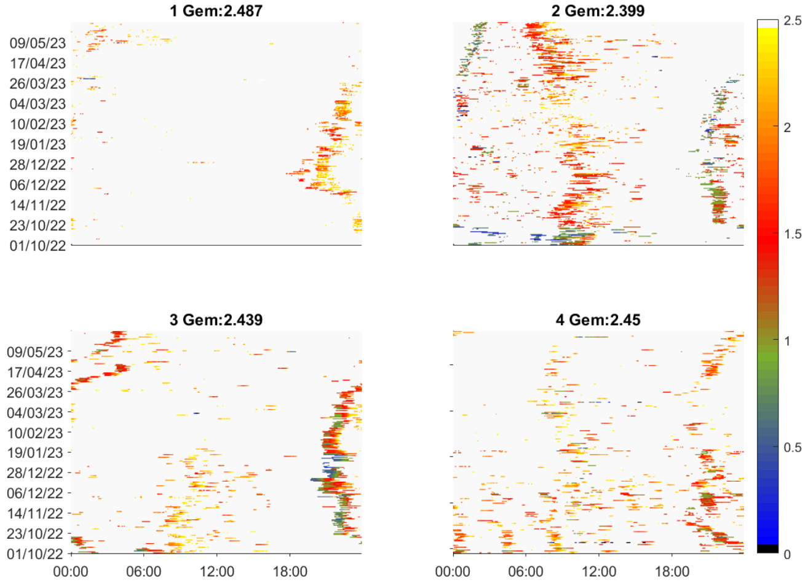  
图16  在四家公司中，VD $(g/m^{3})$ 在温室温度每小时升高超过 $1^{\circ}C$ 的时刻。VD大于 $2.5g/m^{3}$ 的时刻被排除在外。  

# 3.4.5.3 滴水  

滴水发生在蒸发量低于根压时。根压受到低EC和高根温的影响而增强。蒸发量由辐射量（包括光和热辐射）、气孔开度、空气流动量和VD决定。温室温度的下降通常是由于辐射能量的净流出大于输入，导致蒸发量减少，而根温在相对较长时间内仍然高于下降的温室温度。  

滴水的一个难题是下部加热的使用。作物下方的加热促进了作物的辐射、VD和空气流动，但也提高了根温，从而增加了根压。  

特别是在照明关闭时，下部加热通常是唯一的热源（见图6），这也是温度下降的时刻（见图17），VD较低且净辐射较高（见图15）。此外，气孔在黑暗中会关闭。所有这些因素都增加了滴水的风险。可以采取的措施来防止滴水包括（部分）关闭屏幕以限制辐射，并刺激空气流动（通风窗和风扇）以促进蒸发。  

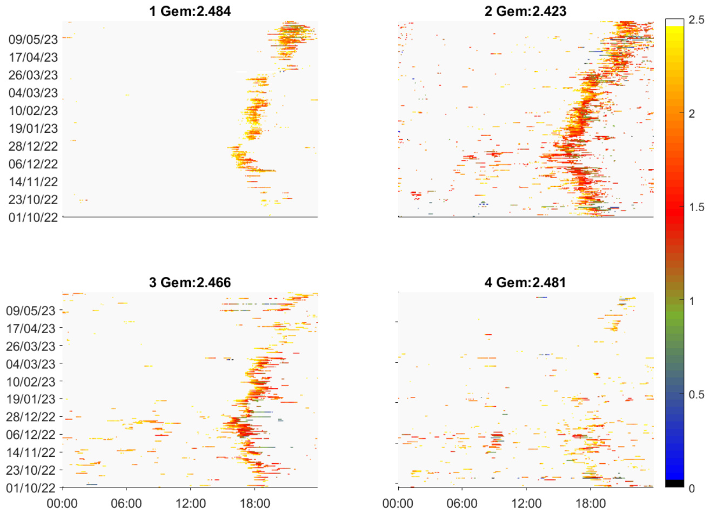  
图17 四个企业在温室温度每小时下降超过$\scriptscriptstyle1^{\circ}C$时的VD值$(g/m^{3})$。VD值大于$2,5g/m^{3}$的时刻已被排除在外。

3.4.6 花蕾和作物温度

# 3.4.6.1 企业1、2和3的VPD

在第3.4.5节中，基于温室温度、VD、幕布状态和外部气候（外部温度、风速、辐射和反辐射（pyrgeo））确定了凝结风险。另一种确定该风险的方法是VPD，该方法基于三个企业的作物温度（红外测量）、VD和温室温度（见图18）。这种确定VPD的方法的一个缺点是植物温度测量的可靠性。这些测量给出了一个平面的平均辐射平均值。如果该平面不具有代表性，或者植物温度计偏差一个或多个$^\circ\mathsf C$，则会产生不可信的数据。如果测量准确，则所有黑色标记的时刻都应发生凝结，但事实并非如此。然而，VPD确实提供了何时最有可能发生凝结的指示。正如第3.4.5节所述，无照明的夜间是凝结风险最大的时刻。

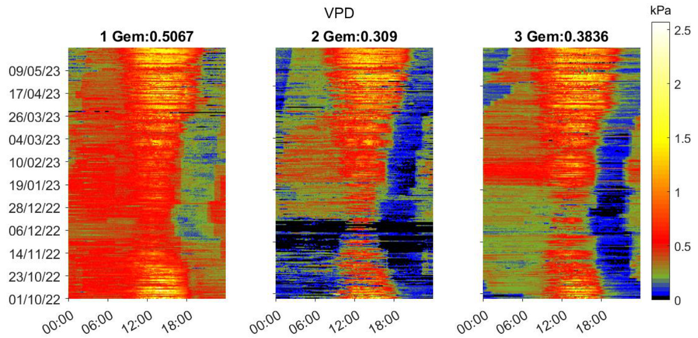  
图18 三个企业的VPD变化。

# 3.4.6.2 企业4的密集测量

如第2.3.2节所述，2023年2月至4月在企业4安装了额外的传感器，以监测花蕾凝结的风险。使用热成像相机比较了花蕾温度和作物温度之间的差异（见图19）。这种变化每天可能不同。一般来说，当进行照明时，辐射会到达作物，叶片和花蕾都会被这种辐射加热。由于叶片比花蕾更容易蒸发，辐射加热会通过更多的蒸发来补偿，因此叶片的温度会比花蕾低。这也可以在图19中看到，在所有照明的夜晚，花蕾温度都高于叶片温度。在3月1日和5日夜间，使用了相对较多的SON-T灯。SON-T灯提供了额外的辐射热，这表现为花蕾温度和叶片温度之间的更大差异。在3月16日使用了风扇。风扇刺激了蒸发，这应该主要导致叶片温度降低，但风扇也增加了对流热传递，从而减小了温室空气与作物（花蕾和叶片）之间的温差。总的来说，风扇对花蕾和叶片温度差异的影响似乎很小。

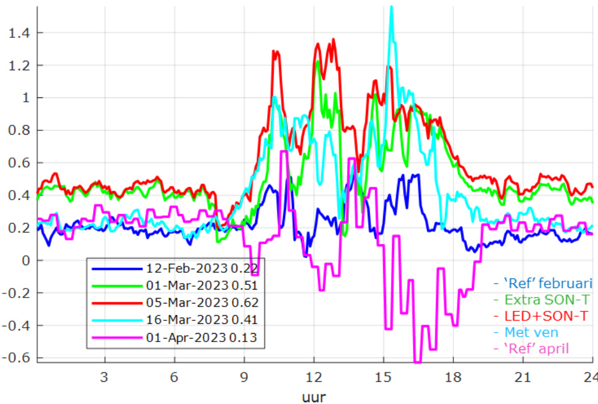  
图19 五个不同昼夜周期中花蕾温度与作物温度的差异。

在相同的几天中，还测量了花蕾温度与花蕾高度的露点温度之间的差异（露点赤字）。结果表明，这种差异几乎总是超过$3^{\circ}\mathsf{C}$。因此，花蕾凝结的风险似乎非常小。需要注意的是，除了2月12日外，所有日子都进行了24小时照明，因此花蕾几乎没有冷却。此外，凝结并不是Botrytis的唯一条件。即使在较高的相对湿度下，Botrytis也可以萌发和发展，因此通常需要较大的余量。最低的露点赤字发生在早晨打开幕布时和晚上温室温度下降时。

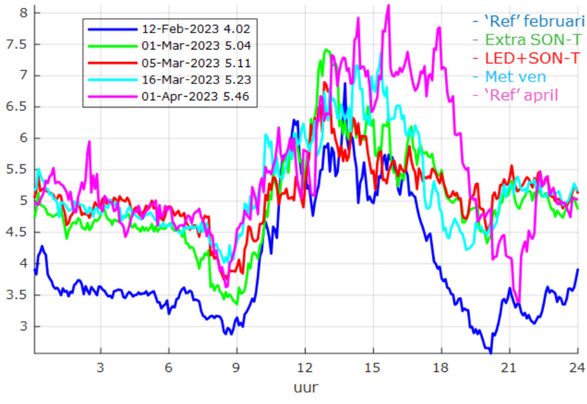  
图20 五个不同昼夜周期中花蕾温度减去花蕾高度的露点温度（露点赤字，单位为$^{\circ}C$）。

# 4 气候对花卉质量影响的分析

# 4.1 气候对瓶插寿命的可能影响

根据[Benninga et al., 2015]的研究，Red Naomi!的瓶插寿命受到充足的光照、较高的日温度、平均较低的相对湿度和温度波动（经常超过$20^{\circ}\mathrm{C}$）的积极影响。对于Avalanche $^+$，瓶插寿命差异的$50\%$可以通过夜晚的长度来解释：夜晚越短，气候越潮湿，瓶插寿命越差。文献研究[Garcia et al., 2016]强调了通过刺激气孔关闭来防止萎蔫的效果，例如通过足够长的夜间时段和低湿度的时刻。[De Gelder et al., 2015]的研究表明，充足的光照和干燥的气候以及足够的空气流动有助于防止Botrytis（灰霉病）。

如第3.2.1节所述，报废的主要原因是Botrytis的存在或花瓣的萎蔫。花瓣萎蔫是由于花朵通过茎部吸收的水分少于叶片蒸发的水分，而水分吸收困难也可能是由于花托中的Botrytis。错误的温室气候，特别是高湿度，通常是Botrytis的原因。

在其中一个品种中经常观察到花托腐烂的原因尚不清楚。在监测期间提出了多种假设。花托腐烂可能是由细胞衰弱引起的，Botrytis孢子容易侵入这些细胞。特别是钙吸收和分布不足会导致细胞壁衰弱。钙吸收受灌溉量和营养液成分（本研究未考虑）以及蒸发过程的影响。根压可能在此过程中扮演双重角色。积极作用是促进钙的吸收和分布，而消极作用则是衰弱的细胞壁无法承受压力而破裂。通过根压测量来验证这一假设不在本监测的目标范围内，但建议进行进一步研究。

# 4.1.1 PAR

图21显示了企业1、2和3的瓶插寿命与每周每$\mathsf{m}^{2}$的PAR总和。所有企业在年底前后都出现了低谷，企业2和3的瓶插寿命从第12周开始波动。

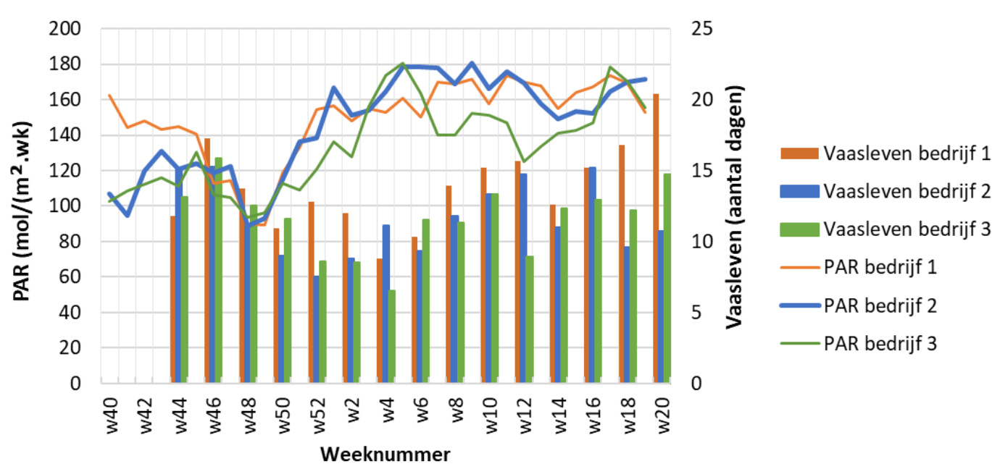  
图21 企业1、2和3每周PAR总和与每收获周瓶插寿命的变化。

# 4.1.2 温室气候的变化

为了确定瓶插寿命是否也可以通过湿度或温室温度的变化来解释，绘制了图22。企业2和4的温度变化与湿度变化之间存在很强的相关性。企业1的相关性几乎不存在$:\mathsf{R}^{2}{=}0.03\$，因为温度保持得非常稳定。瓶插寿命用颜色表示，可以看出图中高湿度变化通常显示为更黄的标记。这并不一定意味着高湿度变化与瓶插寿命之间存在因果关系，因为高湿度变化通常是由于晴天湿度大幅下降引起的。因此，可能不是高湿度变化，而是高PAR总和导致了更长的瓶插寿命。图中圆圈内的彩色区域表示LED在总PAR总和中的比例。黄色标记的圆圈内面积通常较小。也就是说，LED在PAR总和中的比例越小，瓶插寿命越好。但这里也尚未证明因果关系，因为当阳光充足时，LED的比例也较小，因此可能不是LED比例小，而是高PAR总和导致了更长的瓶插寿命。

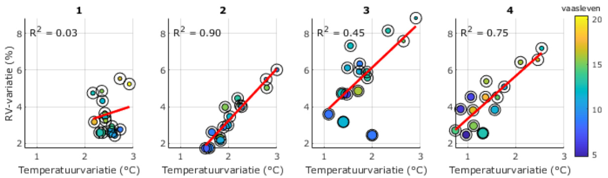  
图22 四个企业每两周的湿度变化与温度变化的关系，颜色表示每两周结束时的瓶插寿命，内圈面积表示LED在总PAR总和中的比例。

# 4.1.3 与温室气候的其他关系

为了分析导致瓶插寿命短的许多可能原因，在附录2中将瓶插寿命与各种因素进行了对比。LED在总PAR总和中的比例，根据标记直径估计为对瓶插寿命有负面影响，确实具有$10\%$到$27\%$的${\mathsf{R}}^{2}$（表示存在关系的程度）。然而，值得注意的是，照明中的SON-T在PAR总和中的比例（不包括阳光）显示出与瓶插寿命的负相关关系（${\mathsf{R}}^{2}$为$9\%$到$30\%$）。PAR总和与瓶插寿命呈正相关，但${\mathsf{R}}^{2}$为$3\%$到$14\%$，并不特别高。

这低于湿度变化的${\mathsf{R}}^{2}$（$11\%$到$37\%$；第二行），还发现相对湿度与瓶插寿命之间的${\mathsf{R}}^{2}$为$6\%$到$20\%$。日平均温度低于$15^{\circ}\mathsf{C}$的时间百分比与瓶插寿命呈负相关。只有企业2发现了轻微的正面关系，但这受到测量点的影响，该测量点是在夜间低温与测量初期高PAR相结合的情况下获得的。

企业2表示，他们的经验是较高的夜间温度会导致更多的腐烂花蕾。附录2显示，企业2没有发现这种关系，而其他企业则显示出夜间温度与瓶插寿命之间的正面关系。这种矛盾可以解释为腐烂花蕾并不是瓶插寿命报废的唯一原因。

企业1、2和3在附录2中的图表显示，夜间长度与瓶插寿命之间存在（轻微）正相关关系。企业4没有这种关系。

# 4.1.4 VD的变化
在第52周的瓶插寿命测量中，企业1的瓶插寿命明显长于企业2-4（分别为12.8天 vs 7.5天、8.6天和4.7天；见图1）。观察过去3周的气候数据，VD的变化尤为显著（图23）。企业1的VD值远高于其他企业，并且在夜间保持相对较低的VD值。企业3也在夜间降低了VD值，而企业2和4则在全天保持较为恒定的VD值。VD的动态变化可能对瓶插寿命有积极影响。

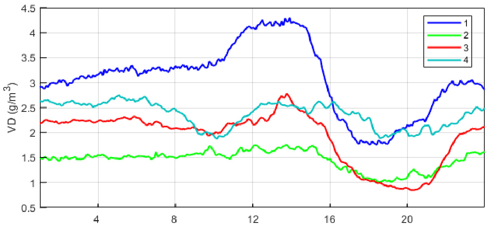  
图23 四个企业在第50-52周VD值$(g/m^{3})$的日平均变化。

在第4周的瓶插寿命测量中，企业2的瓶插寿命明显更高。企业1-4分别为8.8天、11.1天、6.5天和6.3天（见图1）。与第52周前的VD值（图23）相比，第4周前三周的数据（图24）显示企业2在白天VD值较高，夜间VD值较低。然而，这种策略并不能保证较长的瓶插寿命，如企业3所示：虽然白天VD值大幅上升，但瓶插寿命反而略短。

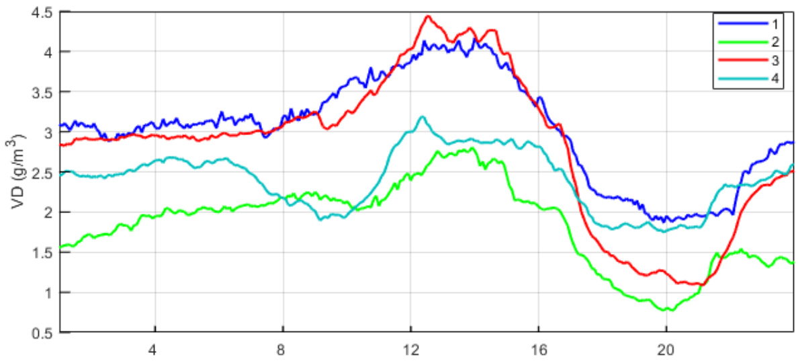  
图24 四个企业在第2-4周VD值$(g/m^{3})$的日平均变化。

# 4.2 花蕾颜色变暗的可能原因

为了了解哪些因素可以解释Red Naomi!花蕾颜色在企业间和季节间的变化，本章在文献综述后，将一些因素与花蕾颜色评分进行对比。较低的评分意味着花蕾颜色较深。首先分别讨论一些气候因素，但最终需要考虑多种因素的组合。种植者的经验表明，在寒冷的夜晚后几天，花蕾颜色会变深，而增加SON-T光照几周后花蕾颜色会改善。由于能源价格高企，在冬季，较低温度和较少光照的界限被探索，通常同时减少SON-T的使用。此外，SON-T的光照强度和光照总量通常较高，因为它通常作为LED的补充使用。温度、PAR总量、热辐射和光谱因此难以分开考虑。由于是主观自我评估，只比较企业间的趋势，而不是绝对值。

# 4.2.1 花蕾颜色和花青素形成的文献

在之前的研究"完美玫瑰"中，发现使用LED（红:蓝=96:4）和红:蓝:绿（87:8:5）光谱种植的玫瑰比SON-T种植的玫瑰在叶片、茎和花朵中产生更多的红/紫色变化，特别是在冬季植物温度过低时，会出现多刺、小叶和长节间的幼态特征{Gelder, $2017\#467$}。在LED光谱中添加白色和远红光（红:白:蓝:远红=77:9:5:9）显著减轻了这些症状，包括花青素的形成，但Red Naomi!的花蕾在冬季仍然比预期的要深。在从SON-T过渡到全LED时，建议在作物顶部使用加热管来定向加热（Arie de Gelder等，2022）。

在LED补光之前，实践经验表明，玫瑰的花蕾颜色在冬季低温时更容易变深，例如在寒冷的夜晚后几天。在相同PAR量的情况下，LED比SON-T和太阳产生的热量更少，因此在相同的日平均温度下，LED下的植物温度比SON-T低{Dieleman, $2020\#471$}。在"完美玫瑰"研究中，冬季的平均差异为$0.4^{\circ}{\mathsf{C}}${Gelder, 2017 #467}，{Terfa, $2013\#470$}提到差异为$1.5^{\circ}{\mathsf{C}}$。

花青素的产生和调节是复杂的。除了光谱和低（植物）温度外，其他因素也起作用。花青素的形成受到高光强、日光照总量、相对较多蓝光的光谱、低温、高${\mathsf{C O}}_{2}$水平以及氮或磷缺乏等因素的刺激。高温和相对较多远红光的光谱（低R:VR）则会抑制花青素的形成。效果取决于作物、品种和发育阶段，以及环境因素之间的相互作用（Hoogdalem & Garcia, 2023）。图25简化展示了影响花青素形成的因素（Hoogdalem & Garcia, 2023）。具体影响花青素形成的高低值取决于作物（种类和品种）、发育阶段以及环境因素之间的相互作用。例如，在低温下，相对较低的光强就足以刺激花青素形成，而在较高温度下，则需要更高的光强。糖的积累也会刺激花青素形成，因此相对较低的植物负荷也可能刺激花青素形成（Hoogdalem & Garcia, 2023）。

在玫瑰中，Terfa等（2013）发现LED下生长的叶片中糖、叶绿素和花青素含量高于SON-T下生长的叶片，他们认为这可能是由于LED光谱中蓝光比例较高（$20\%$ vs $5\%$），因为活性光敏色素（PSS）的相对量在LED和SON-T之间差异不大（分别为$89\%$和$86\%$）{Terfa, 2013 #470}。特别是在玫瑰的花蕾中，{Mor, 1990 #474}发现温度和光谱之间存在相互作用，特别是低温后几天内受到UV-B辐射会导致"花瓣变黑"（花蕾外表面出现黑色阴影）。这种情况主要发生在高辐射和寒冷夜晚的种植区，以及使用双层覆盖（丙烯酸和聚乙烯）的温室中{Marsbergen, $1976~\#475$}。标准玻璃会阻挡UV-B以及热辐射的传输，因此比丙烯酸或聚乙烯导致的花蕾温度更高，但这表明这是一个多因素的综合作用。在较早的文献中，当玫瑰在较低光强下种植时，也提到红色品种的花瓣边缘突然出现黑色、棕色或蓝色。这些主要发生在从温和温度和相对较低光强快速过渡到晴朗温暖天气并伴随凉爽夜晚的情况下。此外，在低钙水平下也观察到更多问题{Marsbergen, 1976 #475}。

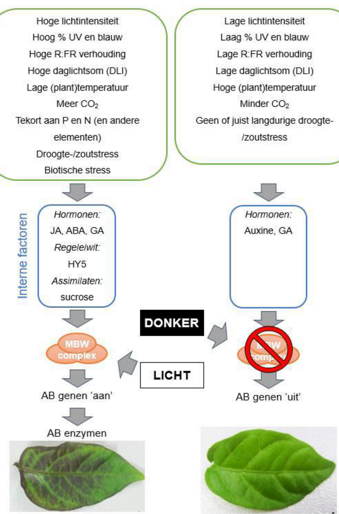  
图25 环境因素和内部因素调节叶片中花青素形成的概念框架（Hoogdalem & Garcia, 2023）。图中仅包含正文中提到的内部因素。更多信息见{LaFountain, 2021 #477}。

# 4.2.2 日平均温度

在整个试验期间，温室日平均温度的变化与花蕾颜色没有明显关联，只有企业2在11月和12月的日平均温度和花蕾颜色明显低于3-4月（图26）。这在表3中可以看出，企业2的日平均温度与下一周花蕾颜色评分的相关系数（r）为0.51。在附录3中，企业2的花蕾颜色评分与评分前一周的平均日平均温度之间的${\mathsf{R}}^{2}$为$0.39^{2}$。其他企业没有发现日平均温度与花蕾颜色评分之间的关联。也可能存在花青素对温度的抛物线效应，即偶尔的高温和低温组合会导致较差的花蕾颜色。

在2022年11月19日至20日夜间，所有企业都出现了温度下降。企业2和3在那周，企业1在下一周的花蕾颜色评分较低。在12月2日和3日的温度下降后，所有企业的花蕾颜色评分也较低。这些天的温室温度比$15^{\circ}{\mathsf{C}}$低约$10\%$至$30\%$，最低温度为$^{10,5^{\circ}{\mathrm{C}}}$（企业3）和14, $5^{\circ}\mathsf{C}$（企业1和2；图26）。

植物温度可能是比日平均温度更好的指标，但这些相关性也很低。企业1和2之间的差异可能解释为企业1在全年有更稳定的热量输入，主要来自上部的热量输入，以及更强的日平均温度整合。企业3的温度通常相对较低，冬季和春季之间的花蕾颜色差异较小，因此关联不太明显。有趣的是，4月底温度再次相对频繁地低于$15^{\circ}\mathsf{C}$，但这并没有导致花蕾颜色变差。除了温室中较高的PAR通常伴随着较高的温度外，温度、PAR总量和光谱在影响花蕾颜色方面可能存在相互作用。这将在接下来的段落中讨论。

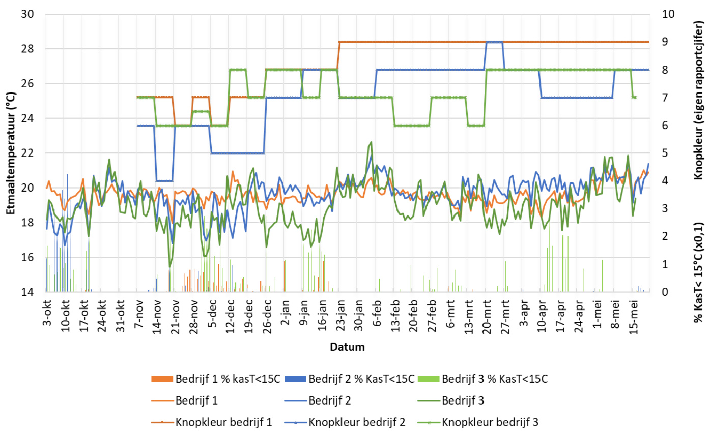  
图26 Red Naomi!在各企业的日平均温度变化和日平均温度低于$15^{\circ}C$的时间比例（以% x 0.1表示）以及花蕾颜色。

气候因素与下一周花蕾颜色评分的相关性。   

<html><body><table><tr><td>气候因素</td><td>企业1</td><td>企业2</td><td>企业3</td></tr><tr><td>PAR(mol/m2.天)</td><td>0,76</td><td>0,78</td><td>0,07</td></tr><tr><td>辐射(J/cm2.天)</td><td>0,45</td><td>0,27</td><td>0,35</td></tr><tr><td>总输入包括太阳(w/m2)</td><td>0,22</td><td>0,61</td><td>0,19</td></tr><tr><td>温室温度 (°C)</td><td>0,08</td><td>0,51</td><td>0,02</td></tr><tr><td>植物温度(°C)</td><td>0,15</td><td>*</td><td>-0,01</td></tr><tr><td>温室温度<15°C时间比例/天</td><td>-0,38</td><td>-0,26</td><td>0,01</td></tr><tr><td>植物温度<15°C时间比例/天</td><td>-0,22</td><td>*</td><td>0,05</td></tr><tr><td>总输入包括太阳(W/m2)/PAR总和比率</td><td>-0,63</td><td>-0,44</td><td>0,21</td></tr><tr><td>LED占比(PAR总和LED/PAR总总和)</td><td>-0,73</td><td>-0,51</td><td>-0,30</td></tr><tr><td>RTR²(日均温/PAR总和)</td><td>-0,76</td><td>-0,76</td><td>60'0-</td></tr></table></body></html>

相关性计算采用Pearson相关系数r。

# 4.2.3 温度与光照比率

如表3所示，在整个试验期间，花蕾颜色与日均温/PAR总和比率(RTR)的相关性比与平均日均温的相关性更强，特别是对于企业1和2（相关系数分别为-0.76和-0.78）。较高的RTR（相对于温度的光照较少）似乎经常（但并非总是）对花蕾颜色产生负面影响。

12月份，相对于温度的光照较少，所有企业的花蕾颜色都相对较深，尽管RTR的峰值并不总是与花蕾颜色的低谷同步。在第50周，企业3的花蕾颜色比其他企业改善得更快。这可能（部分）解释为企业3在前几周（第48-50周）由于在略低的日均温下进行更多补光，RTR较低。在2月/3月，企业3的RTR反而比其他企业略高，并且给自己打了相对较低的评分。

图27显示了PAR总和与日均温之间关系的示意图。可以看出，企业1和2的花蕾颜色评分较低（蓝色标记）主要出现在PAR总和和日均温都较低的情况下。低温和低PAR总和可能在影响花蕾颜色方面相互增强，但由于在本数据集中低PAR总和通常伴随着低日均温和不同的光谱（在低PAR时LED占比较高；图27中较大的圆圈），这一点并不明显。对于企业3，其他因素的影响似乎相对更大。以天为单位而非周为单位的花蕾颜色数据可能会提供更多见解，特别是结合红玫瑰的植物温度数据与PAR总和和光谱变化的关系。

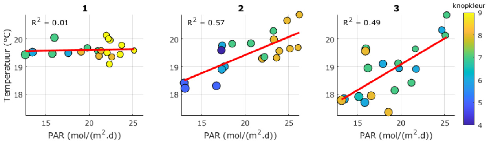  
图27 各企业PAR总和与日均温的关系，以周平均值为单位，颜色表示一周后的花蕾颜色评分。标记的直径表示LED在PAR总和中的占比。

# 4.2.4 各热源的热量输入

不同热源（太阳、下网、上网/OPAC、LED、SON-T；图28）的热量输入（单位：W/m²）变化显示，在花蕾颜色较差的时期，多个可能影响花蕾颜色的因素都不同。企业1的总热量输入（包括太阳）在花蕾颜色良好和较差的时期几乎没有差异。不同的是热源的比例：相对较少的阳光和补光，以及相对较多的上网热量。相对于温度的光照较少，且光谱中LED相对于太阳和SON-T的比例较高。LED在总PAR总和中的占比与花蕾颜色呈较高的负相关（表3：-0.73）。在整个试验期间，企业1的花蕾颜色似乎与PAR总和（0.76）和RTR（-0.76）的相关性比与总热量输入（通过太阳、上网和灯具进入温室的热量，单位：W/m²）的相关性（0.22）更强。需要注意的是，这些企业没有提供通过辐射损失的热量数据，这在夜间可能对植物温度很重要。

企业2的总热量输入（包括太阳）对花蕾颜色的影响（表3：0.61）似乎比企业1（0.22）更大，但企业2的花蕾颜色与PAR总和的相关性也最强（0.78）。光照越多，热量输入越高，相对于温度的光照越多，花蕾颜色似乎越好。第46周花蕾颜色的突然下降与其他企业相比可能有多个原因。与企业1相比，温室温度相似，与企业3相比更高，但补光较少，且LED相对于SON-T的比例高于企业1和3。在企业2，较高的光照总和通常也伴随着相对较高的日均温，尽管RTR与花蕾颜色的相关性同样高。LED在PAR总和中的占比似乎也对花蕾颜色产生负面影响（-0.51）。

企业3的影响不太明显，但值得注意的是，从第50周开始，随着SON-T使用频率增加，花蕾颜色有所改善。增加SON-T意味着更高的PAR总和、不同的光谱和来自上方的更高热量输入。从第12周开始，SON-T几乎不再使用，但并未对花蕾颜色产生负面影响。可能当时的太阳辐射已经足够高，可以保持良好的花蕾颜色。在企业3的计算相关性中，LED在PAR总和中的占比仍然最高（表3：-0.30）。植物温度低于15°C的天数通常也是外温较低的天数，对于企业3（-0.33）和企业1（-0.37）都是如此。对于平均植物温度，情况类似，但企业3与PAR总和、总热量输入（包括太阳）和LED占比的相关性更强（企业3分别为0.53；0.40和-0.44，企业1分别为0.24；-0.03和-0.32）。可能还有其他因素影响植物温度。

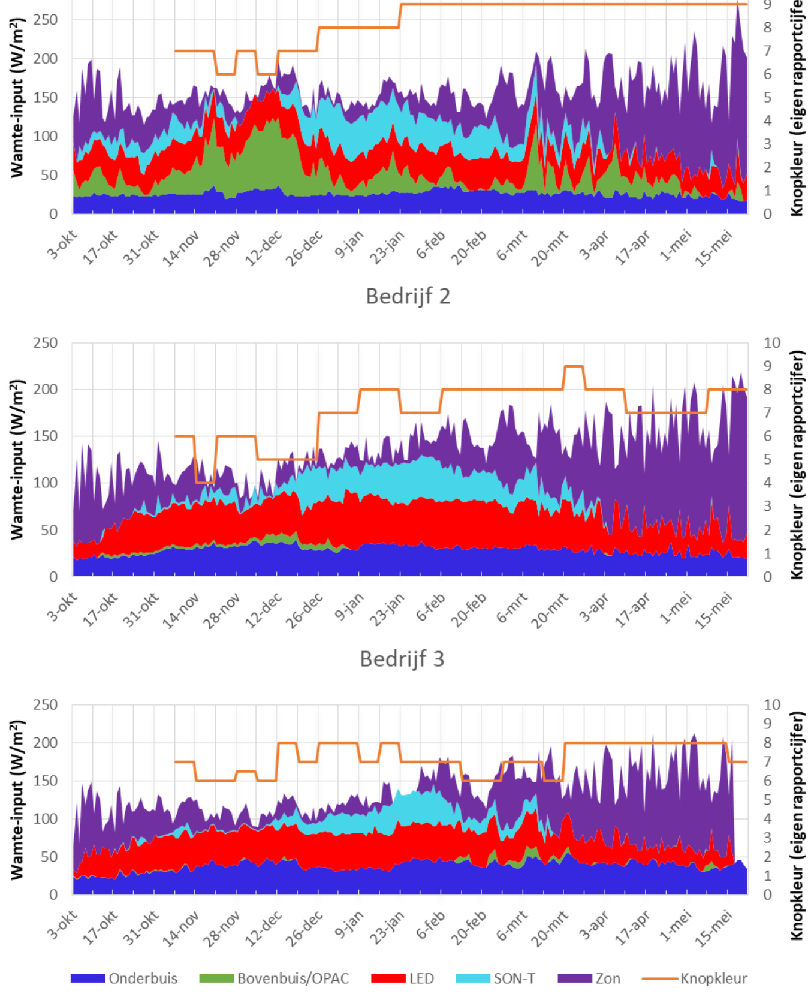  

图28 各企业不同热源的热量输入（单位：W/m²）变化及Red Naomi!花蕾颜色变化。

# 4.2.5 因素组合

为了更深入了解相关性，将不同因素与花蕾颜色进行了对比（附录3）。当将花蕾颜色与评估前一周的气候数据进行对比时，大多数相关性比评估当周或前两周更高。因此，在本分析中，始终使用评估前一周的气候数据。花蕾颜色每周评估一次。气候数据采用日均值。为了了解哪些因素可以解释花蕾颜色的变化，制作了散点图，其中趋势线及其对应的R值表示趋势线对数据点的拟合程度，按企业划分。

附录3显示，以下因素与企业3的花蕾颜色没有关联。但在企业1和2中，可以明显看到花蕾颜色与以下因素的关系：

• RTR（负相关）   
• 仅企业2的日均温呈正相关。企业1的日均温变化太小，难以证明与花蕾颜色的关系。  
• PAR总和（正相关）   
• LED占比（负相关）   
• 温室温度低于15°C的时间比例（轻微负相关）  

遗憾的是，RTR、日均温、LED占比和温度低于15°C的时间比例并不是相互独立的。因此，无法证明是单一因素导致花蕾颜色较差，还是多种因素共同作用的结果。企业3的低相关性表明，可能有完全不同的因素影响了花蕾颜色，尽管评分变化较小也可能有影响。

SON-T与LED的PAR总和比率对于企业1 $(\mathsf{R}^{2}{=}0,6)$ 和企业2 $(\mathsf{R}^{2}{=}0,4)$ 来说变得更加重要，相对较多的SON-T相对于LED能够带来更好的花蕾颜色。这可能是由于更高的PAR总和、热量输入以及光谱的综合影响。SON-T主要在能源价格较高时关闭，同时也意味着接近低温的极限。PAR总和比日平均温度更强的相关性可能解释为PAR总和涵盖了比单独温度更多的因素；在这组数据中，更高的PAR总和通常也意味着更多的热量输入、更高的植物温度、相对较少的LED以及不同的光谱。在冬季能源价格较高的几周内，极低的PAR总和通常伴随着较少的SON-T和较低的温度。由于存在许多相互作用因素，因子分析或偏最小二乘分析可能更合适，理想情况下应进行对照研究，其中可以单独研究各个因素，或至少涉及更多企业和花蕾温度测量、净辐射、光谱的连续测量、施肥和每日客观的花蕾颜色测量，但这超出了本研究的范围。还可以研究关键时刻和低温持续时间的变化与光和热辐射的关系。例如，几个寒冷的夜晚之后，在一天中的不同时间，光谱中相对较多的红光和较少的远红光的影响。

在整个试验期间，三个企业的PAR总和（正相关）和LED占比（负相关）与下一周花蕾颜色的相关性都高于日平均温度和温度低于$15^{\circ}\mathsf{C}$的时间比例。对于企业2，PAR总和和温度都显示出相对较高的相关性。就日平均温度对花蕾颜色的影响而言，在这组数据中似乎比PAR总和和LED占比的影响更有限，但可能存在一种相互作用，即低温仅与其他因素结合时才会对花蕾颜色产生影响。与总输入${\mathsf{W}}/{\mathsf{m}}^{2}$的相关性也高于温室温度，这与预期一致。

值得注意的是，根据文献，高PAR总和会导致花青素的形成，而在这组数据中，较低的PAR总和反而使花蕾颜色更深。重要的是，在这组数据中，较低的PAR总和与较少的阳光和SON-T以及相对较高的LED占比相关。结合发现的与LED占比的相对较高的相关性，这可能指向光谱效应。使用LED时，R:FR比率更高，根据之前的研究，这会导致更多的花青素形成，从而解释深色花蕾。

# 4.3 温室气候与花蕾高度或形状的关系

将第4.1和4.2节中提到的气候因素与一周后的花蕾高度（mm）评估进行比较，最多只显示出温度的相关性（见图29）。然而，企业2完全没有显示出这种相关性，而企业1的日平均温度变化太小，无法证明其相关性。关于LED在PAR总和中的占比，各企业的结果有所不同：企业3显示出正相关，而企业4显示出轻微的负相关。花蕾高度很可能由比过去一周更长时期内的气候因素决定。此外，由于净辐射的影响，温室空气温度可能与花蕾温度不同。

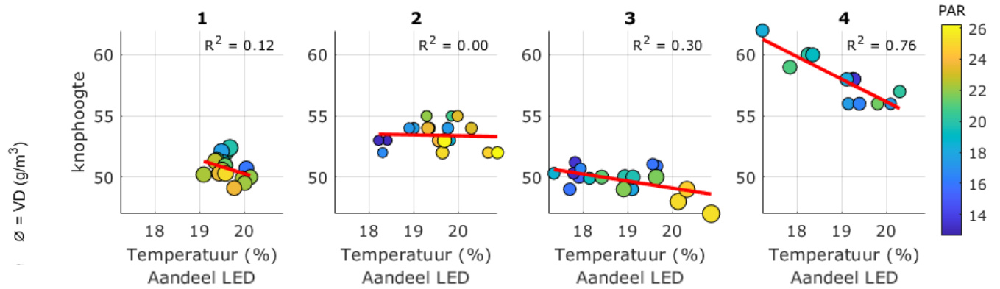  
图29 四个企业的花蕾高度，分别与前一周的平均温室温度（上）和LED在PAR总和中的占比（下）对比。颜色分别表示PAR总和和温度，直径表示相应周的平均VD和PAR总和。

花蕾形状与不同气候因素的相关性更强（见附录4）。对于大多数企业来说，花蕾形状与PAR总量和SON-T在照明中的占比呈正相关。LED在总PAR总和中的占比与企业1、2和3的花蕾形状评分呈负相关。温度和温度低于$15^{\circ}\mathsf{C}$的时间比例与花蕾形状没有显示出相关性。只有企业2显示出日平均温度与花蕾形状的相关性，但这可能与PAR总和和温度之间的相关性有关。RTR（从$12^{\circ}\mathsf{C}$开始的日平均温度除以PAR总和）与花蕾形状呈负相关。

# 5 结论与建议

# 5.1 概述

由于企业5的种植方式和气候条件特殊，其结果几乎没有包含在本报告和结论中。

从SON-T过渡到LED是进一步减少能源使用和光污染的重要一步，但在使用LED和封闭遮阳网的情况下，控制湿度和植物温度仍然是保持花卉质量和瓶插寿命的关键。

在跨年期间，温室中每天的大部分能量来自灯具。中午时分，太阳通常是主要的能源。在无照明的夜晚，底部加热是最主要的能源。部分出于价格考虑，部分出于质量考虑，SON-T灯具被定期使用。

使用植物温度计、温室温度计和企业相对湿度测量计算VPD并不能可靠地反映凝结风险。植物温度计不够代表性和/或可靠。参与该项目的玫瑰种植者已投资于更好地了解其企业的花蕾温度。

在本项目中，无法测量LED对蒸发或根压的影响。然而，可以合理推测，与SON-T和阳光相比，LED的光合作用与蒸发的比率更高。蒸发主要取决于温室中引入的能量。相对较低的蒸发需要采取措施提高每升水吸收的营养吸收。

根据参与种植者的说法，使用LED照明会导致更多的枝条生长。这导致作物生长过快过密，水分积聚在其中。

# 5.2 瓶插寿命与灰霉病

以下气候因素（收获前三周的平均值）对瓶插寿命影响最为显著：

• LED在总PAR中的占比以及SON-T在照明中的占比（=不包括太阳光的PAR）均与瓶插寿命呈负相关。瓶插寿命与PAR总和的相关性较弱。这意味着在相对阳光充足、照明较少的几周后，瓶插寿命会有所改善。
• 空气湿度的变化与瓶插寿命的相关性比平均湿度更大。
• 对于三家企业来说，夜间长度与瓶插寿命呈轻微正相关。

温室温度低于$15^{\circ}\mathsf{C}$的时间比例与瓶插寿命仅呈轻微负相关，有时甚至呈轻微正相关。相对湿度高于$90\%$的时间比例也是如此。这些因素似乎并不是导致瓶插寿命短的主要原因。这与高湿度会导致更多灰霉病从而缩短瓶插寿命的观点相矛盾。可能湿度与灰霉病之间的关系也取决于湿度的动态变化。

RTR（温度与PAR总和的比值）有时与瓶插寿命呈轻微负相关，有时呈轻微正相关，因此似乎对其影响不大。

在企业4的密集气候测量中，从未发现花蕾温度低于露点温度。由于灯具几乎一直开着，花蕾温度通常至少高出$3^{\circ}\mathsf{C}$。因此，玫瑰花蕾中的水分问题（灰霉病）的原因也应从相对较高的根压（如吐水）中寻找。此外，已知灰霉病的发展并不一定需要凝结。喷洒与水分排出不足相结合也可能导致作物长期处于湿润状态。最小的露点亏缺出现在打开遮阳网时（向冷温室顶辐射）和傍晚温室温度下降时。

# 5.2.1 建议/讨论

更多的阳光能提高保鲜性，但这对种植者来说几乎没有直接的切入点可以立即采取行动。可以研究阳光对保鲜性的积极影响是否是由LED和SON-T的光谱引起的，或者是否是由于阳光强度的波动导致湿度和温度的变化更大，而这种波动对保鲜性有积极影响。

尽管温室气候的动态变化与保鲜性呈正相关，但仍建议在低VD时不要过快（每小时$>1^{\circ}\mathsf{C}$）提高温室温度，因为缓慢升温的厚花蕾可能会变湿。

# 5.3 花蕾颜色、高度和形状

从文献中已知的花青素形成原因来看，本数据集中的结果似乎最指向高R:FR和低植物温度。较高的光强度和日光总和反而对花蕾颜色有积极影响（颜色较浅），尽管数据集不足以确定是否有一种相互作用，即低花蕾温度后接高光强度和高比例蓝光会导致花青素形成。${\mathsf{C O}}_{2}.$水平并不极端高。磷和氮的缺乏尚未研究。

仅在1号和2号企业中发现了种植者评估的花蕾颜色与测量的温室气候（评估前一周）之间的相关性。其中最重要的气候因素是：

• 包括太阳在内的热量输入$(\mathsf{W}/\mathsf{m}^{2}$ ) $(+)$ ; • PAR总和（mol/ $m^{2}$ .天） $(+)$ ; • LED在PAR总和中的占比$(\%)$ (-) • SON-T在照明中的占比$(\%)(+)$

就日平均温度而言，仅在2号企业中发现与花蕾颜色呈正相关，因为1号企业的周平均温度变化很小。对于两家企业来说，温室温度低于$15^{\circ}\mathsf{C}$的时间比例与花蕾颜色呈负相关。

深色花蕾的原因可能是多种因素的组合，其中PAR总和和光谱似乎比单独的日平均温度更重要。

对于Red Naomi!种植者来说，花蕾形状与LED在PAR总和（包括阳光）中的占比呈负相关，与PAR总量以及SON-T在照明总和（不包括阳光）中的占比呈正相关。

# 5.3.1 建议

根据我们目前所知，建议为了保持花蕾颜色，应避免低温和高比例LED（可能是高R:FR比）。

可以认为，影响花蕾颜色的主要不是温室温度，而是花蕾温度。可以通过在无照明的夜晚通过（双层）遮阳来限制辐射，必要时结合（小）遮阳网和窗户缝隙以充分排出水分，来防止花蕾温度过低。

为了确定较低R:FR的光谱或当前玫瑰光谱的特定应用（单独控制远红光）是否能进一步改善花蕾颜色并可能实现较低的花蕾温度，可以进行一项对照试验，在不同时间使用不同的R:FR比，并结合净辐射（花蕾温度）的梯度变化，同时每天客观监测花蕾颜色。

# 5.4 气候管理评估

在玫瑰种植中，我们追求花蕾周围的低湿度以防止灰霉病，以及较低的花蕾温度以获得更大的花朵。需要注意的是，较低的花蕾温度可能会对花蕾颜色产生负面影响。为了有效排出水分，天窗的开口（以百分比计）应该是遮阳网开口的四倍（见第3.4.3.3节）。在高风速时，天窗开口可以较小。特别是在使用双层遮阳网且开口较小的情况下，辐射受到限制，这可以补偿LED带来的较低净辐射。为了降低花蕾温度，遮阳网应尽可能完全打开。在企业4中已证明，使用LED而非SON-T照明会导致作物温度降低$0,4~^{\circ}\mathsf C$，花蕾温度比作物温度低$0,2^{\circ}{\mathsf{C}}$。本研究也未发现使用LED与花蕾高度之间存在负相关关系（见第4.3节）。然而，根据参与本项目的种植者反馈，使用LED后，LBE和花蕾大小都有所减小。

为了实现节能、无病且花朵较大的目标，需要回答以下问题：

• 如果使用LED虽然降低了花蕾温度，但导致花蕾形态变差和花蕾变小，这是否与LED的光谱有关？
• 促进蒸发的主要目的是什么？ $\bigcirc$ 输送更多养分（到新叶还是老叶？）； $\bigcirc$ 减少或控制根压； $\bigcirc$ 创造干燥气候以预防疾病（如灰霉病）。
不同的光谱可能会导致灯具效率降低，例如如果需要更多远红光。这时就需要在更好光谱带来的质量提升和每度电PAR减少的缺点之间进行权衡。

如果明确了促进蒸发的主要目的，那么就需要随时权衡在何处以及如何实现这一目标。

• 使用下部管道加热。促进养分向老叶输送，降低根压，并在下部创造干燥气候，但会增加老叶的蒸发，导致温室上部湿度增加。
• 使用上部管道加热或灯具的辐射热。促进养分向新叶和花蕾输送，降低根压，并在作物上部创造干燥气候，但也会使花蕾温度升高，并通过蒸发增加温室湿度。
• 关闭遮阳网。通过限制辐射，其效果与上部管道加热类似，但在完全关闭遮阳网时，会阻碍与外界空气的交换，导致蒸发的水分无法快速排出。
• 打开天窗。促进与外界空气的交换，但（特别是在遮阳网关闭时）可能导致遮阳网温度降低，从而在遮阳网上形成冷凝，同时增加净辐射。

这些选项之间的权衡将取决于种植者在花蕾温度、蒸发和节能方面的优先考虑。

# 参考文献  

Benninga, J., Barendse, H., Vermeulen, C., García Victoria, N., Raaphorst, M. & Hofland-Zijlstra, J (2015), 优质玫瑰种植. 检索自 https://edepot.wur.nl/330338   
Garcia Victoria, N., Slootweg, C. & Marissen, N. (2016). 高湿度条件下切花种植与品质保持. 检索自 https://edepot.wur.nl/394732   
Gelder, A. d. (2016). 蒸腾平衡：必要性与过度之间的平衡 - 当前项目中与水分相关现象的知识清单和分析 [1 在线资源 (PDF, 70 页): 插图]. 检索自 http://edepot.wur.nl/370951   
Gelder, A. d., Warmenhoven, M., Knaap, E. v. d., Baar, P. H. v., Grootscholten, M., Aelst, N. v., (2015). 完美玫瑰：节能种植 [1 在线资源 (PDF, 94 页): 插图]. 检索自 http://edepot.wur.nl/360568   
Gelder, A. d., Warmenhoven, M., Stoep, R. v. d., Hartog, B., Gelder, A. d., Warmenhoven, M., Hartog, B. (2022). 完美玫瑰的可持续种植：2020-2021年完美玫瑰研究 [1 在线资源 (PDF, 58 页): 插图]. 检索自 https://doi.org/10.18174/569124   
Hoogdalem, M. v., & Garcia, N. (2023). 绿色或红色作物：LED下的花青素形成和叶绿素分解 [1 在线资源 (PDF, 66 页): 插图]. 检索自 https://doi.org/10.18174/640072   
LaFountain, A. M., & Yuan, Y. W. (2021). 花青素生物合成的抑制因子. 新植物学家, 231(3), 933-949.   
Mor, Y., Zieslin, N. (1990) 紫外线诱导的玫瑰花瓣变黑. 环境与实验植物学 检索自 https://www.sciencedirect.com/science/article/pii/009884729090025Y   
Terfa, M.T., Solhaug, K.A., Gislerød, H.R., Olsen, J.E., & Torre, S. (2013). 高比例蓝光提高了杂交玫瑰的光合作用能力和叶片形成率，但不影响开花时间. 植物生理学 148(1):146–159  

# Literatuur  

Benninga, J., Barendse, H., Vermeulen, C., García Victoria, N., Raaphorst, M. & Hofland-Zijlstra, J (2015), Kwaliteitsplant Roos. Retrieved from https://edepot.wur.nl/330338   
Garcia Victoria, N., Slootweg, C. & Marissen, N. (2016). Snijbloemen telen bij hoge RV met behoud van kwaliteit. Retrieved from https://edepot.wur.nl/394732   
Gelder, A. d. (2016). Verdamping balans tussen noodzaak en overmaat: kennisinventarisatie en analyses van vocht gerelateerde fenomenen in lopende projecten [1 online resource (PDF, 70 pages): illustrations]. Retrieved from http://edepot.wur.nl/370951   
Gelder, A. d., Warmenhoven, M., Knaap, E. v. d., Baar, P. H. v., Grootscholten, M., Aelst, N. v., (2015). Een perfecte roos: energiezuinig geteeld [1 online resource (PDF, 94 pagina’s): illustraties.]. Retrieved from http://edepot.wur.nl/360568   
Gelder, A. d., Warmenhoven, M., Stoep, R. v. d., Hartog, B., Gelder, A. d., Warmenhoven, M., Hartog, B. (2022). Een perfecte roos is duurzaam geteeld: onderzoek perfecte roos 2020-2021 [1 online resource (PDF, 58 pages): illustrations.]. Retrieved from https://doi.org/10.18174/569124   
Hoogdalem, M. v., & Garcia, N. (2023). Groen of rood gewas: anthocyaanvorming en chlorofylafbraak onder LED [1 online resource (PDF, 66 pages): illustrations]. Retrieved from https://doi.org/10.18174/640072   
LaFountain, A. M., & Yuan, Y. W. (2021). Repressors of anthocyanin biosynthesis. New Phytologist, 231(3), 933-949.   
Mor, Y., Zieslin, N. (1990) U.V.-induced blackening of rose petals. Environmental and Experimental Botany Retrieved from https://www.sciencedirect.com/science/article/pii/009884729090025Y   
Terfa, M.T., Solhaug, K.A., Gislerød, H.R., Olsen, J.E., & Torre, S. (2013). A high proportion of blue light increases the photosynthesis capacity and leaf formation rate of Rosa $\times$ hybrida but does not affect time to flower opening. Physiol Plant 148(1):146–159  

# 附录1 数据记录

表1 试验期间气候和能源数据记录

<html><body><table><tr><td>记录项</td><td>单位</td><td>间隔</td></tr><tr><td>总辐射</td><td>W/m2</td><td>5分钟值</td></tr><tr><td></td><td> J/cm2.天</td><td>每日</td></tr><tr><td>温室温度</td><td>°℃</td><td>5分钟值</td></tr><tr><td>植物温度（如可用）</td><td>°℃</td><td>5分钟值</td></tr><tr><td>室外温度</td><td>℃</td><td>5分钟值</td></tr><tr><td>计算管道温度</td><td>D。</td><td>5分钟值</td></tr><tr><td>测量管道温度</td><td>°C</td><td>5分钟值</td></tr><tr><td>计算上部管道温度</td><td>°℃</td><td>5分钟值</td></tr><tr><td>测量上部管道温度</td><td>°C</td><td>5分钟值</td></tr><tr><td>计算生长管道温度（如适用）</td><td>°℃</td><td>5分钟值</td></tr><tr><td>测量生长管道温度（如适用）</td><td>°℃</td><td>5分钟值</td></tr><tr><td>温室相对湿度/绝对湿度</td><td>% 或 g/m3</td><td>5分钟值</td></tr><tr><td>遮阳网上方相对湿度/绝对湿度</td><td>% 或 g/m3</td><td>5分钟值</td></tr><tr><td>室外相对湿度/绝对湿度</td><td>% 或 g/m3</td><td>5分钟值</td></tr><tr><td>CO2浓度</td><td>wdd</td><td>5分钟值</td></tr><tr><td>CO2施用量</td><td>kg/ha.小时</td><td>5分钟值</td></tr><tr><td>照明1 SON-T</td><td>开/关</td><td>5分钟值</td></tr><tr><td>照明1SON-T</td><td>开</td><td>每日总时间</td></tr><tr><td>照明2 LED 1</td><td>开/关</td><td>5分钟值</td></tr><tr><td>照明2 LED 1</td><td>开</td><td>每日总时间</td></tr><tr><td>照明3 LED 2</td><td>开/关</td><td>5分钟值</td></tr><tr><td>照明3 LED 2</td><td>开</td><td>每日总时间</td></tr><tr><td>遮阳网位置1</td><td>% 计算值</td><td>5分钟值</td></tr><tr><td>遮阳网位置2（如适用）</td><td>% 计算值</td><td>5分钟值</td></tr><tr><td>遮阳网位置3（如适用）</td><td>% 计算值</td><td>5分钟值</td></tr><tr><td>灌溉量</td><td>1/m2</td><td>每日/每周</td></tr><tr><td>电力</td><td>购入+输送 kWh</td><td>每日/每周</td></tr><tr><td>热电联产</td><td>运行小时</td><td>每日/每周</td></tr><tr><td></td><td>燃气消耗</td><td>每日/每周</td></tr><tr><td>锅炉（如适用）</td><td>燃气消耗</td><td>每日/每周</td></tr><tr><td>热泵（如适用）</td><td>电力消耗</td><td>每日/每周</td></tr></table></body></html>  

# 附录2 与瓶插寿命的相关性

将4家企业的瓶插寿命与LED比例、相对湿度变化、相对湿度和前3周的PAR量进行对比。颜色含义在图表右侧标注，标记直径（⌀）的含义在图表左侧显示。

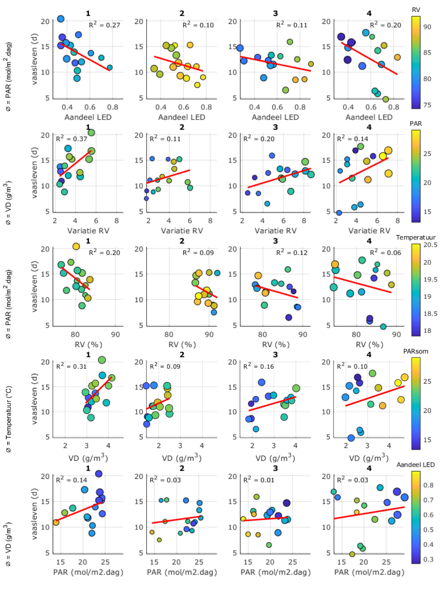  

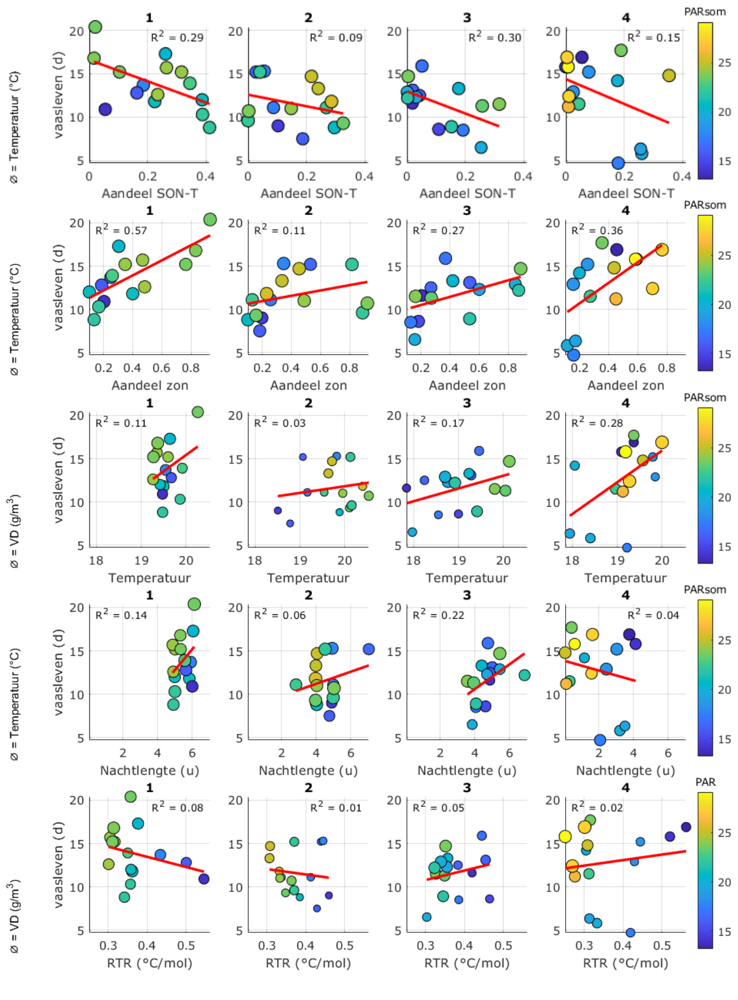  

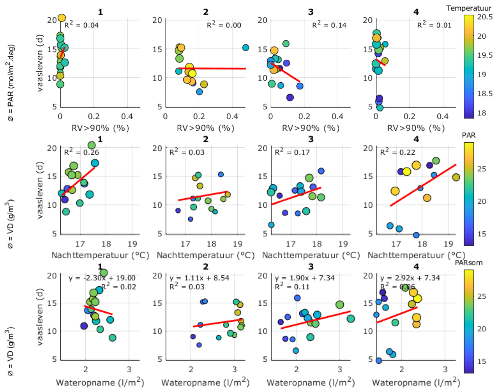  

# 附录3 与花蕾颜色的相关性

在以下图表中，将花蕾颜色评分分别与RTR（日平均温度-12 $(^{\circ}\mathsf C)/$ PAR总量 $(\mathsf{m o l}/\mathsf{m}^{2});$ 、日平均温度 $(^{\circ}\mathsf C)$ 、PAR总量和评估前一周的LED比例进行对比。颜色含义在图表右侧标注，标记直径（⌀）的含义在图表左侧显示。

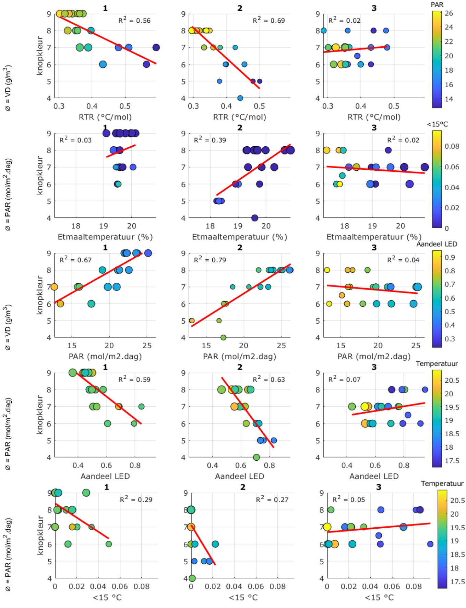  

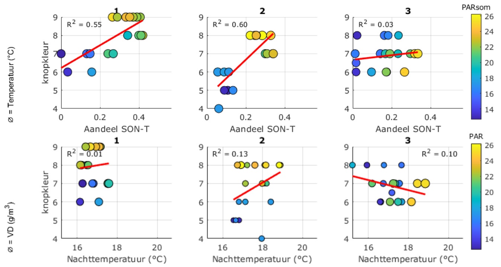  

# 附录4 与花蕾形态的相关性

在以下图表中，将花蕾形态评分分别与RTR（日平均温度-12 $(^{\circ}\mathsf C)/$ PAR总量 $(\mathsf{m o l}/\mathsf{m}^{2});$ 、日平均温度 $(^{\circ}\mathsf C)$ 、PAR总量和评估前一周温室气候中的LED比例进行对比。颜色含义在图表右侧标注，标记直径（⌀）的含义在图表左侧显示。

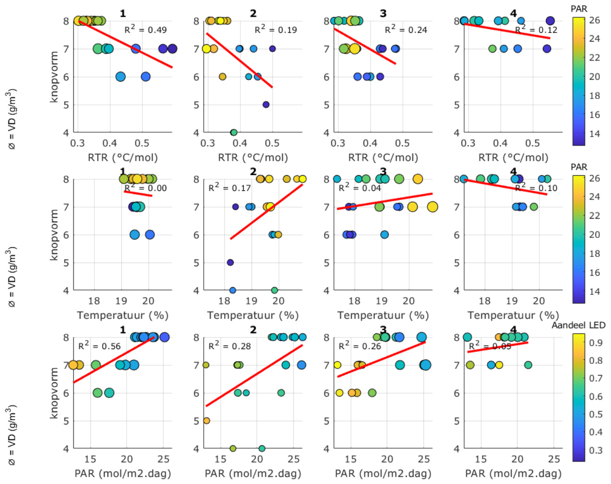  

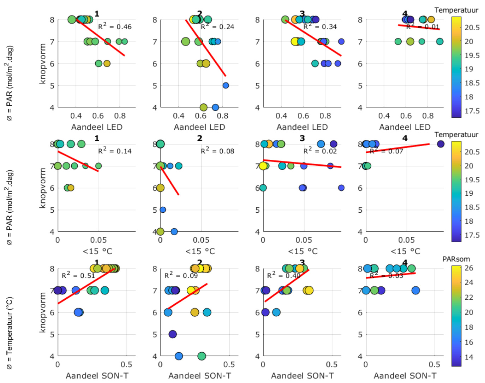  

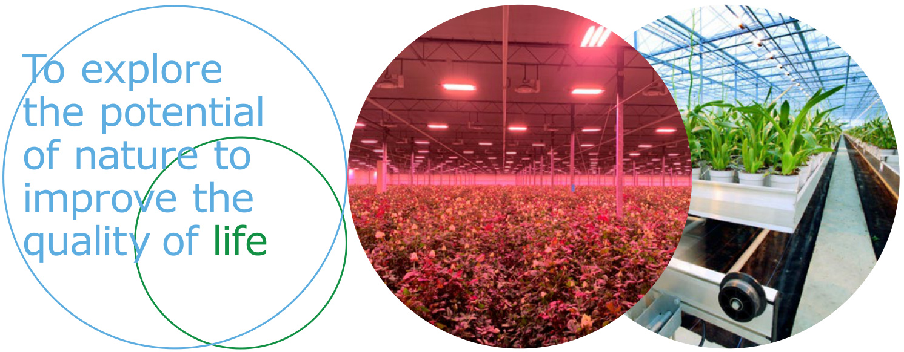  

瓦赫宁根大学与研究中心   
温室园艺部门   
Violierenweg 1, 2665 MV 布莱斯韦克   
邮政信箱 20, 2665 ZG 布莱斯韦克   
$\top+31$ (0)317 48 56 06   
E glastuinbouw@wur.nl   
wur.nl/glastuinbouw  

报告 WPR-1382  

瓦赫宁根大学与研究中心的使命是"探索自然潜力，提高生活质量"。在瓦赫宁根大学与研究中心，瓦赫宁根大学和瓦赫宁根研究基金会的专业研究机构携手合作，致力于解决健康食品和生活环境领域的重要问题。拥有约30个分支机构、7,700名员工（7,000 fte）、2,500名博士和工程博士候选人、13,100名学生和超过150,000名终身学习参与者，瓦赫宁根大学与研究中心在全球其领域内属于领先的知识机构。问题的综合方法和不同学科之间的合作构成了独特的瓦赫宁根方法的核心。