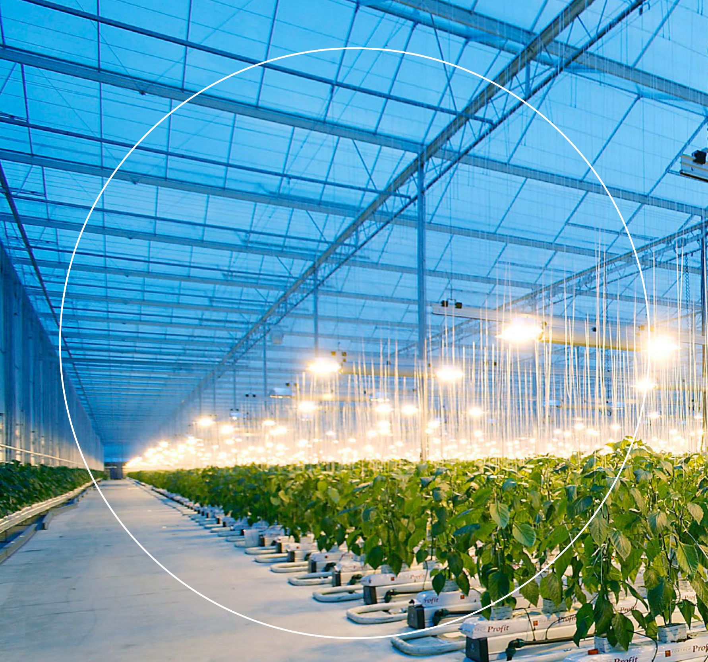  

Lichtwinst met hydrofiele glas coatings  

Vida Mohammadkhani, Bas Briaire, Khanh Pham  

# Referaat  

In de wintermaanden is het dak van een kas aan de binnenkant bijna altijd nat door condensatie. Hierdoor ontstaan waterdruppels welke lichtverlies kunnen veroorzaken. Juist op dat moment is de hoeveelheid licht de beperkende factor voor een goede productie. Daarom is van groot belang om het aanwezige licht zo optimaal mogelijk te gebruiken. Een hydrofiele coating biedt hier mogelijk een oplossing.  

Het is al bekend dat het aanbrengen van hydrofiele coatings op de binnenkant van een kasdekmateriaal tot reductie van lichtverlies kan leiden. Tot nu toe zijn meerdere hydrofiele coatingmaterialen, waaronder Titaandioxide, in laboratoria in schone omgeving met positieve resultaten getest. Echter er is weinig praktijkonderzoek hiernaar gedaan, dus in een niet-schone praktijkomgeving met organisch of anorganisch vuil op een kasdek.  

Middels het hier uitgevoerde onderzoek is het gedraag van drie hydrofiele materialen, een TiO2 coating van Full Boost en hydrofiele coating van Lumiforte en een hydrofiele zelfklevende folie van Fujifilm en hun mogelijk toegevoegde waarde voor Nederlandse kassen onderzocht.  

# Abstract  

During the winter months, the inside of a greenhouse roof is almost always wet. At that particular moment, the amount of light becomes the limiting factor for optimal production. Therefore, it is crucial to use the available light as efficiently as possible. A hydrophilic coating may offer a solution.  

This type of coating is used globally for its super-hydrophilic properties and to make surfaces self-cleaning. It is already known that applying a hydrophilic coating to the inside of greenhouse roof materials reduces light loss caused by condensation. So far, various hydrophilic coated materials, including Titanium Dioxide, have been tested in laboratories with positive results, in clean environments. However, there has been limited practical research conducted under non-clean conditions, specifically with organic or inorganic dirt on a greenhouse roof. Through the proposed practical research, the behavior of two hydrophilic coatings, TiO2 and Hydrophilic Glass coating from ReduSystems, plus self-adhesive Fuji film with self-cleaning properties, and their potential added value for Dutch greenhouses can be examined.  

# Rapportgegevens  

Rapport WPR-1401   
Projectnummer: 3742340800   
DOI: https://doi.org/10.18174/686758  

Dit project / onderzoek is mede tot stand gekomen in het kader van programma Kas als Energiebron, het innovatie- en actieprogramma van het Ministerie van LVVN en Glastuinbouw Nederland en mede gefinancierd door Stichting Kennis in je Kas.  

Wij bedanken Leo van Ammerlaan, Lumiforte, Full Boost (Uvatio) en Fujifilm voor hun bijdrage aan dit project.  

  

# Disclaimer  

$\circleddash$ 2025 Wageningen, Stichting Wageningen Research, Wageningen Plant Research, Businessunit Glastuinbouw Postbus 20, 2665 MV Bleiswijk T 0317 48 56 06, wur.nl/plant-research Kamer van Koophandel-nr.: 09098104 | BTW-nr.: NL 8113.83.696.B07  

Stichting Wageningen Research. Alle rechten voorbehouden. Niets uit deze uitgave mag worden verveelvoudigd, opgeslagen in een geautomatiseerd gegevensbestand, of openbaar gemaakt, in enige vorm of op enige wijze, hetzij elektronisch, mechanisch, door fotokopieën, opnamen of enige andere manier zonder voorafgaande schriftelijke toestemming van Stichting Wageningen Research.  

Stichting Wageningen Research aanvaardt geen aansprakelijkheid voor eventuele schade voortvloeiend uit het gebruik van de resultaten van dit onderzoek of de toepassing van de adviezen  

# Adresgegevens  

Wageningen University & Research, Businessunit Glastuinbouw   
Postbus 20, 2665 ZG Bleiswijk Postbus 644, 6700 AP Wageningen   
Violierenweg 1, 2665 MV Bleiswijk  Droevendaalsesteeg 1, 6708 PB Wageningen   
T $^{+31}$ (0)317 48 56 06 T $^{+31}$ (0)317 48 60 01   
wur.nl/glastuinbouw wur.nl/glastuinbouw  

# Inhoud  

Samenvatting 5  

1 Inleiding  

2 Materiaal en methodes 8  

2.1 Behandeling met hydrofiele coatings 8   
2.2 Bepaling van de lichttransmissie 9   
2.2.1 Lichtmetingen in lab, droge conditie 9   
2.2.2 Lichtmetingen in lab, natte conditie 9   
2.2.3 Lichtmetingen in kas 10   
2.2.4 Metingen vervuiling 11  

3 Resultaten 13  

3.1 Lichttransmissie, droge conditie 13   
3.2 Lichttransmissie, natte conditie 15   
3.3 Lichtmetingen in kas 17  

4 Conclusies 21  

Literatuur 22  

Bijlage 1 Lichtmetingen WUR Lightlab 23  

# Samenvatting  

In de wintermaanden is het dak van een kas aan de binnenkant vaak nat door condensatie, wat lichtverlies kan veroorzaken. Dit is problematisch omdat licht in deze periode een beperkende factor is voor een goede productie. Een mogelijke oplossing is het gebruik van coatings, die bekend staan om hun super-hydrofiele eigenschappen en zelfreinigende werking. Dit onderzoek richt zich op het effect van hydrofiele coatings op de lichttransmissie in kassen.  

Voor dit onderzoek werden drie soorten hydrofiele materialen getest: ${\mathsf{T i O}}_{2}$ coating van Full Boost (Uvatio coating MULTI-COVER), Hydrofiele coating van Lumiforte en zelfklevende hydrofiele folie van Fujifilm.  

Deze materialen werden aangebracht op helder glas en getest op hun hemisferische lichttransmissie in zowel droge als natte condities. De metingen werden uitgevoerd in het laboratorium en in een praktijkkas.  

Uit laboratoriummetingen blijkt dat hydrofiele coatings de lichttransmissie van glas onder natte omstandigheden verbeteren in vergelijking met standaard glas, dat onder deze omstandigheden $3,2\%$ lichtverlies ervaart door condensatie. De Fujifilm folie liet een toename van $2,8\%$ zien, de Lumiforte coating $1,4\%$ , en de Full Boost coating $0,9\%$ ten opzichte van het droge referentieglas. In vergelijking met het natte referentieglas waren de toenames dus in totaal $6\%$ , $4,6\%$ en $4,1\%$ onder natte condities. Afhankelijk hoe vaak het glas in een kas nat is kan in de praktijk meer of minder lichtwinst worden geboekt.  

Uit de tests in de proefkas blijkt dat, vergeleken met standaard glas, een hydrofiele behandeling aan de binnenkant van het glas de transmissie van het kasdekmateriaal verhoogt. Dit is vooral belangrijk voor de wintermaanden. Onder gelijke omstandigheden, bij schoon en droog glas als ook glas in natte condities, komen de meetresultaten uit de kas en het laboratorium goed overeen.  

De Lumiforte coating heeft zeer goede hydrofiele eigenschappen, wat zowel in het lab als in de kas is gemeten. Er werd een lichtwinst gemeten onder natte omstandigheden in het lab als ook in de kas. De Lumiforte coating liet ook onder droge condities en lichte lichtwinst zien, heeft dus ook onder deze omstandigheden geen nadelige effecten. De meetresultaten van het glas behandeld met de Lumiforte coating welke een jaar in de kas heeft gelegen, laat zien dat de coating minstens een jaar goed presteert.  

De Fujifilm folie had geen voordelen in lichttransmissie onder droge condities maar wel onder natte condities in lab en kas.  

De diffuse hydrofiele coating van Full-Boost verminderde de lichttransmissie na aanbrengen onder droge condities. Eventueel kan het diffuse licht een voordelig bijkomend effect hebben voor schaduwminnende planten, dat werd echter niet verder onderzocht. Ook deze coating liet onder natte condities een lichte lichtwinst.  

Gedurende deze proef was er weinig vuil en algen op zowel de Lumiforte als de Full-Boost coating geaccumuleerd. Deze ‘zelfreinigende’ eigenschap zou een positieve invloed op de gemiddelde transmissie van het kasdek op de lange termijn kunnen hebben, dit is hier echter niet onderzocht en behoeft een lange termijn praktijk proef.  

Tot slot, hydrofiele coatings verbeteren de lichttransmissie onder natte condities, met variabele prestaties afhankelijk van het type behandeling.  

# 1 Inleiding  

Condensatie is het proces waarbij een gasvormige stof, zoals waterdamp, overgaat in een vloeibare fase door afkoeling of drukverhoging. Dit gebeurt wanneer de temperatuur van het gas daalt tot onder zijn dauwpunt of wanneer de druk stijgt, waardoor de moleculen van het gas dichter bij elkaar komen en een vloeistof vormen. Als warme vochtige lucht afkoelt, zoals bij het contact met een koud oppervlak, kan waterdamp in de lucht condenseren tot waterdruppels, zoals te zien op glas in kassen. Condensatie in de vorm van druppels op het kasdek verstrooit invallende licht in verschillende richtingen en dit kan de lichttransmissie van de dekmateriaal aanzienlijk beïnvloeden. De mate van lichtverlies kan variëren afhankelijk van het type kasdek materiaal, relatieve luchtvochtigheid en temperatuurverschil binnen en buiten de kas. Bijvoorbeeld in de wintermaanden, wanneer het temperatuurverschil buiten en binnen kas dek hoog is, is er bijna altijd condens op het kasdek aanwezig. In het rest van het jaar kan de condensvorming voornamelijk in de ochtenduren of aan het eind van de middag plaatsvinden.  

De vorm van de condens, druppels of filmvorming, en de hoeveelheid die op een bepaald moment op het glas aanwezig is, zijn afhankelijk van de oppervlakte eigenschappen van het kasdekmateriaal. De vorm van het condens kan worden beïnvloed door deze eigenschappen van het materiaal te veranderen, bijvoorbeeld door gebruik te maken van een hydrofiel glasoppervlak. In dit onderzoek is gekeken naar het effect van hydrofiele behandelingen op de binnenkant van het glas op de lichttransmissie. Om verschillende varianten van hydrofiele behandelingen met elkaar goed te kunnen vergelijken, zijn alle behandelingen op helder glas met gelijke hemisferische lichttransmissie toegepast. De hemisferische lichttransmissie van de glasplaten is voor en na de behandeling gemeten. Er is ook kleinschalig kwantitatief onderzoek gedaan naar het zelfreinigende karakter van hydrofiele coating wat kan tot minder onderhoud van de kasdek materiaal leiden. Een verhoogde lichttransmissie in de kas zorgt voor meer natuurlijk zonlicht, en daarmee meer energie in de kas, naast meer licht voor gewasproductie.  

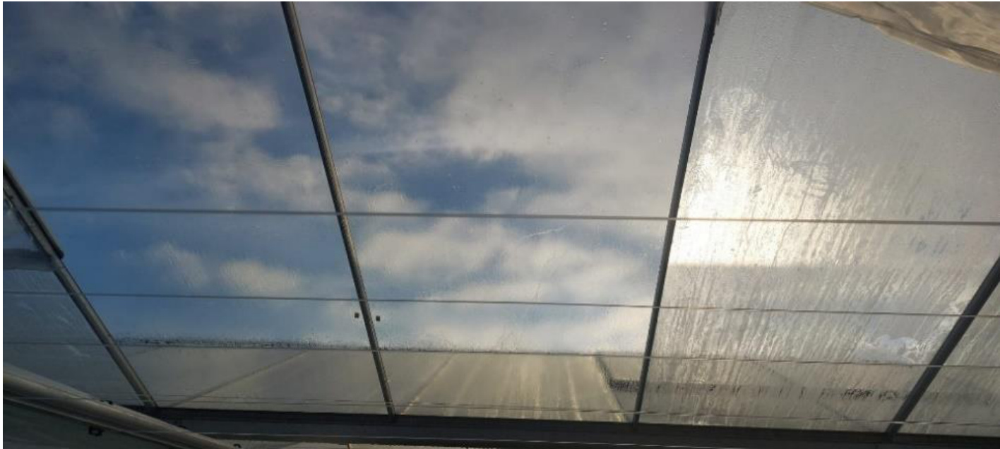  
Figuur 1 Het verschil tussen twee ruiten voorzien van hydrofiele coating (links) en een niet behandelde ruit (rechts).  

# 2 Materiaal en methodes  

# 2.1 Behandeling met hydrofiele coatings  

Voor dit onderzoek zijn drie leveranciers benaderd die materialen met hydrofiele eigenschappen ontwikkelen. Twee van de leveranciers ontwikkelen hydrofiele coatings die op glas aangebracht kunnen worden, de derde ontwikkelt zelfklevende hydrofiele folies die op glas of andere oppervlaktes geplakt kunnen worden.  

Het basisglas was het originele heldere (reserve) glas van de Ammerlaan The Green Innovator kassen. Alle glasplaten kwamen uit dezelfde partij, wat de consistentie in kwaliteit en leeftijd van het glas waarborgt.  

Volgens het onderzoeksplan zijn de glasplaten in setjes van vier behandeld en getest, met als volgt:  

• 4 glas platen onbehandeld als referentie • 4 glas platen behandeld met Full Boost coating • 4 glas platen behandeld met Lumiforte coating • 4 glas platen behandeld met Fujifilm folie  

Van de zestien glasplaten die voor de proef waren bedoeld, zijn er twee tijdens het transport gebroken. De overige glasplaten zijn na aankomst in WUR LightLab, Wageningen University & Research, eerst geacclimatiseerd en vervolgens gereinigd en gecodeerd. Codering is essentieel om de verschillende behandelingen van de glasplaten te kunnen onderscheiden. Deze codes zijn in bijlage 1, Tabel 4, te vinden.  

Voorafgaand aan de behandeling zijn alle glasplaten gemeten op hun hemisferische lichttransmissie.  

Hierna heeft de leverancier van de Full Boost de coating ter plekke in WUR LightLab op het glas aangebracht. Deze behandeling werd uitgevoerd met een fijne sproeier op een horizontaal liggende glasplaat (Figuur 2 links). Vervolgens is de coating uitgehard met een warme luchtblazer. Deze set is vanaf dat moment te identificeren met het achtervoegsel $\yen123^{\prime\prime}$ .  

De Lumiforte coating werd volgens de voorschriften van de leverancier op een schuin liggende glasplaat aangebracht. Dit is door WUR LightLab medewerkers uitgevoerd. Door de schuine positie van het glas glijdt de overtollige coating eraf (Figuur 2 rechts). De coating is verder aan de lucht gedroogd. Deze set was na de behandeling met achtervoegsel “_LF” van andere platen te onderscheiden.  

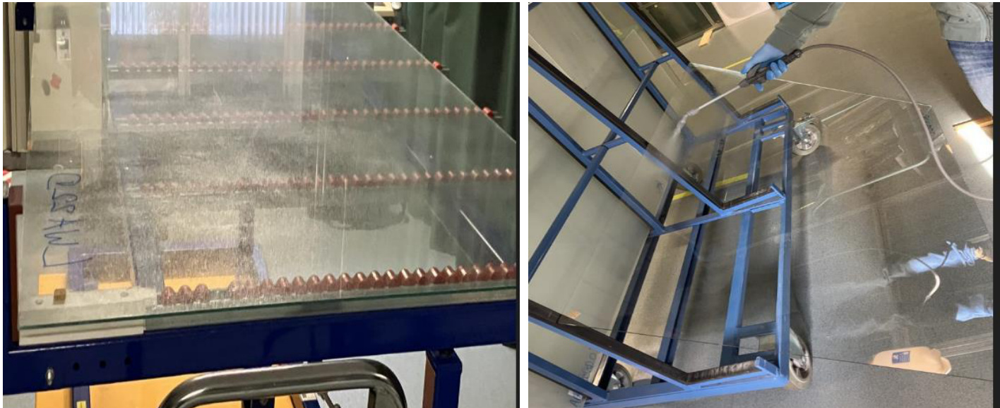  
Figuur 2 Foto links: aanbrengen coating Full Boost; foto rechts: aanbrengen coating Lumiforte.  

De leverancier van de Fujifilm folie heeft zelf de folie in WUR LightLab op het glas aangebracht. De zelfklevende folie werd op een goed gereinigd oppervlak geplaatst dat besproeid was met gedemineraliseerd water. Vervolgens werden luchtbellen en overtollig water zo veel mogelijk verwijderd met een spaan. Bij een van de ruiten kwamen de luchtbellen steeds terug. Het hele proces werd voor deze glasplaat meerdere keren herhaald, maar dit leverde geen beter resultaat op. Deze set werd na de behandeling onderscheiden met achtervoegsel “_FJ” gekenmerkt.  

De laatste twee glasplaten, LWA22M en LWA22N, bleven onbehandeld en dienden als referentiemonster. Omdat de rest van de kas met hetzelfde type glas bedekt was, was het niet nodig om voor deze set transmissie van twee extra glasplaten te meten. Aangezien de bestaande glasplaten op het kasdek niet schoon waren, werden bij het installeren van deze ruiten in de kas twee schone ruiten uit de resterende partij ernaast geïnstalleerd, zodat een set van vier schone glasplaten weer compleet was.  

# 2.2 Bepaling van de lichttransmissie  

# 2.2.1 Lichtmetingen in lab, droge conditie  

Voorafgaand aan de proef en de hydrofiele behandelingen zijn alle glazen gereinigd en gemeten op hemisferische lichttransmissie volgens NEN $2675\substack{+\mathrm{C1}}$ . Het is essentieel om hemisferische lichtmetingen als testwaarde voor deze proef te gebruiken, omdat de reflectie onder verschillende licht invalshoeken kan variëren waardoor de transmissie ook varieert. In Nederland bestaat ongeveer twee derde van de jaarlijkse globale straling uit diffuus licht. Bovendien valt het directe licht gedurende de dag onder veel verschillende invalshoeken op het kasdek. Door de positie van de zon wijken deze invalshoeken in de wintermaanden nog meer af, waardoor de toch al geringe hoeveelheid winterlicht nog minder de kas binnendringt. Een hemisferische meting in het laboratorium zal beter correleren met metingen in het praktijk.  

Hemisferische lichttransmissie volgens NEN $2675\substack{+\mathrm{C1}}$ wordt in WUR LightLab met de WUR Transvision apparatuur gemeten. De resultaten van de onbehandelde droge glazen zijn te vinden in bijlage 1, Tabel 4. De verschillen tussen de gemeten transmissiewaarden vallen binnen de meettolerantie van $+/-0.5\%$ . Dit geeft aan dat de kwaliteit van deze glas partij consistent is.  

Na de hydrofiele behandeling zijn de glazen opnieuw gemeten op hemisferische lichttransmissie. De resultaten van de droge glazen met de hydrofiele behandelingen is weergegeven in bijlage 1, Tabel 5.  

Daarna zijn de glazen in de kas gemonteerd en na ongeveer 12 maanden op de kasdek te hebben gelegen, zijn ze weer naar WUR LightLab gebracht en opnieuw gemeten. De resultaten van de laatste reeks metingen van de droge glazen terug uit de kas is te vinden in bijlage 1, Tabel 6.  

# 2.2.2 Lichtmetingen in lab, natte conditie  

WUR LightLab beschikt over de Transvision-Wet apparatuur welke de lichtdoorlatendheid van materialen in natte condities kan kwantificeren (Swinkels et al., 2017, https://edepot.wur.nl/415351). Het apparaat meet de hemisferische reflectie van het kasdekmateriaal in zowel droge als gecondenseerde toestand gedurende meerdere uren achter elkaar. De ruit staat daarbij schuin, zoals gebruikelijk is bij een kasdek. Er wordt een hoge luchtvochtigheid gegenereerd, vergelijkbaar met de omstandigheden in een kas met gewassen. Vanuit de gemeten hemisferische reflectie in droge en natte toestand kan de verandering in hemisferische transmissie worden uitgedrukt als een percentage. Om de resultaten van praktijk en laboratorium te kunnen vergelijken, zijn deze metingen ook voor alle drie behandelingen uitgevoerd. Aangezien het apparaat niet geschikt is om grote glasplaten mee te meten, zijn deze tests uitgevoerd op glasplaten van $50\times50~\mathsf{c m}$ .  

# 2.2.3 Lichtmetingen in kas  

Eind maand Oktober 2022 zijn de glasplaten, na behandelingen en metingen in het lab, naar de kas gebracht. In de kas werden van elke set twee glasplaten tegenover twee andere glasplaten uit dezelfde set geplaatst, waarbij één sensor de gemiddelde lichttransmissie van de vier platen zou meten (Figuur 3). Tijdens het plaatsen van de glasplaten op het kasdek viel een van de platen met Full-Boost behandeling naar beneden en brak. Later in de week werd een reserveglas van de tuinder naar het WUR-Lichtlab gebracht ter vervanging. Dit glas heeft dezelfde behandeling van Full-Boost ondergaan als de eerdere platen (code LWA22O_FB, zie bijlage). Na de test op hemisferische lichttransmissie werd de glasplaat teruggebracht naar de kas en in het vierde vak van de bijbehorende set geplaatst. Dit zorgde voor een vertraging van drie weken in de metingen in de kas. Toen de opstelling van het glas in de kas voltooid was, konden de sensoren geïnstalleerd worden.  

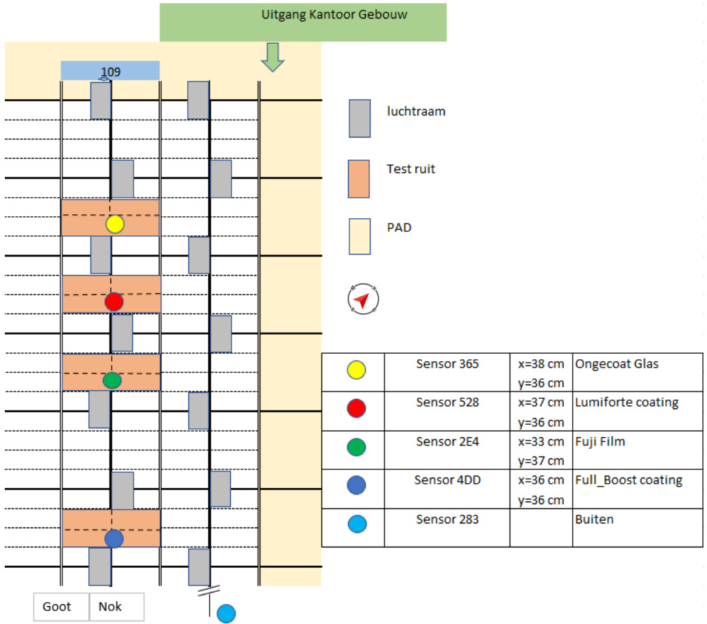  
Figuur 3 Indeling test ruiten en sensoren in en buiten de kas.  

Voor dit project is gekozen voor PAR lichtsensoren van Apogee Instruments SQ-500 serie quantum sensoren. De SQ-500 is een vol-spectrum kwantumsensor met een spectraal bereik van 389 tot $692\mathrm{nm}\pm5$ (Figuur 4 rechts) en een gevoeligheid van $0.01\mathrm{mV}$ per μmol $\mathsf{m}^{-2}\mathsf{s}^{-1}$ . De sensor data werd via een draadloos netwerk, verbonden met een 30MHz Gateway, opgeslagen op een online bereikbare centrale server.  

De binnen sensoren waren gemonteerd op metalen kabelgoten, die met stalen draden aan de nok waren opgehangen (Figuur 4 links). De afstand van de sensor tot het bevestigingspunt op de nok $(\times)$ en de hoogteafstand tot de nok (y) zijn aangegeven in Figuur 4 aangegeven. De buiten sensor is op het dak van de kas geplaatst. Het is getracht om met deze configuratie de invloed van bijliggende glasplaten te minimaliseren.  

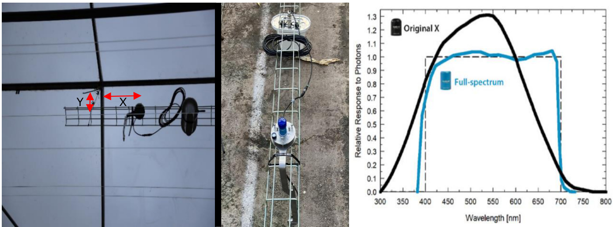  
Figuur 4 Van links naar rechts: Positie PAR sensor t.o.v. nok, bevestiging PAR op kabelgoot; de blauwe lijn geeft de spectrale bereik van sensor aan.  

# 2.2.4 Metingen vervuiling  

In een eerder onderzoek in 2022 (Hemming et al., 2022, https://edepot.wur.nl/579968) is praktijkonderzoek gedaan naar het type vuil dat aan buiten- en binnenkant van een kasdek voorkomt. Het aangetroffen vuil op de kasdek kan aan de buitenkant is anders dan aan de binnenkant. Binnen de kaders van dit project heeft het kasdek alleen aan binnenkant een behandeling gekregen, daarom werd er alleen gekeken naar het vuil dat zich aan de binnenkant van het kasdek bevond. De vervuiling aan de binnenkant heeft diverse oorzaken zoals: groei van algen en schimmels, resten van bestrijdingsmiddelen, rookgassen, stof, zand, kalkaanslag, bijenpoep (afhankelijk van gewas type). Uitvoeren van tests op alle mogelijke oorzaken is kostbaar en buiten het budget van dit project.  

ATP-metingen kunnen echter als indicator voor microbiële of organische vervuiling op een oppervlak worden gebruikt. ATP staat voor adenosinetrifosfaat en is de belangrijkste drager van energie in cellen. De hoeveelheid ATP wordt door middel van luminometrie gemeten. Hierbij wordt licht gegenereerd door de reactie van ATP met een chemische oplossing. Hoe meer licht er wordt gemeten, hoe meer ATP er aanwezig is. ATP metingen kunnen daarom als indicator voor organische vervuiling worden gebruikt.  

Detectie van organisch vuil is met ATP tests in de kas van Ammerlaan uitgevoerd. Direct nadat de glasplaten op de kasdek gemonteerd waren, is bij iedere set van ruiten, een ruit uitgekozen en zijn er twee monsters op een random spot afgenomen (Figuur 5).  

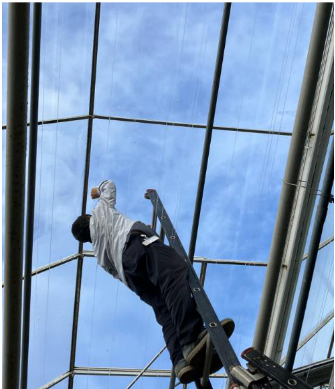  
Figuur 5 Bemonstering ATP test in november 2022 aan het begin van de kasproef.  

Vervolgens zijn aan het eind van de praktijkproef, na het demonteren van de ruiten, van iedere set twee ruiten gekozen en zijn er op iedere ruit op een random spot met een oppervlakte van 10cmx10 cm ATP monsters afgenomen (Figuur 6).  

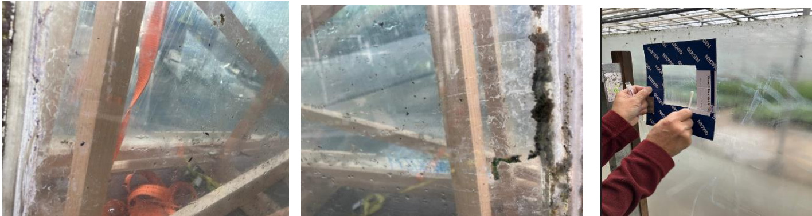  
Vuil accumulatie op de test ruiten, bemonstering ATP test November 2023 na afloop van de  

Tabel 1 Relatieve Light Units (RLU) van bemonstering van glazen op een oppervlakte van 10cmx10cm voor de kasproef (november 2022) en na afloop van de kasproef (november 2023).   

<html><body><table><tr><td>Sample</td><td>November2022</td><td>November2023</td></tr><tr><td>Referentie1</td><td>133</td><td>785</td></tr><tr><td>Referentie2</td><td>71</td><td>336</td></tr><tr><td>FullBoost1</td><td>53</td><td>466</td></tr><tr><td>FullBoost2</td><td>30</td><td>266</td></tr><tr><td>Fujifilm 1</td><td>126</td><td>11253*</td></tr><tr><td>Fujifilm 2</td><td>85</td><td>4505</td></tr><tr><td>Lumiforte1</td><td>33</td><td>229</td></tr><tr><td>Lumiforte2</td><td>25</td><td>307</td></tr></table></body></html>

\*Bemonstering dicht bij de rand.  

# 3 Resultaten  

# 3.1 Lichttransmissie, droge conditie  

Er zijn veertien glasplaten van dezelfde herkomst getest op hun lichttransmissie. Bij de eerste test is alleen gekeken naar onderlinge verschillen in lichtdoorlatendheid van de nog onbehandelde glazen. De variaties in de gemeten transmissiewaardes liggen binnen de meettolerantie van meetinstrument $+/-0,5\%$ , bijlage 1, Tabel 4. Dit duidt op consistente optische eigenschappen van de materiaal. Het gemiddelde van de gemeten hemisferische lichttransmissie van alle veertien glazen is $82.4\%$ , wat als referentiewaarde dient voor verdere vergelijkingen in dit rapport.  

Zoals eerder besproken (§2.1) hebben drie sets van vier glasplaten een hydrofiele behandeling ondergaan, uitgevoerd met twee verschillende spray coatings of een zelfklevende folie. De resultaten van hemisferische lichttransmissiemetingen op droge en schone glazen (Figuur 7) tonen het volgende aan:  

• De gemiddelde hemisferische transmissie van vier platen behandeld met Full-Boost coating daalt met $2.0\%$ ten opzichte van de referentie, wat te wijten is aan de verstrooiingseigenschappen van deze coating.   
• De gemiddelde hemisferische transmissie van vier platen behandeld met Fujifilm folie daalt met $0.4\%$ ten opzichte van de referentie, wat binnen de meettolerantie van $+/-0.5\%$ valt.   
• De gemiddelde hemisferische transmissie van vier platen behandeld met Lumiforte coating stijgt met $0.8\%$ ten opzichte van de referentie, wat wijst op anti-reflectieve eigenschappen van deze coating.   
• De spreiding in hemisferische lichttransmissie van de glazen behandeld met Full-Boost of Lumiforte coating is iets groter dan die tussen de glazen behandeld met Fujifilm folie, wat te wijten is aan de handmatige sproeitechnieken.  

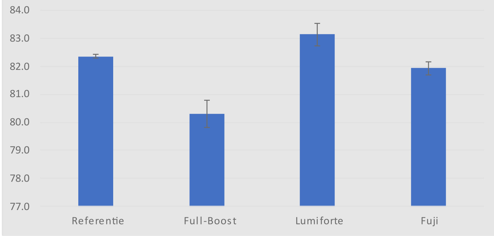  
$[\%]$   
Figuur 7 Gemiddelde transmissie waarde van referentie en behandelde glazen in droog en schone condities.  

Met deze behandelde glazen werd een kasproef bij Ammerlaan uitgevoerd. Na ca. 1 jaar kasproef werden de glasplaten gedemonteerd en teruggebracht naar het lab, waar de hemisferische lichttransmissie opnieuw werd gemeten. In de afdeling waarin de proef heeft plaats gevonden, werden tropische planten gekweekt. Deze planten verdragen geen felle zon, daarom werd in de maanden maart $\mathtt{t}/\mathsf{m}$ september het dak voorzien van een witte seizoen afhankelijke buitencoating om te schermen en licht diffuus te maken. Aan het eind van deze periode werd de buitencoating weer verwijderd. De glasplaten werden deze keer alleen aan de buitenkant schoongemaakt om 1) eventuele resten van de buitencoating goed te verwijderen 2) de coating aan de binnenkant niet beschadigen. Bovendien beïnvloedde geaccumuleerde vuil aan de binnenkant de lichttransmissie. De opnieuw gemeten transmissiewaarden geven aan hoe de transmissie onder invloed van vuil en klimaatomstandigheden in de kas was veranderd. Een overzicht van de resultaten van deze reeks metingen is in bijlage 1, Tabel 4 weergegeven.  

De resultaten van de licht transmissiemetingen aan glas platen in vervuilde en droog conditie tonen het volgende aan (Figuur 8):  

• De gemiddelde hemisferische lichttransmissie van glasplaten behandeld met Full-Boost coating daalt met $2.6\%$ ten opzichte van de referentie en met $0.8\%$ t.o.v. zijn oorspronkelijke staat   
• De gemiddelde hemisferische lichttransmissie van vier platen behandeld met Fujifilm daalt met $1.4\%$ ten opzichte van de referentie en met $1.1\%$ t.o.v. zijn oorspronkelijke staat.   
• De gemiddelde hemisferische lichttransmissie van vier platen behandeld met Lumiforte coating stijgt met $1.5\%$ ten opzichte van de referentie en met $0.5\%$ t.o.v. zijn oorspronkelijke staat.   
• De variatie in hemisferische lichttransmissie (Figuur 9) van elke behandelde set is nu veranderd. Deze variatie is nu het grootst bij Fujifilm en het kleinst bij Lumiforte. Met het blote oog is te zien dat de vervuiling op het glas behandeld met Lumiforte coating het minst was.  

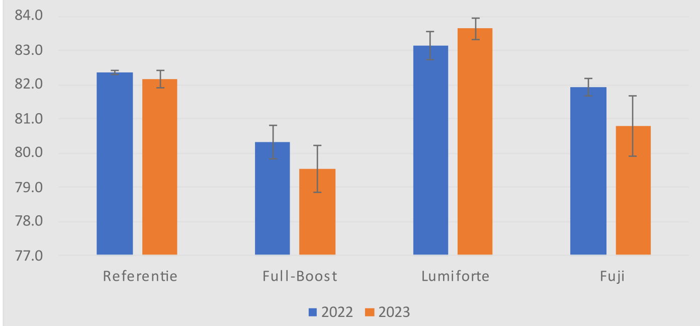  
$[\%]$   
Figuur 8 Gemiddelde transmissie waarde van referentie en behandelde glazen voor en na de kasproef.  

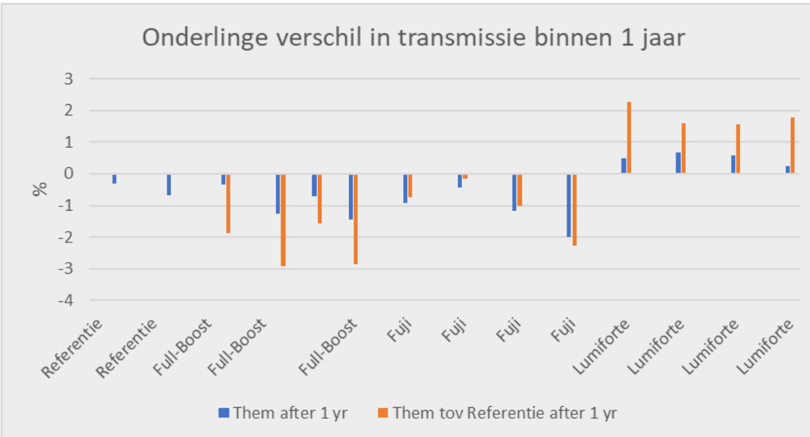  
Figuur 9 Licht transmissie van individuele samples aan het begin en einde van de kasproef.  

# 3.2 Lichttransmissie, natte conditie  

Onderzoek in het lab naar de invloed van condensatie op de diverse glazen met hydrofiele behandelingen geeft de volgende resultaten (Figuur 10):  

• De lichtdoorlatendheid van standard glas in natte conditie daalt met $3.2\%$ t.o.v. droge conditie.   
• De lichtdoorlatendheid van het glas behandeld met Full-Boost coating in natte conditie stijgt met $0.9\%$ t.o.v. droge conditie.   
• De lichtdoorlatendheid van het glas behandeld met Lumiforte coating in natte conditie stijgt gemiddeld met $1.4\%$ t.o.v. droge conditie.   
• De lichtdoorlatendheid van het glas behandeld met Fujifilm folie in natte conditie stijgt gemiddeld in de metingen voor dit onderzoek met $2.8\%$ t.o.v. droge conditie.   
• De spreiding in gemeten lichtdoorlatendheid waarden van glas behandeld met Fujifilm folie is het kleinst. We zien een grotere variatie in lichtdoorlatendheid bij onbehandeld glas. De druppelvorming op het hydrofobe oppervlak van onbehandeld glas blijft zeer dynamisch en onvoorspelbaar, wat resulteert in grotere variaties in lichtdoorlatendheid in natte conditie.  

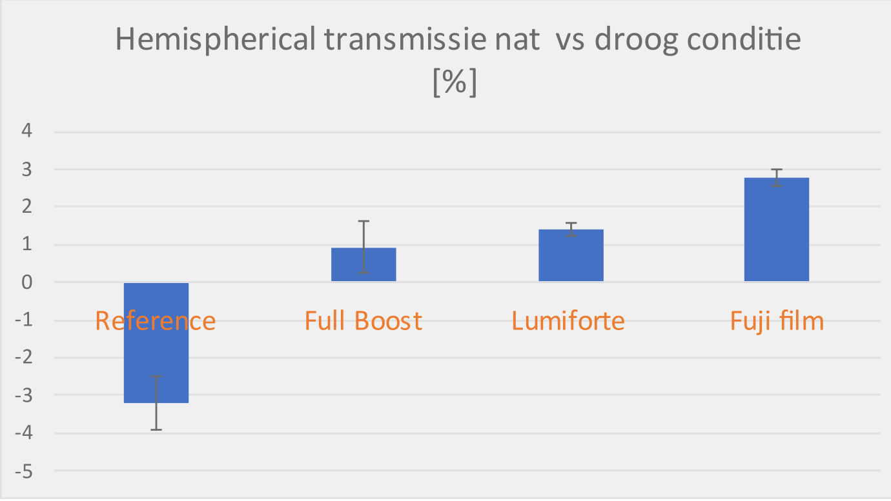  
Figuur 10 Verandering in lichtdoorlatendheid van test glazen in natte conditie t.o.v. transmissie van onbehandelde glas in droge conditie.  

De hydrofiele eigenschappen van alle drie behandelingen verbeteren de lichttransmissie onder natte omstandigheden tot een niveau vergelijkbaar met dat onder droge omstandigheden. Deze verbetering is nog indrukwekkender wanneer de toename in lichttransmissie wordt vergeleken met die van referentieglas onder natte omstandigheden. Condensvorming op het referentieglas veroorzaakt in dit onderzoek een lichtverlies van $3.2\%$ . Als we dit als nieuw referentiepunt beschouwen, wordt het positieve effect van het hydrofiele oppervlak duidelijker zichtbaar (Tabel 2). Op basis van dit nieuwe referentiepunt is een toename in lichttransmissie van 2 tot $5.6\%$ waar te nemen wanneer het heldere glas met een hydrofiele coating behandeld wordt (Figuur 11). Deze resultaten kunnen voor diffuus of AR glas anders zijn, dit was hier niet onderdeel van het onderzoek.  

Tabel 2 Verandering in transmissie eigenschappen na de hydrofiele behandeling vergeleken met de referentie in diverse condities.   

<html><body><table><tr><td></td><td>Referentie</td><td>FullBoost</td><td>Lumiforte</td><td>Fujifilm</td></tr><tr><td>△Tr nahydrofielebehandeling,droge conditie[%]</td><td>N/A</td><td>2.0↓</td><td>0.8↑</td><td>0.4↓</td></tr><tr><td>△Tr gedurende condensatie,natte conditie[%]</td><td>3.2↓</td><td>0.9↑</td><td>1.4↑</td><td>2.8↑</td></tr><tr><td>△Tr t.o.v.referentie in natte conditie[%]</td><td>N/A</td><td>2.1↑</td><td>5.4↑</td><td>5.6↑</td></tr></table></body></html>  

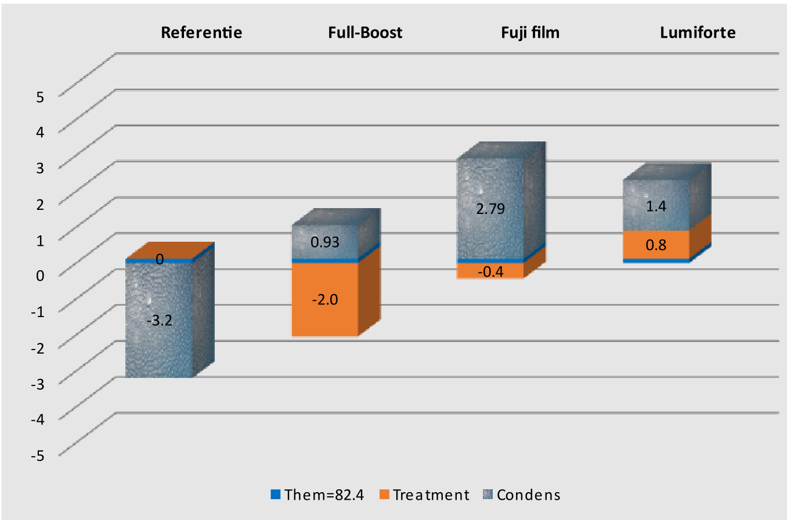  
Figuur 11 Toename in lichttransmissie van 2 tot $5.6\%$ t.o.v. lichttransmissie van standard glas in natte conditie.  

# 3.3 Lichtmetingen in kas  

De week nadat de glazen volgens geplande lay-out (§2.2.3) op de dek geplaats zijn, zijn de sensoren in de kas geplaatst. Tijdens de installatie van sensoren viel op dat er in drie weken tijd grote luchtbellen waren ontstaan tussen de Fujifilm folie en het glasoppervlak van één ruit (Figuur 12). Deze luchtbellen waren niet zichtbaar bij alle Fujifilm ruiten, wat aangeeft dat er geen sprake is van een systematisch probleem. Een mogelijke oorzaak kan zijn dat deze ruit niet goed gereinigd was, waardoor de zelfklevende eigenschap van de folie niet goed werkte. Het zichtbare tijgerpatroon zal echter invloed hebben gehad op de lichtmetingen in de kas. Bij het interpreteren van de resultaten van dit product moet hiermee rekening worden gehouden. Opvallend waren de fijne condens druppels in de vroege ochtend welke de Fujifilm ruiten diffuus hadden gemaakt (Figuur 12), terwijl de referentie ruiten ernaast zonder condens en helder waren. De oorzaak hiervan is de vochtabsorptie door de folie. Gedurende de nacht raakt de folie verzadigd met vocht en in de ochtend duurt het langer om deze weer op te drogen. Dit betekent dat bij dalende temperaturen in de middag de folie vocht zal absorberen totdat deze verzadigd is, waarna pas zichtbare kleine druppels als condensatie beginnen op te treden. Hiermede door wordt het lichtverlies in de ochtend gecompenseerd met lichtwinst in de middag.  

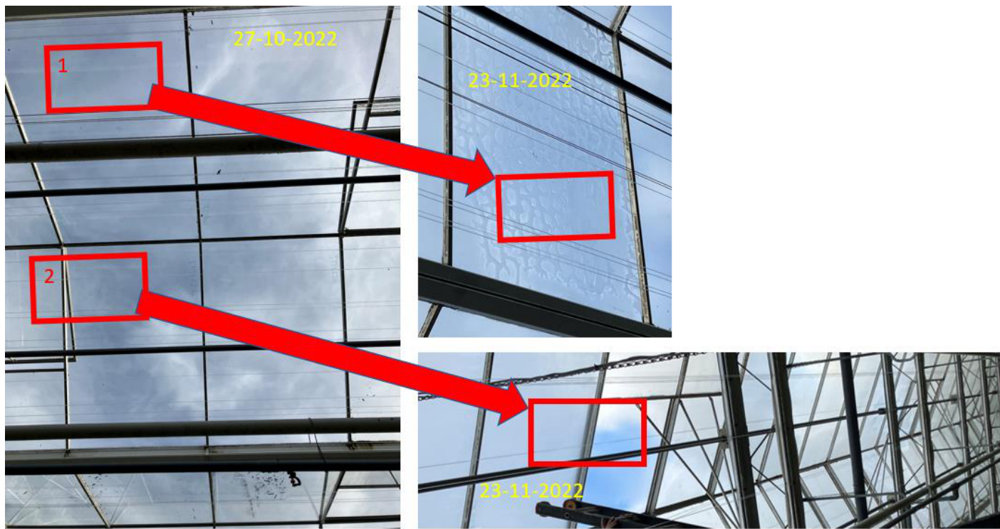  
Figuur 12 Grote luchtbellen tussen film en glas oppervlak; Aanwezigheid van condens in de ochtenduren.  

Aanvankelijk zou de proef zes maanden duren. Een bijkomend effect van de eigenschappen van hydrofiele oppervlakken kan een zelfreinigend effect zijn. Aangezien de proef in plaats van in oktober pas eind november is begonnen en het kasdek gedurende de maanden maart tot en met september met een witte buitencoating geschermd werd, is besloten om de proef langer te laten doorgaan. Dit om de eventuele gebruikelijke vuilophoping en algengroei te laten plaatsvinden. Echter, dit betekent dat de nuttige gecollecteerde lichtmeetdata in de praktijk beperkt bleef van eind november 2022 tot en met 14 maart 2023.  

In dit rapport wordt vooral het condensatiegedrag geanalyseerd. De verhouding van meetresultaten in de kas en het lab wordt vergeleken.  

In Figuur 13 is de lichtdoorlatendheid van alle vier sets glazen uitgezet tegen de gemeten straling buiten de kas. In de vroege ochtend en late middag zien we uitschieters wanneer de PAR-lichtintensiteit laag is. Dit heeft geen significante invloed op de voor het gewas beschikbare lichtsom, omdat er dan bijna geen licht is en dit weinig bijdraagt aan de dagelijkse totalen. Bovendien is de meetonnauwkeurigheid dan groter dan de daadwerkelijke PAR.  

Bij alle sensoren zien we rond het middag uur een dip in de data, dit is veroorzaakt door de schaduw van constructie, in dit geval de nok.  

Van 24 november tot en met 24 december 2022 zien we dat de Lumiforte coating een duidelijke toename in lichttransmissie vertoont ten opzichte van het referentieglas. Deze toename begint vooral rond 10:00 uur ‘s ochtends. Dan is het referentieglas nog gecondenseerd, terwijl de condens op het gecoate glas is opgedroogd (Figuur 13), waardoor het effect van reflectie door condens wordt geëlimineerd. In de periode daarna is er een geleidelijke afname van het verzamelde PAR-licht onder deze glasplaat. Aanvankelijk werd gedacht dat de coating was weggespoeld, waardoor de hydrofiele eigenschappen niet meer actief waren. Echter, de meetresultaten in het lab aan het einde van de proef lieten zien dat de coating nog goed aanwezig was en de lichttransmissie zelfs verbeterd was. De oorzaak van deze langzaam groeiende afwijking in de meting was helaas een geleidelijk verloop van de sensor.  

Het positieve effect in lichttoename onder condensatie is ook te zien bij de Full-Boost coating, zij het in mindere mate. De reden hiervan is dat zodra het glas met Full-Boost coating begint op te drogen, wordt het iets diffuser, wat de behaalde lichtwinst vermindert. Dit werd ook in de labmetingen op droge glazen aangetoond. Echter de totale toename in licht transmissie gedurende condens momenten blijft positief.  

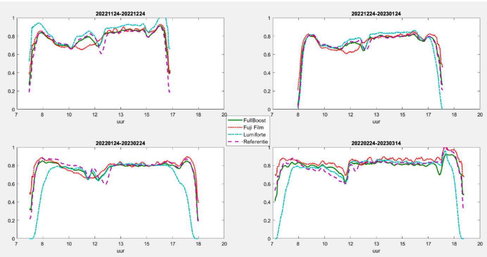  
Figuur 13 Hoeveelheid doorgelaten licht onder geteste glas t.o.v. buitenstraling.  

In Figuur 14 wordt de cumulatieve lichtopbrengst gedurende de wintermaanden vóór de toepassing van krijt weergegeven. Het positieve effect van de hydrofiele eigenschappen van de Lumiforte-coating is al na twee weken zichtbaar.  

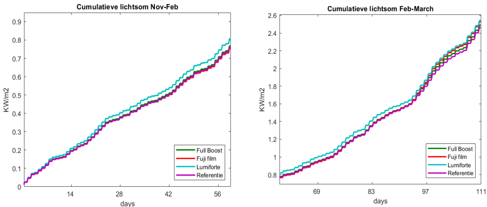  
Figuur 14 Cumulatieve PAR lichtsom voor ieder set van test ruiten vanaf eind November tot half Maart.  

Aan het einde van de periode is de verhouding van de totale lichtopbrengst per behandeld glas ten opzichte van onbehandeld glas (referentie) berekend. De procentuele toename in de lichtsom is weergegeven in Tabel 3.  

Tabel 3 Procentuele licht opbrengst na 111 winter dagen vergeleken met lichtopbrengst van onbehandeld glas.   

<html><body><table><tr><td>Behandelding</td><td>Lichtsom toename (%)</td></tr><tr><td>FullBoost</td><td>1.1</td></tr><tr><td>Fuji Film</td><td>2.7</td></tr><tr><td>Lumiforte</td><td>3.2</td></tr></table></body></html>  

In Figuur 15 wordt de PAR-energie per uur weergegeven als een voortschrijdend gemiddelde over twee perioden. Links zijn de wintermaanden weergegeven, waarin nog geen witte buitencoating is aangebracht, en rechts de voorjaars- en zomerperiode, waarin de witte buitencoating is aangebracht.  

Uit deze grafiek wordt bevestigd dat het gemiddelde PAR-licht gedurende wintermaanden onder hydrofiel behandelde glazen verbetert.  

De witte coating is ontworpen om het licht diffuus te maken en de hoge temperaturen tijdens de zomermaanden zoveel mogelijk te vermijden. De dikte en homogeniteit van deze coating hebben een significante invloed op de hoeveelheid doorgelaten licht door het kasdek. Aangezien er informatie beschikbaar was over de dikte en homogeniteit van de buitencoating, zijn de waargenomen gegevens in deze periode niet verder geanalyseerd.  

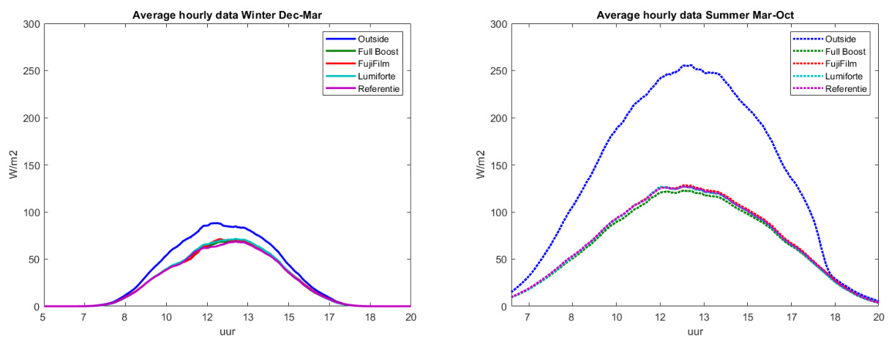  
Figuur 15 Gemiddelde PAR-licht voor twee periodes: links, winter maanden zonder krijt $(-)$ en rechts voorjaar-zomer met krijt op het glas (.).  

# Conclusies  

Er zijn weinig producten op de markt waarmee de binnenkant van een kasdek hydrofiel kan worden gemaakt. Bij de start van dit onderzoek hebben drie verschillende leveranciers dergelijke producten geleverd. Deze werden aangebracht op helder glas en in het laboratorium onder gedefinieerde omstandigheden en in een kasproef onderzocht om hun invloed op de lichtdoorlatendheid.  

De toename van lichtdoorlatendheid onder natte omstandigheden door het aanbrengen van een hydrofiele behandeling kan verschillen voor diffuus of AR-glas, dit is hier niet onderzocht.  

Uit de metingen van de lichtdoorlatendheid van glas onder natte condities in het lab blijkt dat, vergeleken met standaard glas, de drie geteste hydrofiele behandelingen de lichttransmissie positief beïnvloeden.  

• Uit de tests in de proefkas blijkt dat, vergeleken met standaard glas, een hydrofiele behandeling aan de binnenkant van het glas de transmissie van het kasdekmateriaal verhoogt. Dit is vooral belangrijk voor de wintermaanden.   
• Onder gelijke omstandigheden, zowel bij schoon en droog glas als glas in natte condities, komen de meetresultaten uit de kas en het laboratorium goed overeen.   
• De Lumiforte coating heeft zeer goede hydrofiele eigenschappen, wat zowel in het lab als in de kas is gemeten. Er werd een lichtwinst gemeten onder natte omstandigheden in het lab als ook in de kas. De Lumiforte coating liet ook onder droge condities en lichte lichtwinst zien, heeft dus ook onder deze omstandigheden geen nadelige effecten. De meetresultaten van het glas behandeld met de Lumiforte coating welke een jaar in de kas heeft gelegen, laat zien dat de coating minstens een jaar goed presteert.   
• De Fujifilm folie had geen voordelen in lichttransmissie onder droge condities maar wel onder natte condities in lab en kas. Een professionelere aanpak voor het aanbrengen van de zelfklevende hydrofiele Fujifilm folie had betere resultaten kunnen opleveren. De intensieve behandeling van het aanbrengen van de folie in het laboratorium heeft de groei van algen op de folie bevorderd, wat nadelig was voor de lichttransmissie in de kas.   
• De diffuse hydrofiele coating van Full-Boost verminderde de lichttransmissie na aanbrengen onder droge condities. Eventueel kan het diffuse licht een voordelig bijkomend effect hebben voor schaduwminnende planten. Voor lichtminnende planten moet er rekening mee worden gehouden dat de totale lichtsom op jaarbasis verlaagd. De verstrooiing van het licht kan volgens de leverancier door variatie in de concentratie van coating aangepast worden. Onder natte condities werd wel een lichtwinst gemeten door de hydrofiele coating.   
• Gedurende deze proef was er weinig vuil en algen op zowel de Lumiforte als de Full-Boost coating geaccumuleerd. Deze ‘zelfreinigende’ eigenschap zou een positieve invloed op de gemiddelde transmissie van het kasdek op de lange termijn kunnen hebben, hiervoor is een lange termijn praktijk proef nodig.  

# Literatuur  

1. Frank Kempkes, Gert-Jan Swinkels, Silke Hemming, 2015 “Verbetering lichtinval winterlicht”. Rapport GTB 1364, Wageningen University & Research Glastuinbouw.   
2. Gert-Jan Swinkels, Bram van Breugel en Ilias Tsafaras, 2017 “Meetprotocol voor lichttransmissie van materialen met condens”. Rapport GTB-1438, Wageningen University & Research Glastuinbouw.   
3. Stanghellini, C.; Mohammadkhani, V.; Bruins, M.A.; Hemming, S.; Sonneveld, P.J., 2010 “Condensatie tegen het kasdek; Licht- en energie-effecten van condensatie op acht kasdekmaterialen.” Rapport GTB-1025, Wageningen University & Research Glastuinbouw.   
4. Silke Hemming, Bram van Breugel, Bas Briaire, Vida Mohammadkhani, Khanh Pham, Marta Streminska, 2022 “Veilig en effectief AR glas reinigen”. Rapport WPR-1171, Wageningen University & Research Glastuinbouw.  

# Bijlage 1 Lichtmetingen WUR Lightlab  

Tabel 4 Hemisferisch en hoekafhankelijke transmissie van alle onbehandelde glazen.   

<html><body><table><tr><td>Sample ID</td><td>Them</td><td>Tn</td><td>15</td><td>30</td><td>40</td><td>45</td><td>50</td><td>60</td><td>75</td></tr><tr><td>LWA22A</td><td>82.3</td><td>89.7</td><td>89.5</td><td>89.3</td><td>88.6</td><td>88.0</td><td>86.6</td><td>81.7</td><td>58.9</td></tr><tr><td>LWA22B</td><td>82.4</td><td>89.5</td><td>89.5</td><td>89.3</td><td>88.6</td><td>88.0</td><td>86.8</td><td>81.9</td><td>59.5</td></tr><tr><td>LWA22C</td><td>82.4</td><td>89.7</td><td>89.6</td><td>89.5</td><td>88.7</td><td>87.9</td><td>86.7</td><td>82.0</td><td>59.6</td></tr><tr><td>LWA22D</td><td>82.4</td><td>89.6</td><td>89.5</td><td>89.3</td><td>88.7</td><td>87.9</td><td>86.8</td><td>82.1</td><td>59.6</td></tr><tr><td>LWA22E</td><td>82.4</td><td>89.6</td><td>89.6</td><td>89.1</td><td>88.7</td><td>87.8</td><td>86.8</td><td>82.0</td><td>59.3</td></tr><tr><td>LWA22F</td><td>82.2</td><td>89.8</td><td>89.6</td><td>89.3</td><td>88.6</td><td>87.7</td><td>86.7</td><td>81.5</td><td>59.4</td></tr><tr><td>LWA22G</td><td>82.4</td><td>89.4</td><td>89.4</td><td>89.4</td><td>88.7</td><td>88.1</td><td>86.7</td><td>82.0</td><td>59.1</td></tr><tr><td>LWA22H</td><td>82.4</td><td>89.7</td><td>89.5</td><td>89.4</td><td>88.8</td><td>88.2</td><td>86.8</td><td>82.1</td><td>59.2</td></tr><tr><td>LWA22I</td><td>82.4</td><td>89.5</td><td>89.5</td><td>89.3</td><td>88.6</td><td>87.9</td><td>86.8</td><td>82.1</td><td>59.4</td></tr><tr><td>LWA22]</td><td>82.3</td><td>89.5</td><td>89.5</td><td>89.2</td><td>88.6</td><td>87.9</td><td>86.7</td><td>82.0</td><td>59.4</td></tr><tr><td>LWA22K</td><td>82.4</td><td>89.6</td><td>89.5</td><td>89.4</td><td>88.7</td><td>87.9</td><td>86.8</td><td>82.0</td><td>59.3</td></tr><tr><td>LWA22L</td><td>82.4</td><td>89.6</td><td>89.6</td><td>89.3</td><td>88.7</td><td>88.1</td><td>86.8</td><td>82.1</td><td>59.5</td></tr><tr><td>LWA22M</td><td>82.4</td><td>89.6</td><td>89.5</td><td>89.4</td><td>88.4</td><td>88.1</td><td>86.7</td><td>81.9</td><td>59.5</td></tr><tr><td>LWA22N</td><td>82.3</td><td>89.6</td><td>89.5</td><td>89.2</td><td>88.7</td><td>87.9</td><td>86.9</td><td>82.0</td><td>59.3</td></tr><tr><td>LWA220</td><td>82.3</td><td>89.4</td><td>89.4</td><td>89.3</td><td>88.7</td><td>87.3</td><td>86.7</td><td>81.7</td><td>59.1</td></tr><tr><td>Afwijking</td><td>0.1</td><td>0.1</td><td>0.1</td><td>0.1</td><td>0.1</td><td>0.2</td><td>0.1</td><td>0.2</td><td>0.2</td></tr></table></body></html>  

Tabel 5 Hemisferische en hoekafhankelijke transmissie na de hydrofiele behandeling van de glazen in het lab, droge condities.   

<html><body><table><tr><td>Sample ID</td><td>Them</td><td>Tn</td><td>15</td><td>30</td><td>40</td><td>45</td><td>50</td><td>60</td><td>75</td></tr><tr><td>LWA22A_FB</td><td>80.3</td><td>88.1</td><td>88.0</td><td>87.7</td><td>87.2</td><td>85.9</td><td>84.9</td><td>79.9</td><td>55.5</td></tr><tr><td>LWA22B_FB*</td><td>79.6</td><td>86.9</td><td>86.7</td><td>86.6</td><td>86.0</td><td>85.1</td><td>84.1</td><td>79.2</td><td>56.3</td></tr><tr><td>LWA22C_FB</td><td>80.2</td><td>87.5</td><td>87.5</td><td>87.2</td><td>86.4</td><td>85.8</td><td>84.4</td><td>79.7</td><td>56.8</td></tr><tr><td>LWA22D_FB</td><td>81.0</td><td>88.3</td><td>88.3</td><td>88.0</td><td>87.4</td><td>86.6</td><td>85.5</td><td>80.8</td><td>57.2</td></tr><tr><td>LWA22O_FB</td><td>80.5</td><td>87.9</td><td>88.0</td><td>87.7</td><td>86.7</td><td>86.2</td><td>84.9</td><td>80.2</td><td>56.2</td></tr><tr><td>Afwijking</td><td>0.49</td><td>0.53</td><td>0.63</td><td>0.55</td><td>0.57</td><td>0.56</td><td>0.55</td><td>0.58</td><td>0.63</td></tr><tr><td>LWA22E_FJ</td><td>82.0</td><td>89.3</td><td>89.3</td><td>89.1</td><td>88.4</td><td>87.7</td><td>86.4</td><td>81.6</td><td>58.8</td></tr><tr><td>LWA22F_FJ</td><td>82.1</td><td>89.3</td><td>89.3</td><td>89.2</td><td>88.4</td><td>87.7</td><td>86.4</td><td>81.7</td><td>59.0</td></tr><tr><td>LWA22G_FJ</td><td>82.0</td><td>89.3</td><td>89.3</td><td>89.0</td><td>88.3</td><td>87.5</td><td>86.4</td><td>81.5</td><td>58.8</td></tr><tr><td>LWA22H_FJ</td><td>81.6</td><td>88.8</td><td>88.8</td><td>88.5</td><td>87.9</td><td>87.0</td><td>85.9</td><td>81.2</td><td>58.6</td></tr><tr><td>Afwijking</td><td>0.24</td><td>0.25</td><td>0.27</td><td>0.32</td><td>0.24</td><td>0.31</td><td>0.25</td><td>0.24</td><td>0.17</td></tr><tr><td>LWA22I_LF</td><td>83.6</td><td>91.0</td><td>90.9</td><td>90.7</td><td>89.9</td><td>89.1</td><td>88.0</td><td>83.2</td><td>60.3</td></tr><tr><td>LWA22J_LF</td><td>82.8</td><td>90.0</td><td>90.3</td><td>89.7</td><td>89.2</td><td>88.3</td><td>87.1</td><td>82.5</td><td>59.5</td></tr><tr><td>LWA22K_LF</td><td>82.8</td><td>90.2</td><td>90.3</td><td>89.7</td><td>89.0</td><td>88.5</td><td>87.2</td><td>82.4</td><td>59.7</td></tr><tr><td>LWA22L_LF</td><td>83.4</td><td>90.9</td><td>90.8</td><td>90.2</td><td>89.6</td><td>88.9</td><td>87.9</td><td>83.1</td><td>60.0</td></tr><tr><td>Afwijking</td><td>0.40</td><td>0.50</td><td>0.32</td><td>0.48</td><td>0.40</td><td>0.40</td><td>0.48</td><td>0.42</td><td>0.37</td></tr></table></body></html>

$^*$ Glasplaat LWA22B_FB is tijdens installatie in de kas gevallen en gebroken. Deze plaat is vervangen door LWA22O_FB.  

Tabel 6 Hemisferische en hoekafhankelijke transmissie van onbehandeld en de hydrofiele behandeling van de glazen na 1 jaar in een praktijkkas, droge conditie.   

<html><body><table><tr><td>Sample ID</td><td>Them</td><td>Tn</td><td>15</td><td>30</td><td>40</td><td>45</td><td>50</td><td>60</td><td>75</td></tr><tr><td>LWA22A_FB_na</td><td>80.0</td><td>87.8</td><td>87.7</td><td>87.4</td><td>86.4</td><td>85.7</td><td>84.2</td><td>79.4</td><td>55.7</td></tr><tr><td>LWA22C_FB_na</td><td>78.9</td><td>87.6</td><td>87.3</td><td>86.7</td><td>85.8</td><td>84.5</td><td>82.9</td><td>77.5</td><td>54.6</td></tr><tr><td>LWA22D_FB_na</td><td>80.3</td><td>88.5</td><td>88.1</td><td>87.7</td><td>86.8</td><td>85.9</td><td>84.4</td><td>79.4</td><td>55.8</td></tr><tr><td>LWA22O_FB_na</td><td>79.0</td><td>87.3</td><td>87.0</td><td>86.2</td><td>85.1</td><td>84.2</td><td>83.0</td><td>77.7</td><td>56.4</td></tr><tr><td>LWA22E_FJ_na</td><td>81.1</td><td>89.3</td><td>89.1</td><td>88.5</td><td>87.8</td><td>86.5</td><td>85.1</td><td>80.0</td><td>56.8</td></tr><tr><td>LWA22F_FJ_na</td><td>81.7</td><td>89.7</td><td>89.7</td><td>89.0</td><td>88.1</td><td>87.5</td><td>85.9</td><td>80.8</td><td>58.1</td></tr><tr><td>LWA22G_FJ_na</td><td>80.8</td><td>88.9</td><td>88.9</td><td>88.1</td><td>87.2</td><td>86.5</td><td>85.1</td><td>79.9</td><td>57.0</td></tr><tr><td>LWA22H_FJ_na</td><td>79.6</td><td>87.5</td><td>87.3</td><td>87.0</td><td>86.0</td><td>85.2</td><td>83.8</td><td>78.3</td><td>55.4</td></tr><tr><td>LWA22I_LF_na</td><td>84.1</td><td>92.0</td><td>91.7</td><td>91.3</td><td>90.5</td><td>89.5</td><td>88.4</td><td>83.3</td><td>60.7</td></tr><tr><td>LWA22J_LF_na</td><td>83.5</td><td>91.1</td><td>91.1</td><td>90.4</td><td>89.8</td><td>88.8</td><td>87.7</td><td>82.7</td><td>60.0</td></tr><tr><td>LWA22K_LF_na</td><td>83.4</td><td>91.6</td><td>91.2</td><td>90.8</td><td>89.9</td><td>89.2</td><td>87.7</td><td>82.6</td><td>59.7</td></tr><tr><td>LWA22L_LF_na</td><td>83.6</td><td>91.6</td><td>91.5</td><td>91.1</td><td>90.1</td><td>89.5</td><td>88.0</td><td>82.9</td><td>59.7</td></tr><tr><td>LWA22M_na</td><td>82.0</td><td>89.6</td><td>89.3</td><td>89.0</td><td>88.1</td><td>87.5</td><td>86.4</td><td>81.6</td><td>59.2</td></tr><tr><td>LWA22N_na</td><td>81.7</td><td>89.2</td><td>88.9</td><td>88.7</td><td>87.8</td><td>87.4</td><td>86.0</td><td>81.2</td><td>58.5</td></tr></table></body></html>  

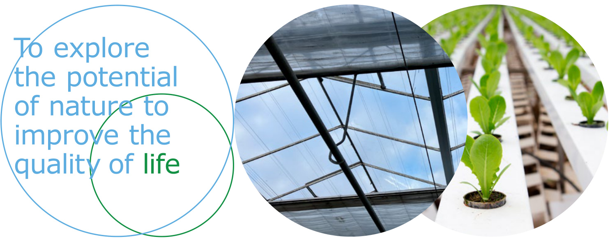  

Wageningen University & Research   
BU Glastuinbouw   
Violierenweg 1, 2665 MV Bleiswijk   
Postbus 20, 2665 ZG Bleiswijk   
$\top+31$ (0)317 48 56 06   
E glastuinbouw@wur.nl   
wur.nl/glastuinbouw  

Rapport WPR-1401  

De missie van Wageningen University & Research is ‘To explore the potential of nature to improve the quality of life’. Binnen Wageningen University & Research bundelen Wageningen University en gespecialiseerde onderzoeksinstituten van Stichting Wageningen Research hun krachten om bij te dragen aan de oplossing van belangrijke vragen in het domein van gezonde voeding en leefomgeving. Met ongeveer 30 vestigingen, 7.700 medewerkers (7.000 fte), 2.500 PhD- en EngD-kandidaten, 13.100 studenten en ruim 150.000 Leven Lang Leren-deelnemers behoort Wageningen University & Research wereldwijd tot de aansprekende kennisinstellingen binnen haar domein. De integrale benadering van de vraagstukken en de samenwerking tussen verschillende disciplines vormen het hart van de unieke Wageningen aanpak.  